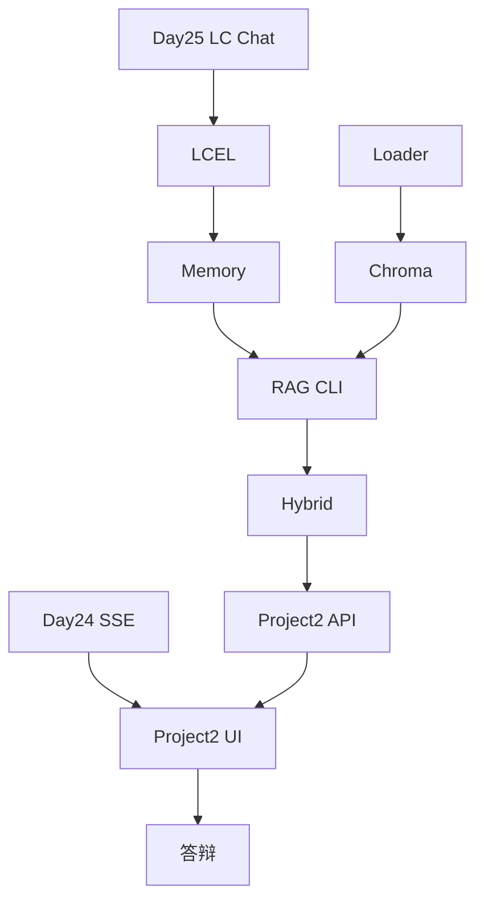

# 阶段三学习路径索引 · Day 25–38（LangChain 与 RAG）

> 若你刚加入或从 Day 24 跳入，按本索引 **顺序学习**，勿跳天。

---

## 一、阶段目标

完成 **星火智服知识库** 从 LangChain 重构到 **可答辩的全栈 RAG 产品**（Project 2）。

---

## 二、每日导航

| 天 | 目录 | 关键词 | 验收命令 |
|----|------|--------|----------|
| 25 | day25/ | LangChain ChatModel | `python3 verify_day25.py` |
| 26 | day26/ | LCEL `\|` | `python3 verify_day26.py` |
| 27 | day27/ | Memory | `python3 verify_day27.py` |
| 28 | day28/ | Loader/Splitter | `python3 verify_day28.py` |
| 29 | day29/ | Chroma | `python3 verify_day29.py` |
| 30 | day30/ | **RAG CLI** | `SPARKTECH_MOCK=1 python3 verify_day30.py` |
| 31 | day31/ | 调参 | `python3 verify_day31.py` |
| 32 | day32/ | HyDE/Multi-Query | `python3 verify_day32.py` |
| 33 | day33/ | Hybrid+Rerank | `python3 verify_day33.py` |
| 34 | day34/ | Ragas | `python3 verify_day34.py` |
| 35 | day35/ | LlamaIndex | `python3 verify_day35.py` |
| 36 | day36/ | Project2 后端 | `python3 verify_project2.py` |
| 37 | day37/ | Project2 前端 | `bash run.sh` |
| 38 | day38/ | 答辩 | 现场 verify + Demo |

---

## 三、代码依赖关系



---

## 四、环境变量

| 变量 | 用途 |
|------|------|
| `SPARKTECH_MOCK=1` | 全阶段 mock |
| `OPENAI_API_KEY` | live LLM/Embedding |
| `RAG_SCORE_THRESHOLD` | Day30 拒答阈值 |

详见 `curriculum/02_环境变量与API配置说明.md`。

---

## 五、Project 2 唯一源码路径

```
day36/code/project2/
```

Day 37、Day 38 **不要复制** 第二份 backend，只通过 `run.sh` 与文档引用。

---

*索引完 · 2026-07-06 增补*
