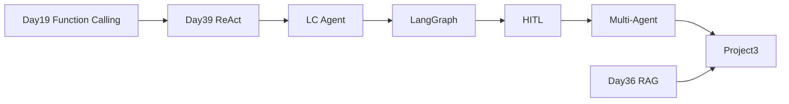

# 阶段四学习路径索引 · Day 39–50（Agent 智能体）

> 从 RAG 问答升级到 **自主规划 + 工具调用 + 多 Agent 协作**。

---

## 一、阶段目标

交付 **星火智服 Phase3**：多 Agent 智能办公助手（项目三），具备日程/邮件/搜索/RAG、人工审批、任务中断恢复。

---

## 二、每日导航

| 天 | 目录 | 关键词 | 验收 |
|----|------|--------|------|
| 39 | day39/ | ReAct 手写 | `verify_day39.py` |
| 40 | day40/ | LangChain Agent | `verify_day40.py` |
| 41 | day41/ | LangGraph 图 | `verify_day41.py` |
| 42 | day42/ | HITL / Checkpointer | `verify_day42.py` |
| 43 | day43/ | Supervisor | `verify_day43.py` |
| 44 | day44/ | MCP | `verify_day44.py` |
| 45 | day45/ | 周测 + Dify | `verify_day45.py` |
| 46 | day46/ | 护栏 / Trace | `verify_day46.py` |
| 47 | day47/ | Text-to-SQL | `verify_day47.py` |
| 48–50 | day48/code/project3/ | **项目三** | `verify_project3.py` |

---

## 三、技术演进链



---

## 四、项目三启动

```bash
cd day48/code/project3
pip install -r requirements.txt
export SPARKTECH_MOCK=1 PYTHONPATH=$PWD
python3 verify_project3.py
bash run.sh
# http://127.0.0.1:8088
```

**端口**：API `8010`，前端 `8088`（与 project2 的 8000/8080 区分）

---

## 五、与前三阶段项目对照

| 项目 | 天数 | 核心能力 |
|------|------|----------|
| 一 | 14 | 命令行多轮对话 |
| 二 | 36–38 | RAG + 引用 + Web |
| 三 | 48–50 | 多 Agent + 审批 + 工具链 |

---

*索引 · 2026-07-06*
