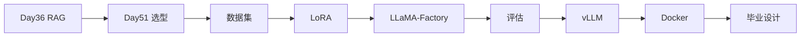

# 阶段五学习路径索引 · Day 51–57（微调与部署）

> Phase4：**垂直客服 LoRA + vLLM + Docker** 上线，与 Project2 RAG 并存。

---

## 一、阶段目标

| 产出 | 说明 |
|------|------|
| 数据集 | `day52/code/data/train.jsonl` |
| LoRA 配置 | `day53/code/configs/lora_sparktech.json` |
| 训练产物 | `day54/code/output/sparktech_lora/`（mock 或真机） |
| 评估报告 | `day55/code/reports/ab_summary.json` |
| 推理服务 | `day56` Mock vLLM `:8100` |
| 部署栈 | `day57` Gateway `:8020` + Compose |

---

## 二、每日导航

| 天 | 目录 | 关键词 | 验收 |
|----|------|--------|------|
| 51 | day51/ | 微调选型 | `verify_day51.py` |
| 52 | day52/ | 数据集工程 | `verify_day52.py` |
| 53 | day53/ | LoRA 原理 | `verify_day53.py` |
| 54 | day54/ | LLaMA-Factory | `verify_day54.py` |
| 55 | day55/ | 离线评估 | `verify_day55.py` |
| 56 | day56/ | vLLM 推理 | `verify_day56.py` |
| 57 | day57/ | Docker 部署 | `verify_day57.py` |

---

## 三、技术演进链

---

## 四、环境变量

| 变量 | 用途 |
|------|------|
| `SPARKTECH_MOCK=1` | 无 GPU/API 时全链路 mock |
| `VLLM_BASE_URL` | 推理服务地址 |
| `CUDA_VISIBLE_DEVICES` | 真机训练 |

---

## 五、端口约定

| 服务 | 端口 |
|------|------|
| Project2 RAG | 8000 / 8080 |
| Project3 Agent | 8010 / 8088 |
| Mock vLLM | 8100 |
| Deploy Gateway | 8020 |

---

*索引 · 2026-07-06*
