# Day 1 需求文档 · 入职信息卡片 v1.0

| 属性 | 内容 |
|------|------|
| 文档编号 | PRD-SPARK-ONBOARD-001 |
| 版本 | v1.0 |
| 作者 | 人力资源部 · 王姐 |
| 技术对接 | 张工 |
| 状态 | 已评审 · 培训日执行 |

---

## 1. 背景与目标

### 1.1 背景

新培训生入职首日需采集基础信息并做终端展示备份，供信息科人工抽检后录入 OA。首期采用 **命令行程序** 实现（与后续 Web 表单技术栈演进路径一致）。

### 1.2 目标

- 培训生独立完成可运行的 Python 程序  
- 输出格式统一，减少人工整理成本  
- 为 Day 2「字符串清洗」、Day 5「JSON 导出」预留扩展点  

## 2. 用户故事

| ID | 角色 | 故事 | 优先级 |
|----|------|------|--------|
| US-01 | 培训生 | 运行程序后按提示输入我的信息，以便一次性生成卡片 | P0 |
| US-02 | 信息科 | 看到固定版式的卡片输出，以便快速目视检查 | P0 |
| US-03 | 张工 | 代码结构清晰有注释，以便 Day 6 重构为函数 | P1 |
| US-04 | 培训生 | 工号为只读默认值，以便减少输错 | P2 |

## 3. 功能需求

### 3.1 输入字段

| 字段名 | 类型 | 必填 | 规则 | 示例 |
|--------|------|------|------|------|
| name | 字符串 | 是 | 2–20 字符 | 陈晓 |
| employee_id | 字符串 | 是 | 格式 ST-YYYY-NNN | ST-2026-001 |
| department | 字符串 | 是 | 固定枚举之一 | 大模型应用开发部 |
| onboard_date | 字符串 | 是 | YYYY-MM-DD | 2026-07-05 |
| phone | 字符串 | 是 | 11 位数字 | 13800138000 |
| need_dorm | 布尔 | 是 | 用户输入 y/n | false |

**v1.0 说明**：暂不做复杂校验（Day 10 异常处理、Day 11 正则再加强）。

### 3.2 输出要求

1. 使用分隔线围成的「卡片」版面  
2. 字段中文标签对齐  
3. 末尾打印生成时间（程序运行时刻）  
4. 所有输出使用 UTF-8，中文不乱码  

### 3.3 非功能需求

| 项 | 要求 |
|----|------|
| 运行环境 | Python 3.10+，Windows / macOS / Linux |
| 依赖 | 仅标准库（v1.0 不引入第三方包） |
| 性能 | 交互响应 < 1s（本地） |
| 可维护 | 单文件可运行；关键步骤中文注释 |

## 4. 界面原型（终端）

```text
==================================================
           星火科技 · 入职信息卡片
==================================================
  姓    名：陈晓
  工    号：ST-2026-001
  部    门：大模型应用开发部
  入职日期：2026-07-05
  联系电话：13800138000
  是否住宿：否
--------------------------------------------------
  生成时间：2026-07-05 16:42:10
==================================================
```

## 5. 验收标准

| 编号 | 验收项 | 通过条件 |
|------|--------|----------|
| AC-01 | 程序可启动 | `python personal_info_card.py` 无报错 |
| AC-02 | 交互完整 | 6 个字段均有提示且可输入 |
| AC-03 | 版式 | 与原型结构一致，分隔线完整 |
| AC-04 | 布尔展示 | need_dorm 显示为「是」或「否」 |
| AC-05 | 编码 | 中文标签正常显示 |
| AC-06 | 代码规范 | 含文件头注释、主要变量命名语义化 |

## 6.  Out of Scope（本期不做）

- 写入文件 / 数据库（Day 11 文件操作）  
- JSON 导出（Day 5）  
- Web 页面（Day 22–24）  
- 手机号格式强校验（Day 11 正则）  

## 7. 里程碑与依赖

```mermaid
gantt
    title Day1 需求里程碑
    dateFormat HH:mm
    section 上午
    环境就绪           :a1, 09:00, 3h
    section 下午
    卡片 v1 开发       :a2, 14:00, 3h
    section 晚上
    Git 首次提交       :a3, 19:00, 2h
```



## 8. 风险

| 风险 | 缓解 |
|------|------|
| 学员环境 Python 版本过低 | 讲义提供 pyenv/官方安装指引 |
| Windows 终端乱码 | 讲义说明 `chcp 65001` 与 VS Code 终端设置 |
| 复制代码缩进错误 | 强调空格与 Tab 不可混用 |

---

**评审签字（虚构）**：王姐（业务） · 张工（技术） · 2026-07-04
