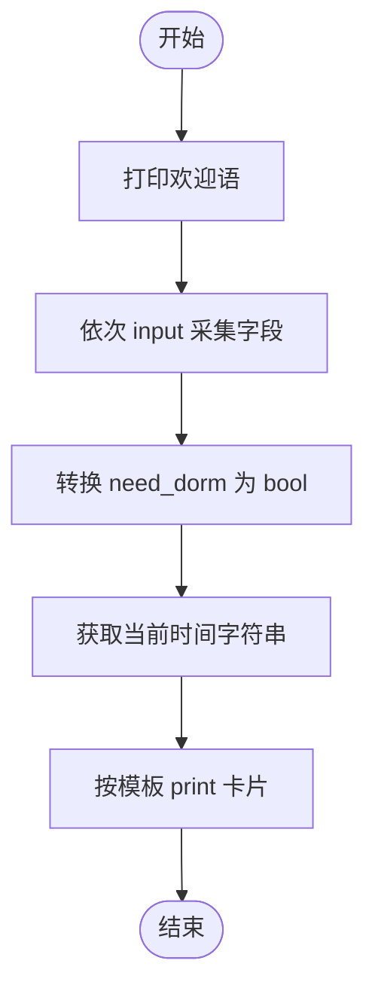

# Day 1 架构与设计 · 入职信息卡片

## 1. 系统边界（v1.0）

本日程序属于 **单机命令行应用**，无网络、无数据库，边界清晰：

```text
┌──────────────────────────────────────────────┐
│              操作系统 (用户终端)               │
│  ┌────────────────────────────────────────┐  │
│  │         personal_info_card.py          │  │
│  │  ┌──────────┐    ┌─────────────────┐  │  │
│  │  │ 输入模块  │───▶│  内存中的变量    │  │  │
│  │  │ input()  │    │  name, phone... │  │  │
│  │  └──────────┘    └────────┬────────┘  │  │
│  │                           │            │  │
│  │                           ▼            │  │
│  │                  ┌─────────────────┐  │  │
│  │                  │  格式化输出模块  │  │  │
│  │                  │  print()        │  │  │
│  │                  └────────┬────────┘  │  │
│  └───────────────────────────┼────────────┘  │
│                              ▼               │
│                     终端屏幕（stdout）        │
└──────────────────────────────────────────────┘
```

与 **Day 24 网页版 Chat** 对比（先建立演进意识）：

| 维度 | Day 1 卡片 | Day 24 Chat |
|------|------------|-------------|
| 输入 | `input()` | 浏览器表单 / SSE |
| 处理 | 变量赋值 | FastAPI + 大模型 API |
| 输出 | `print()` | HTTP 响应流 |
| 状态 | 无持久化 | SQLite 会话 |

## 2. 模块划分

虽 v1.0 为单文件，逻辑上仍分三层，便于 Day 6 函数化重构：

```text
main
 ├── collect_user_input()   # Day6 抽取
 ├── normalize_boolean()    # Day6 抽取
 └── render_card()          # Day6 抽取
```

## 3. 数据模型（概念层）

| 变量名 | Python 类型 | 业务含义 |
|--------|-------------|----------|
| `name` | `str` | 姓名 |
| `employee_id` | `str` | 工号 |
| `department` | `str` | 部门 |
| `onboard_date` | `str` | 入职日期（v1 用字符串） |
| `phone` | `str` | 电话（v1 用字符串防前导 0 丢失） |
| `need_dorm` | `bool` | 是否住宿 |
| `generated_at` | `str` | 卡片生成时间展示用 |

**设计说明**：电话不用 `int`，因为「038」类区号或前导零在整数类型会丢失——这是企业开发常见坑，Day 1 就要建立「**电话、工号、订单号用字符串**」的习惯。

## 4. 控制流（顺序结构）



v1.0 无分支循环；Day 3 将为「输入为空则重新输入」加 `while`。

## 5. 输出模板设计

采用 **固定宽度分隔线 + 中文全角空格对齐标签**，避免 `tab` 在不同终端宽度不一致。

常量建议（见代码 `constants.py`）：

- `CARD_WIDTH = 50`  
- `COMPANY_NAME = "星火科技"`  

## 6. 扩展点（为后续课程预埋）

| 扩展 | 计划日 | 接口预留 |
|------|--------|----------|
| 导出 JSON | Day 5 | 变量 dict 化 |
| 写文件 | Day 11 | `render_card` 返回字符串 |
| 配置部门列表 | Day 4 | `department` 改枚举 list |
| API 提交 | Day 23 | 数据结构用 Pydantic 模型 |

## 7. 部署视图（本日无部署）

```text
开发者笔记本
    └── python3 personal_info_card.py
```

Day 56 同一业务将变为：

```text
Docker 容器
    └── FastAPI 服务 :8000
            └── 前端静态页
```

---

设计评审记录：张工 · 「单文件可以，但注释里写明每段对应 PRD 哪条验收项。」
