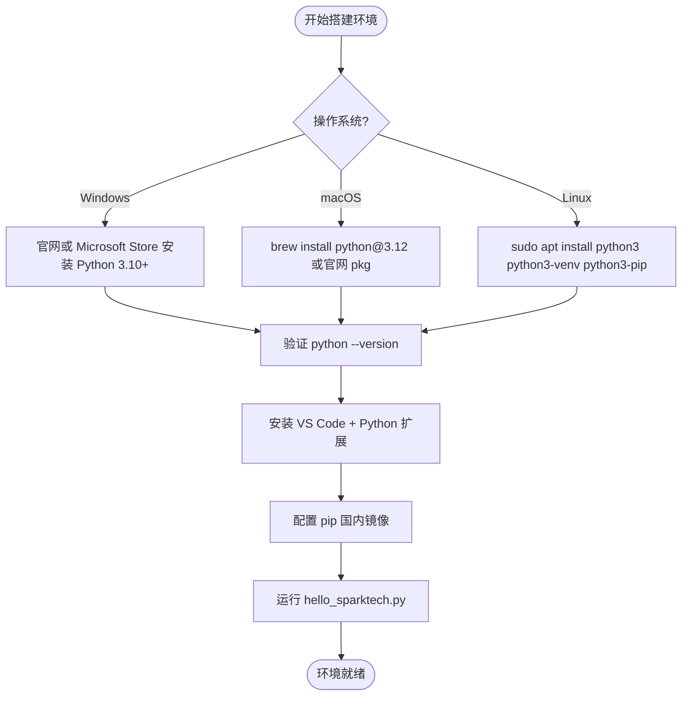
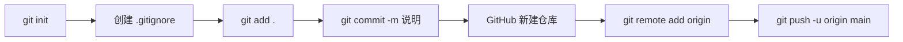

# Day 1 流程图与示意图

## 1. 本日学习时间轴

```mermaid
gantt
    title Day 1 学习时间轴
    dateFormat HH:mm
    axisFormat %H:%M

    section 上午
    行业与岗位认知     :09:00, 90m
    Python安装与验证   :10:30, 90m

    section 下午
    变量与输入输出     :14:00, 90m
    信息卡片实操       :15:30, 120m

    section 晚自习
    Git与首次提交      :19:00, 120m
```



## 2. 开发环境搭建流程



## 3. 程序执行数据流

```text
用户键盘
   │
   ▼
┌─────────┐     ┌─────────────────────────────────────┐
│ input() │────▶│ Python 进程内存                      │
└─────────┘     │  name = "陈晓"                       │
                │  employee_id = "ST-2026-001"         │
                │  ...                                 │
                │  need_dorm = True                    │
                └──────────────────┬──────────────────┘
                                   │
                                   ▼
                          ┌────────────────┐
                          │ f-string 拼接   │
                          │ print() × N    │
                          └────────┬───────┘
                                   ▼
                            终端标准输出
```

## 4. Python 在「星火智服」项目中的位置（总览示意）

```text
                    ┌─────────────────────┐
                    │   企业客户          │
                    │   (浏览器/企微)     │
                    └──────────┬──────────┘
                               │ HTTP
                    ┌──────────▼──────────┐
                    │  FastAPI 后端       │  ← Day 23-24
                    │  (Python)           │
                    └──────────┬──────────┘
           ┌───────────────────┼───────────────────┐
           │                   │                   │
    ┌──────▼──────┐    ┌───────▼───────┐   ┌──────▼──────┐
    │ 向量数据库   │    │ 大模型 API     │   │ 业务数据库   │
    │ Chroma/Milvus│    │ DeepSeek/Qwen │   │ SQLite/PG   │
    └─────────────┘    └───────────────┘   └─────────────┘
         Day 29              Day 12              Day 24

    ═══════════════════════════════════════════════════
    Day 1 你在这里：用 Python 处理「结构化输入输出」
    ═══════════════════════════════════════════════════
```

## 5. Git 首次提交流程（晚自习）



## 6. 变量与类型关系示意图

```text
         Python 对象
              │
    ┌─────────┼─────────┬─────────┐
    │         │         │         │
   int      float      str       bool
    │         │         │         │
  计数      金额      姓名      是否住宿
  token数   API费用   工号      need_dorm
```

## 7. 课堂板书 ASCII：print 做了什么

```text
  print("Hello")
       │
       │  1. 计算括号内表达式 → 得到 str 对象 "Hello"
       │  2. 调用对象的显示逻辑
       │  3. 写入 sys.stdout
       │  4. 默认追加换行符 \n
       ▼
  屏幕: Hello
```

---

以上图示均可直接用于答辩 PPT 或笔记复盘。
