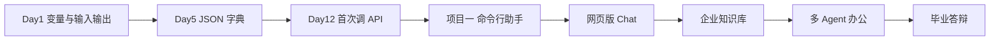

# Day 1 · 入职报到与第一行代码

> **旁白（讲师口吻）**  
> 欢迎加入星火科技。今天不是「学 Python 第一天」这么简单——你是以**大模型应用开发工程师（培训生）**的身份入职的。HR 会在下午五点前收集每个人的「入职信息卡片」电子版，信息科要把这批数据导入员工系统；而你的直属 Leader 张工说得很直白：*「两周后你们要开始调 API，今天先证明你能让电脑听话、能把结构化信息写对。」*  
> 所以 Day 1 的三件事是：**认清行业与岗位**、**把开发环境搭到能交付**、**用变量和输入输出完成第一张信息卡片**。  
> 别小看 `print` 和 `input`——以后你写 Prompt 模板、拼 JSON 请求体、做日志排查，全是同一套「数据进、数据出」思维。

---

## 今日学习地图

| 时段 | 主题 | 产出物 |
|------|------|--------|
| 09:00–10:30 | 行业全景、岗位路径、本课程业务主线 | 学习笔记《我为什么在这》 |
| 10:30–12:00 | Python 3.10+、VS Code、国内镜像 | 可运行 `python --version` |
| 14:00–15:30 | 变量、类型、print/input | `hello_sparktech.py` |
| 15:30–17:30 | 实操：个人信息卡片 v1 | `personal_info_card.py` |
| 19:00–21:00 | Git/GitHub 初始化、首次 commit | 远程仓库第一条记录 |

## 与后续 69 天的衔接

- **今天**：结构化「人」的信息（字符串、数字）  
- **Day 5**：同样的信息变成 **JSON** 发给服务器  
- **Day 12**：`messages` 列表里每一条都是「角色 + 内容」  
- **Day 14**：多轮对话历史就是「列表里套字典」  

## 今日文件清单

| 文件 | 用途 |
|------|------|
| [01_业务背景.md](./01_业务背景.md) | 星火科技入职场景 |
| [02_需求文档.md](./02_需求文档.md) | 信息卡片 PRD |
| [03_架构与设计.md](./03_架构与设计.md) | 程序模块与数据流 |
| [04_课堂讲义.md](./04_课堂讲义.md) | **主课**（环境 + 语法 + 实操） |
| [05_流程图与示意图.md](./05_流程图与示意图.md) | 安装与程序流程图 |
| [06_课后作业.md](./06_课后作业.md) | 必做 / 选做 / 挑战 |
| [07_作业参考答案.md](./07_作业参考答案.md) | 参考答案与讲评要点 |
| [code/](./code/) | 全部示例与作业骨架 |

## 今日验收标准（对照需求文档）

- [ ] 本机 `python3 --version` ≥ 3.10  
- [ ] VS Code 能运行并调试一个 `.py` 文件  
- [ ] `personal_info_card.py` 运行后生成格式正确的终端输出  
- [ ] Git 仓库已创建并完成至少 1 次有意义的 commit  
- [ ] 能用自己的话说明：大模型应用开发工程师日常做哪三类事  

---

**讲师提醒**：慢就是快。环境出问题很正常，把报错原文复制到笔记里，这是以后调 API 的必备习惯。
