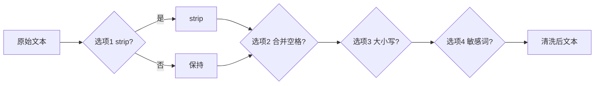

# Day 2 架构与设计 · 文本清洗流水线

## 1. 总体架构

```text
┌─────────────────────────────────────────────────┐
│                  text_cleaner.py                   │
│  ┌─────────────┐   ┌──────────────┐   ┌─────────┐ │
│  │ CLI 菜单    │──▶│ Pipeline     │──▶│ Report  │ │
│  │ read_lines  │   │ apply_steps  │   │ f-string│ │
│  └─────────────┘   └──────┬───────┘   └─────────┘ │
└───────────────────────────┼─────────────────────────┘
                            │
              ┌─────────────┼─────────────┐
              ▼             ▼             ▼
        cleaners.py   sensitive_words   constants.py
        纯函数库       .txt 词表         选项枚举
```

## 2. 清洗流水线（Pipeline）



**设计原则**：每一步接收 `str`、返回 `str`，可组合、可单测——与 Day 26 LCEL 管道思想同构。

## 3. 模块职责

| 模块 | 职责 |
|------|------|
| `constants.py` | `CaseMode` 枚举、菜单文案 |
| `cleaners.py` | `strip_edges`, `collapse_spaces`, `normalize_case`, `mask_sensitive` |
| `text_cleaner.py` | 交互与 pipeline 编排 |
| `operators_demo.py` | 教学：算术/比较/逻辑运算符 |
| `string_methods_demo.py` | 教学：索引/切片/方法 |

## 4. 数据流

```text
用户粘贴:
  "  CHENXIAO  \n138 0013 8000"

read_multiline_input() -> str

apply_pipeline(text, flags) -> str
  step1: strip_edges
  step2: collapse_spaces  -> "CHENXIAO\n138 0013 8000" 仍含内部空格
  step3: title case       -> "Chenxiao\n138 0013 8000"
  step4: (手机号行单独处理见作业)

format_report(before, after) -> 打印
```

## 5. 与 Day 1 集成点

Day 1 `personal_info_card.py` 在 Day 6 重构时改为：

```python
from cleaners import strip_edges, collapse_spaces

name = strip_edges(input(PROMPT_NAME))
```

今日在 `integration_example.py` 中演示调用方式。

## 6. 扩展预留

| 扩展 | 日期 | 说明 |
|------|------|------|
| 正则清洗 | Day 11 | `re.sub` 替换简易 split 逻辑 |
| 批量文件 | Day 11 | 读 csv 列清洗 |
| Prompt 模板 | Day 17 | f-string 抽成 template 文件 |
