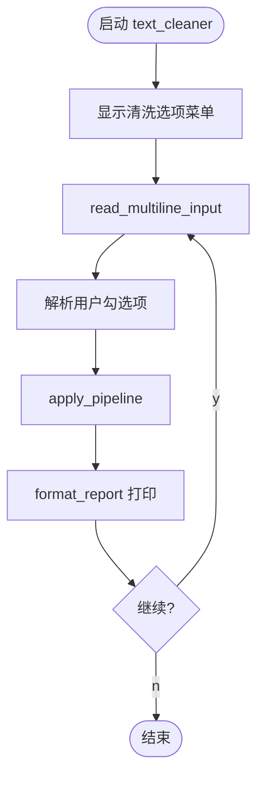
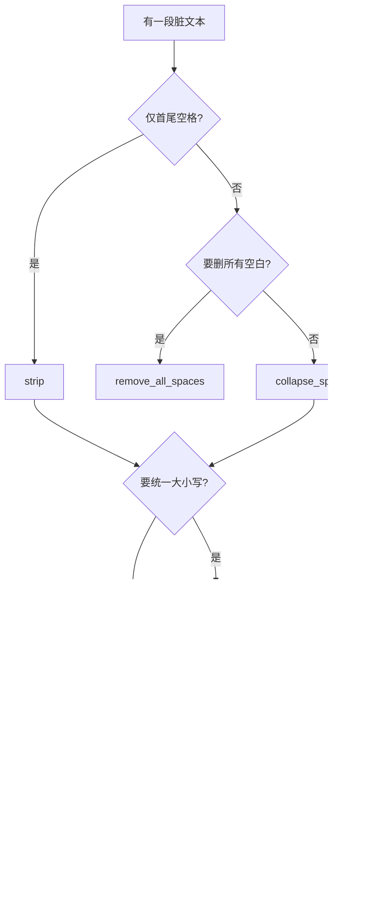
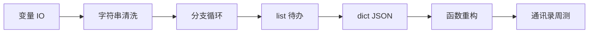

# Day 2 流程图与示意图

## 1. 清洗流水线



## 2. 字符串方法决策树



## 3. 运算符与 API 参数（超前示意）

```text
  temperature = 0.7  ──▶  float  ──▶  API JSON 字段
  max_tokens = 1024  ──▶  int    ──▶  控制生成长度
  stream = True      ──▶  bool   ──▶  是否流式
```

## 4. f-string 在 Prompt 中的数据流

```text
  variables: context, question
           │
           ▼
  f"""...{context}...{question}..."""
           │
           ▼
  完整 Prompt 字符串 ──▶ Day12 API messages[].content
```

## 5. 七日学习链（第一周）


