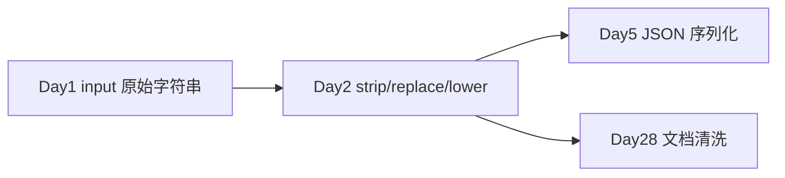

# Day 2 · 运算符与字符串 · 文本清洗小工具

> **旁白**  
> 昨天 HR 收上来的入职卡片里，出现了「 陈晓 」「CHENXIAO」「138 0013 8000」等脏数据，信息科导入失败了一半。  
> 张工把你叫过去：「今天别写新功能，先把**字符串洗干净** —— 以后 RAG 切文档、洗网页、拼 Prompt 全是这活。」  
> Day 1 你学会了把数据**存进变量**；Day 2 学会对字符串**做运算和变形**。

## 今日产出

- `text_cleaner.py`：文本清洗 CLI（去空格、大小写、敏感词替换）  
- 为 Day 5 JSON 字段清洗、Day 28 文档预处理埋钩子  

## 学习地图

| 文件 | 内容 |
|------|------|
| [01_业务背景.md](./01_业务背景.md) | 脏数据导致 OA 导入失败事件 |
| [02_需求文档.md](./02_需求文档.md) | 文本清洗工具 PRD |
| [04_课堂讲义.md](./04_课堂讲义.md) | 运算符 + 字符串方法 + f-string 深入 |
| [code/](./code/) | 可运行代码 |

## 与 Day 1 的衔接

**状态**：Day 2 课件与 Day 1 同结构，正文持续扩充中（目标 ≥30000 字）。
