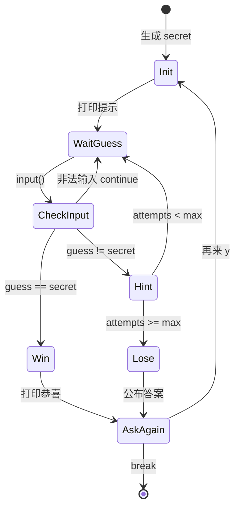

# Day 3 架构与设计 · 培训 CLI 套件

## 1. 总体架构

```text
┌──────────────────────────────────────────────────────────┐
│                    simple_menu.py（主壳）                  │
│  ┌────────────┐   ┌─────────────┐   ┌─────────────────┐  │
│  │ REPL 循环  │──▶│ 命令路由器   │──▶│ 子功能 dispatch │  │
│  │ while True │   │ /exit /clear │   │ 1/2/3/4         │  │
│  └────────────┘   └─────────────┘   └────────┬────────┘  │
└───────────────────────────────────────────────┼────────────┘
                                                │
              ┌─────────────────┬───────────────┼───────────────┐
              ▼                 ▼               ▼               ▼
      guess_number.py   multiplication_table   flow_control   constants.py
      游戏状态机         双重 for 生成器         _demo.py       菜单文案
```

**设计原则**：主菜单只做**路由**；各游戏可独立运行，也可被 `import` 后调用 `main()`——与 Day 6 函数重构、Day 14 插件式命令一致。

## 2. 猜数字状态机



## 3. 命令路由（预埋 Day 14）

```text
用户输入 raw
      │
      ▼
 raw.startswith("/") ?
      │
  ┌───┴───┐
  是      否
  │       │
  ▼       ▼
命令表   数字菜单
/exit    "1" -> guess_number
/clear   "2" -> multiplication_table
/help    ...
```

Day 14 将扩展为：

```python
COMMANDS = {
    "/exit": handle_exit,
    "/clear": handle_clear,
    "/help": handle_help,
    # Day 20+ /save /load
}
```

## 4. 模块职责

| 模块 | 职责 |
|------|------|
| `constants.py` | 菜单项、命令列表、默认 `MAX_ATTEMPTS` |
| `guess_number.py` | `play_round()`, `read_valid_int()` |
| `multiplication_table.py` | `print_full_table()`, `print_row(n)` |
| `simple_menu.py` | REPL、`dispatch_command()`, `clear_screen()` |
| `flow_control_demo.py` | 教学四段，无业务依赖 |

## 5. 数据流 · 猜数字一局

```text
random.randint(1, 100) -> secret = 42

loop attempt in 1..7:
    guess = read_valid_int("请输入: ")
    if guess < secret: print "太小"
    elif guess > secret: print "太大"
    else: print "正确"; break
else:
    print "次数用尽，答案是", secret
```

## 6. 数据流 · 九九表第 i 行

```text
for i in range(1, 10):          # 外层：行号 1..9
    for j in range(1, i + 1):   # 内层：列 1..i（下三角）
        print f"{i}×{j}={i*j}", end="  "
    print()                     # 换行
```

## 7. 与 Day 1 / Day 2 集成点

**Day 1 姓名空输入**（今日修正模式）：

```python
name = ""
while not name.strip():
    name = input("姓名不能为空，请重新输入: ")
name = name.strip()
```

**Day 2 清洗工具** 的 `while True` 读多行已是循环预习；今日学显式 `break` 条件。

## 8. 扩展预留

| 扩展 | 日期 | 说明 |
|------|------|------|
| list 存历史猜测 | Day 4 | `guesses.append(guess)` |
| 函数抽取 `read_int` | Day 6 | 三件套共用输入校验 |
| `/clear` 清对话历史 | Day 14 | `messages.clear()` |
| 异常 `try/except` | Day 8 | 替代手工 `isdigit` 校验 |
