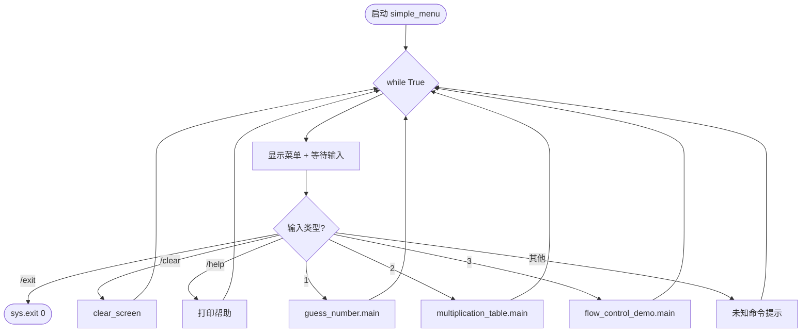
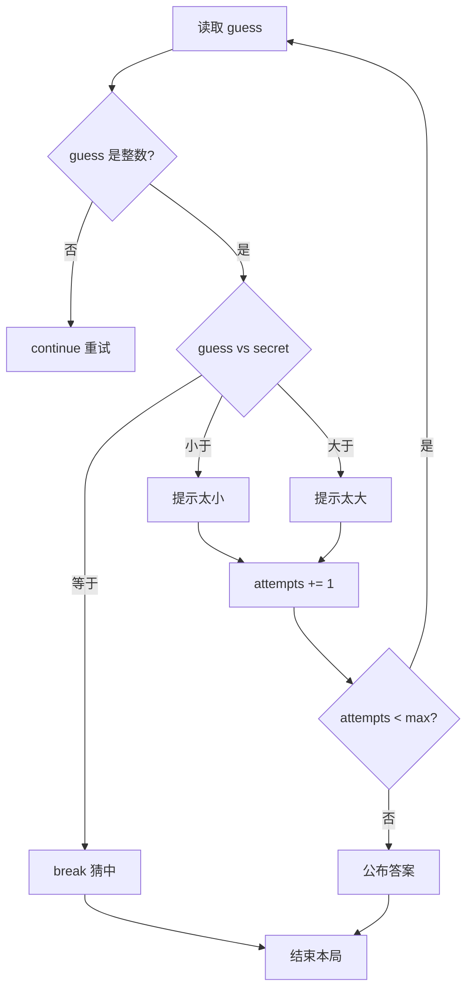
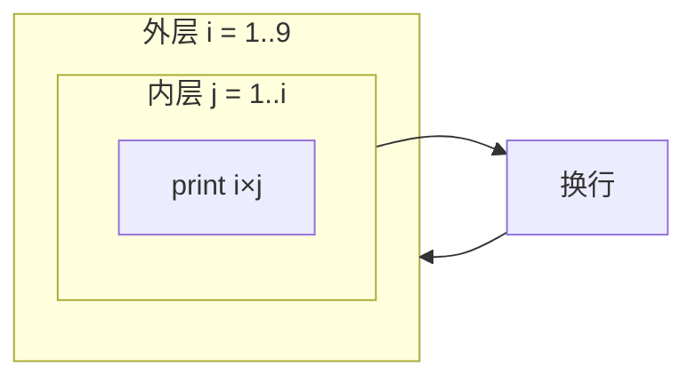
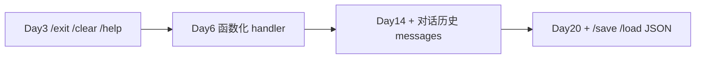
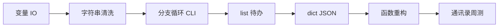
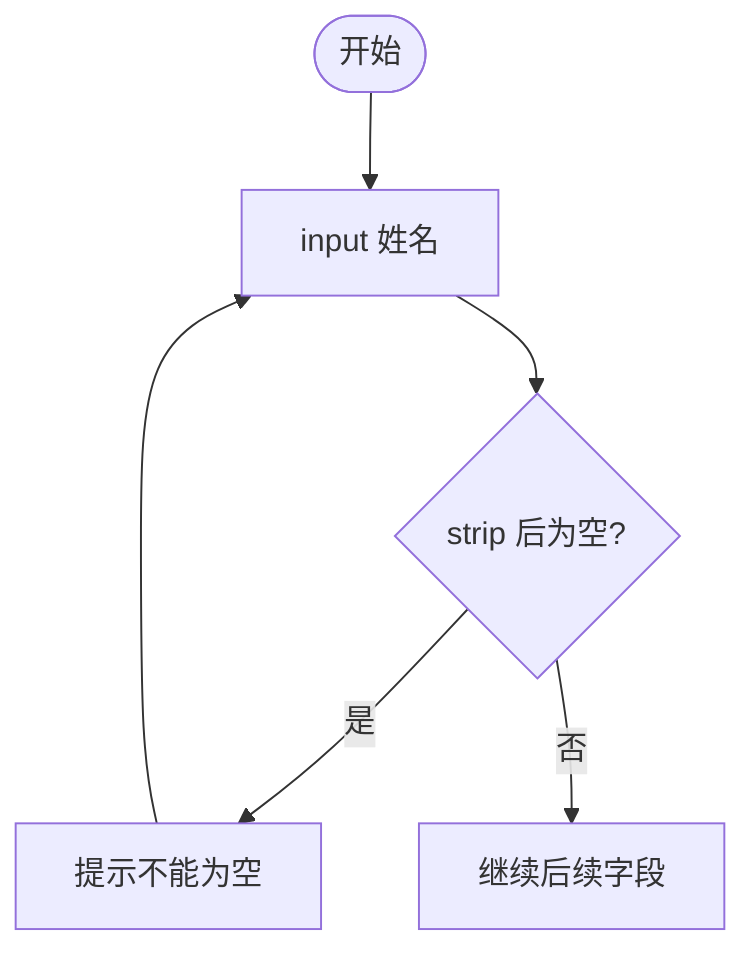

# Day 3 流程图与示意图

## 1. 主菜单 REPL



## 2. if / elif / else 决策



## 3. for 循环 · 九九表

```text
i = 1 ──▶ j: 1 ──▶ 打印 1×1=1
          │
i = 2 ──▶ j: 1,2 ──▶ 打印 2×1=4  2×2=4
          │
i = 3 ──▶ j: 1,2,3
          │
  ... 直到 i = 9
```



## 4. break vs continue

```text
  for i in range(10):
      if i % 2 == 0:
          continue    ──▶ 跳过本次，i+1 继续
      if i == 7:
          break       ──▶ 整个循环结束
      print(i)

  输出: 1 3 5 7  （7 时 break，不打印 7）
```

| 关键字 | 作用范围 | 典型场景 |
|--------|----------|----------|
| `continue` | 跳过**当前这一次**迭代 | 非法输入不计次 |
| `break` | 跳出**整个**循环 | 猜中、用户 `/exit` |

## 5. range 三种形式

```text
range(5)        → 0, 1, 2, 3, 4
range(2, 6)     → 2, 3, 4, 5
range(0, 10, 2) → 0, 2, 4, 6, 8
```

业务映射：

- `range(1, 10)`：九九表行号  
- `range(max_attempts)`：固定次数尝试（0 起算需注意 +1 显示）  
- `range(len(items))`：Day 4 遍历 list 下标  

## 6. Day 3 → Day 14 命令体系演进



```text
  Day 3  simple_menu:
           if raw == "/exit": break

  Day 14 chat_assistant:
           if raw == "/clear":
               messages.clear()
           elif raw == "/exit":
               break
           else:
               messages.append({"role":"user","content":raw})
               reply = call_api(messages)
```

## 7. 第一周学习链（更新）



## 8. 嵌套条件示意 · 成绩 + 补考

```text
           score
             │
             ▼
        score >= 60 ?
        /          \
      是            否
      │              │
  grade A/B/C    makeup >= 60 ?
  (嵌套 if)      /            \
               是              否
            补考及格          不及格
```

## 9. while 空输入重试（修复 Day 1）



---

*示意图可直接用于集训 PPT 与答辩材料。*
