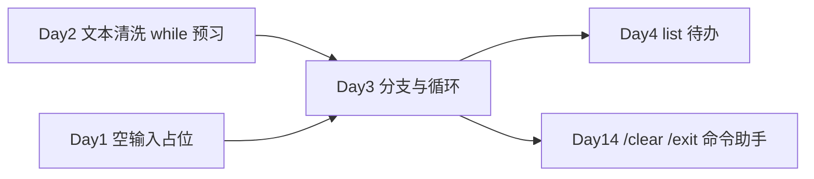

# Day 3 · 分支与循环 · 内部培训 CLI 小游戏套件

> **旁白**  
> Day 2 你把脏文本洗干净了，王工导入顺利。张工在站会上说：「清洗工具是**批处理**；但新人培训、内部演练需要**能反复玩的交互程序**——猜数字练逻辑、九九表练循环、菜单练命令分发。今天做三个 CLI 小游戏，菜单里先预埋 `/clear`、`/exit` 的写法，两周后 Day 14 命令行 AI 助手会原样升级。」  
> Day 1 你学会了**存数据**；Day 2 学会了**洗字符串**；Day 3 学会让程序**根据条件走不同路、反复执行直到用户满意**。

## 今日产出

- `guess_number.py`：猜数字培训游戏（`while` + 分支提示）  
- `multiplication_table.py`：九九乘法表生成器（`for` + `range`）  
- `simple_menu.py`：星火智服内部菜单壳（`/clear`、`/exit` 命令预览）  
- `flow_control_demo.py`：上午下午语法速查演示  

## 学习地图

| 文件 | 内容 |
|------|------|
| [01_业务背景.md](./01_业务背景.md) | 培训部要交互小游戏、张工布置 CLI 套件 |
| [02_需求文档.md](./02_需求文档.md) | 三件套 PRD 与验收标准 |
| [03_架构与设计.md](./03_架构与设计.md) | 菜单循环、命令路由、游戏状态机 |
| [04_课堂讲义.md](./04_课堂讲义.md) | if/elif/else、嵌套条件、while/for/range、break/continue |
| [05_流程图与示意图.md](./05_流程图与示意图.md) | 流程图与 Day 14 衔接示意 |
| [code/](./code/) | 可运行代码 |

## 与前后课程的衔接

## 验收清单

- [ ] `flow_control_demo.py` 四段演示全部运行通过  
- [ ] `guess_number.py` 通过 PRD AC-01～AC-03  
- [ ] `multiplication_table.py` 支持标准表与指定行  
- [ ] `simple_menu.py` 识别 `/clear`、`/exit` 与数字菜单  
- [ ] 能口述 `break` 与 `continue` 的区别  
- [ ] 晚间 LeetCode 两题思路写在作业里  
- [ ] 作业已提交 Git  

**状态**：✅ Day 3 完整课件已发布
