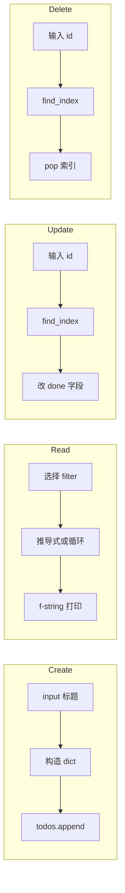
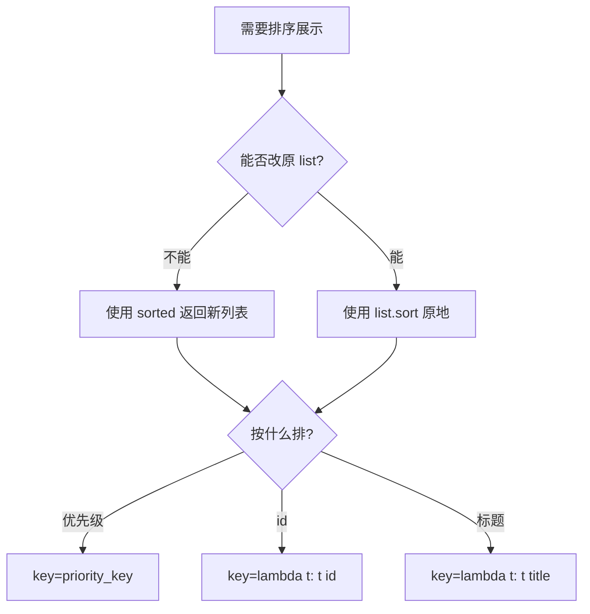
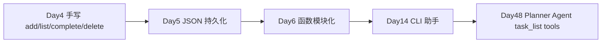
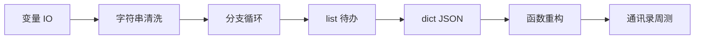

# Day 4 流程图与示意图

## 1. 待办管理器主流程

```mermaid
flowchart TD
    Start([启动 todo_manager]) --> Init[todos=[], next_id=1]
    Init --> Menu[打印菜单 1-4,0]
    Menu --> Input[读取用户选择]
    Input --> Branch{choice}
    Branch -->|1| Add[add_todo: append]
    Branch -->|2| List[list_todos: 过滤+排序+打印]
    Branch -->|3| Complete[complete_todo: done=True]
    Branch -->|4| Delete[delete_todo: pop]
    Branch -->|0| Quit[提示未持久化并退出]
    Branch -->|其他| Invalid[打印无效选项]
    Add --> Menu
    List --> Menu
    Complete --> Menu
    Delete --> Menu
    Invalid --> Menu
    Quit --> End([结束])
```

## 2. 列表 CRUD 与待办业务映射



## 3. 切片与上下文窗口（超前示意）

```text
  messages = [m0, m1, m2, ... m99]
                              │
                              ▼
                    messages[-10:]   # 最近 10 条
                              │
                              ▼
                    拼入 Prompt（Day 15 token 控制）
```

## 4. 排序决策树



## 5. list / tuple / set 选型

```text
        需要容器
            │
    ┌───────┼───────┐
    ▼       ▼       ▼
  要顺序  要固定  要去重
    │       │       │
   list   tuple    set
    │                 │
  todos[]          tags{}
```

## 6. Day 4 → Day 48 Agent 任务链



## 7. 第一周学习链（更新）



## 8. 列表推导式数据流

```text
  todos (list[dict])
        │
        ▼
  [t["title"] for t in todos if not t["done"]]
        │
        ▼
  pending_titles (list[str])  ──▶  统计 / 拼 Prompt / 导出
```
