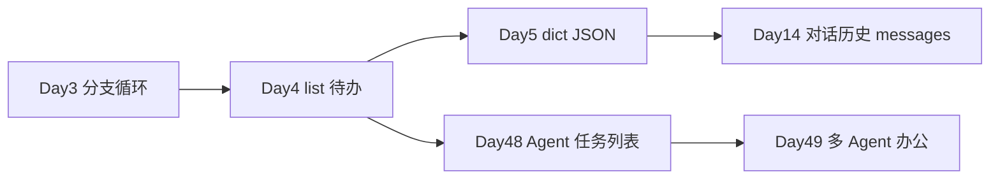

# Day 4 · 列表、元组与集合 · 命令行待办管理器

> **旁白**  
> 周三上午，产品部李姐在站会前二十分钟冲进开放区：「下周 Sprint 规划表还没对齐，研发各自记在微信和便签里，昨天又漏了两条验收标准。」  
> 张工当场拍板：「培训生今天交付一个**内存版待办管理器**——先别接数据库，把 **list 的增删改查**练到肌肉记忆。六周后 Day 48 做 Agent 办公流时，Planner Agent 的任务列表就是今天这个 `todos` 列表的升级版。」  
> Day 3 你学会了用分支和循环控制流程；Day 4 学会用**有序集合**装下一整批任务，并用元组、集合处理不可变配置与标签去重。

## 今日产出

- `list_demo.py`：列表 CRUD、切片、排序、推导式演示  
- `tuple_set_demo.py`：元组不可变、集合去重与集合运算  
- `todo_manager.py`：命令行待办管理器（add / list / complete / delete）  

## 学习地图

| 时段 | 主题 | 产出物 |
|------|------|--------|
| 09:00–10:30 | 列表 CRUD、索引与切片 | `list_demo.py` 前半 |
| 10:30–12:00 | 排序、`sorted`、列表推导式 | `list_demo.py` 后半 |
| 14:00–15:30 | 元组、集合及业务场景 | `tuple_set_demo.py` |
| 15:30–17:30 | 实操：待办管理器 v1 | `todo_manager.py` |
| 19:00–21:00 | 作业与 Git 提交 | `homework/day04/` |

## 与前后课程的衔接

- **今天**：`todos` 列表在内存中管理任务  
- **Day 5**：每条待办序列化成 **JSON** 写入文件  
- **Day 12**：`messages` 列表里每条是「角色 + 内容」  
- **Day 48**：Planner Agent 读写结构化 `task_list`，接口与今日 CRUD 同构  

## 今日文件清单

| 文件 | 用途 |
|------|------|
| [01_业务背景.md](./01_业务背景.md) | Sprint 前内部任务跟踪需求 |
| [02_需求文档.md](./02_需求文档.md) | 待办管理器 PRD |
| [03_架构与设计.md](./03_架构与设计.md) | 数据结构与模块划分 |
| [04_课堂讲义.md](./04_课堂讲义.md) | **主课**（list / tuple / set + 实操） |
| [05_流程图与示意图.md](./05_流程图与示意图.md) | CRUD 与 CLI 流程图 |
| [06_课后作业.md](./06_课后作业.md) | 必做 / 选做 / 挑战 |
| [07_作业参考答案.md](./07_作业参考答案.md) | 参考答案与讲评要点 |
| [08_补充讲义_列表与Agent任务.md](./08_补充讲义_列表与Agent任务.md) | 列表思维与 Agent 任务预告 |
| [code/](./code/) | 全部示例与主程序 |

## 验收清单

- [ ] `list_demo.py` / `tuple_set_demo.py` 运行通过  
- [ ] `todo_manager.py` 通过 PRD AC-01～AC-06  
- [ ] 能口述 list / tuple / set 三者的选用场景  
- [ ] 能解释「列表推导式」与「for 循环 append」的等价关系  
- [ ] 作业已提交 Git  

**状态**：✅ Day 4 完整课件已发布
