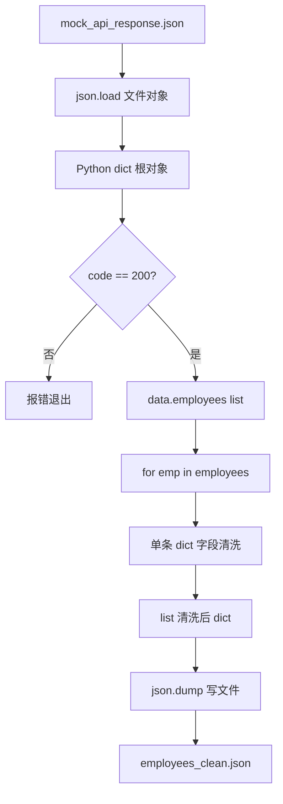
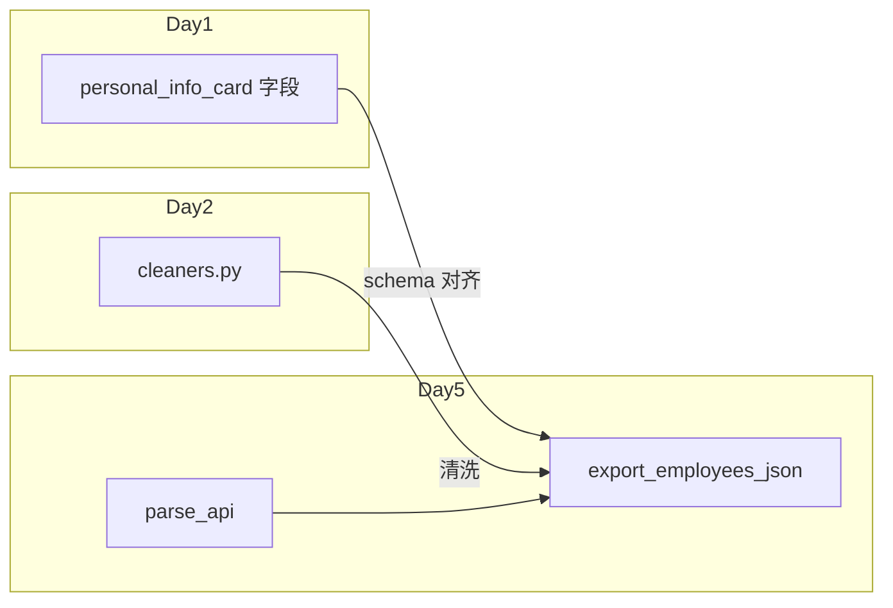

# Day 5 架构与设计 · Mock API 解析与 JSON 导出流水线

## 1. 总体架构

```text
┌──────────────────────────────────────────────────────────────┐
│              export_employees_json.py（编排入口）               │
│  ┌──────────────┐   ┌───────────────┐   ┌─────────────────┐ │
│  │ load_mock    │──▶│ clean_records │──▶│ write_json_file │ │
│  │ parse_api    │   │ + cleaners    │   │ json.dump       │ │
│  └──────┬───────┘   └───────┬───────┘   └─────────────────┘ │
└─────────┼───────────────────┼─────────────────────────────────┘
          │                   │
          ▼                   ▼
   mock_api_response.json   day02/code/cleaners.py
   parse_api.py             strip / upper / remove_all_spaces
```

## 2. 数据流（端到端）



## 3. 模块职责

| 模块 | 职责 | 依赖 |
|------|------|------|
| `dict_demo.py` | 教学：字典 CRUD、嵌套、遍历、JSON 预览 | 无 |
| `mock_api_response.json` | 信息科 Mock 数据源 | 无 |
| `parse_api.py` | 读文件、校验 code、提取 employees | `json`, `pathlib` |
| `export_employees_json.py` | 清洗 + 导出 + 控制台报告 | `parse_api`, `cleaners` |
| `day02/cleaners.py` | 复用 Day 2 清洗函数 | 上游模块 |

## 4. 嵌套字典访问设计

Mock 响应典型路径：

```text
root
 ├── code: 200
 ├── message: "success"
 └── data: dict
      ├── employees: list[dict]   ← 今日主战场
      │    ├── [0].name
      │    ├── [0].employee_id
      │    └── ...
      └── pagination: dict
           ├── page
           └── total
```

**访问策略**（张工规范）：

```python
# 推荐：分层取值，便于报错定位
data = root.get("data") or {}
employees = data.get("employees") or []

# 不推荐：一行链式（中间 None 会 AttributeError）
# employees = root["data"]["employees"]  # data 缺失时崩溃
```

## 5. JSON 序列化设计

| 决策 | 选择 | 原因 |
|------|------|------|
| 缩进 | `indent=2` | 王工人工 diff |
| 中文 | `ensure_ascii=False` | 部门名等保持可读 |
| 键排序 | 默认不排序 | 与源字段顺序一致；Day 10 可改 `sort_keys=True` |
| 换行 | `ensure_ascii=False` 时 UTF-8 写文件 | 避免 `\u4e2d` 转义 |

## 6. 与 Day 1 / Day 2 集成点



Day 1 卡片字段 → Day 5 导出 JSON 的 key 命名保持一致，降低信息科映射成本。

## 7. 扩展预留

| 扩展 | 日期 | 说明 |
|------|------|------|
| `requests.get` 拉取 JSON | Day 12 | `response.json()` 底层即 `loads` |
| 异常类 `ApiError` | Day 9 | 封装 code != 200 |
| Pydantic `Employee` 模型 | Day 23 | 清洗后 `model_validate` |
| 对话历史 JSON 持久化 | Day 14 | 同一套 `dump/load` |
