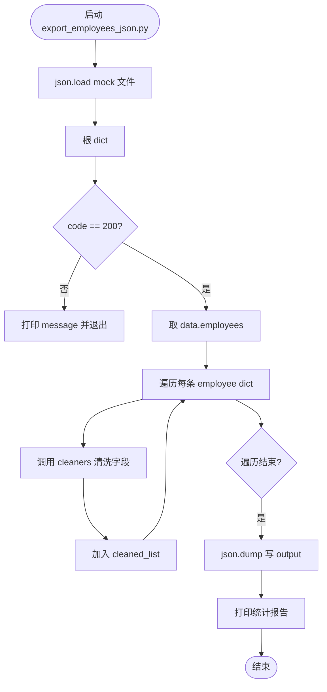
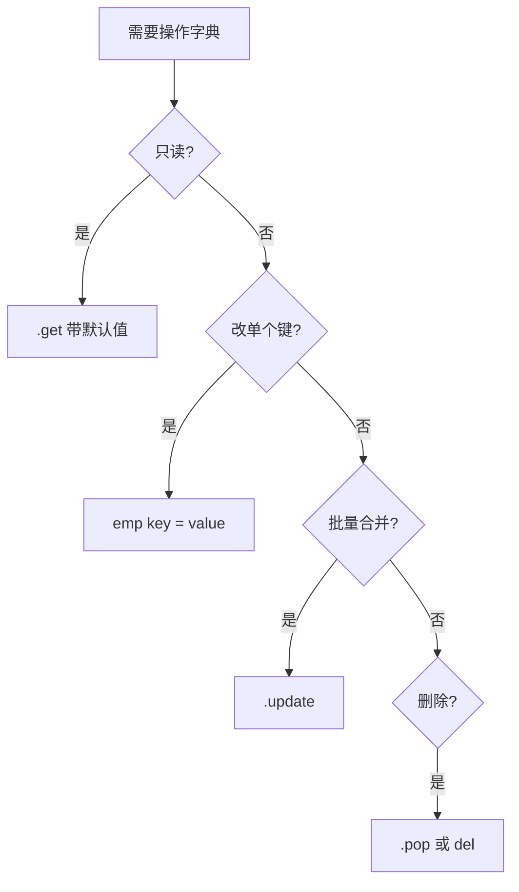
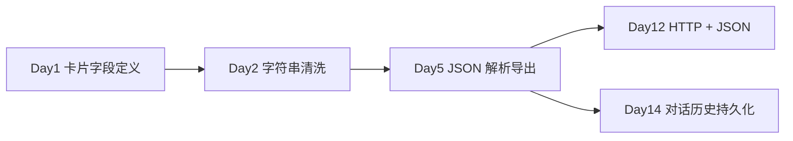
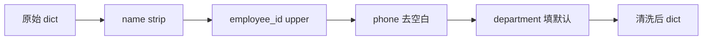
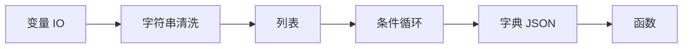

# Day 5 流程图与示意图

## 1. Mock API 解析主流程



## 2. 字典 CRUD 决策树



## 3. JSON 四个 API 选择

```text
  数据在哪？
       │
       ├─ 内存里的 str ──────▶  json.loads / json.dumps
       │
       └─ 磁盘上的文件 ──────▶  json.load  / json.dump
```

## 4. 嵌套结构解剖图

```text
mock_api_response.json
│
├─ code: int
├─ message: str
└─ data: dict ─────────────────┐
     ├─ employees: list ────┐   │
     │    ├─ [0]: dict      │   │  今日主要遍历区
     │    │    ├─ name      │   │
     │    │    ├─ employee_id
     │    │    └─ phone     │   │
     │    └─ [1]: dict ...  │   │
     └─ pagination: dict    │   │
          ├─ page           │   │
          └─ total          │   │
```

## 5. Day 1 → Day 2 → Day 5 业务链



## 6. 清洗流水线（单条 employee）



## 7. loads 与 load 对比（ASCII）

```text
  ┌─────────────┐     json.load      ┌──────────────┐
  │  .json 文件  │ ─────────────────▶ │ Python dict  │
  └─────────────┘      (文件对象)      └──────────────┘

  ┌─────────────┐     json.loads     ┌──────────────┐
  │ JSON 字符串  │ ─────────────────▶ │ Python dict  │
  └─────────────┘      (str)          └──────────────┘
```

## 8. 第一周学习链（更新）


