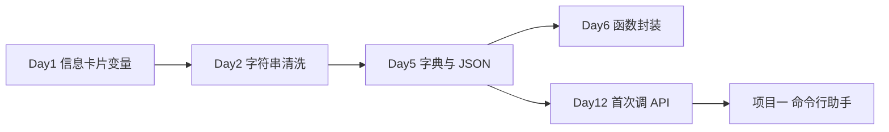

# Day 5 · 字典与 JSON · 员工 API 数据解析导出

> **旁白（讲师口吻）**  
> Day 1 你把「人」的信息写进变量，打印成卡片；Day 2 你学会了把脏字符串洗干净。  
> 今天信息科王工发来一封邮件：*「OA 对接接口还没开放，先用这份 **Mock API JSON** 做联调。你们把里面的员工记录解析出来，字段洗干净，导出成标准 JSON 文件——下午五点前给我。」*  
> 张工补充：*「HTTP 请求体、模型 API 的 `messages`、RAG 检索结果的 metadata，底层全是 **字典 + JSON**。今天把这两样练透，Day 12 调真 API 才不会懵。」*

---

## 今日学习地图

| 时段 | 主题 | 产出物 |
|------|------|--------|
| 09:00–10:30 | 字典 CRUD：增删改查、`.get()`、`.update()` | `dict_demo.py` 第一节 |
| 10:30–12:00 | 嵌套字典、遍历 `keys/values/items` | `dict_demo.py` 第二节 |
| 14:00–15:30 | JSON 格式详解；`loads/dumps` vs `load/dump` | 课堂笔记 + 讲义第四章 |
| 15:30–17:30 | 实操：解析 Mock API、清洗、导出 | `parse_api.py` + `export_employees_json.py` |
| 19:00–21:00 | 作业 + Git commit | `homework/day05/` |

## 与前后课程的衔接

| 前序能力 | 今日用法 |
|----------|----------|
| Day 1 `personal_info_card.py` 字段 | 今日导出 JSON 的字段 schema 与之对齐 |
| Day 2 `cleaners.py` | 解析 API 后对 `name`、`phone` 等字段调用清洗 |
| Day 4 列表（预习） | `data["employees"]` 是 **list[dict]**，下午会遍历 |

## 今日文件清单

| 文件 | 用途 |
|------|------|
| [01_业务背景.md](./01_业务背景.md) | 信息科 Mock API 联调场景 |
| [02_需求文档.md](./02_需求文档.md) | 员工 JSON 导出 PRD |
| [03_架构与设计.md](./03_架构与设计.md) | 解析流水线与模块划分 |
| [04_课堂讲义.md](./04_课堂讲义.md) | **主课**（字典 + JSON + 实操） |
| [05_流程图与示意图.md](./05_流程图与示意图.md) | 数据流 Mermaid 图 |
| [06_课后作业.md](./06_课后作业.md) | 必做 / 选做 / 挑战 |
| [07_作业参考答案.md](./07_作业参考答案.md) | 参考答案与讲评要点 |
| [08_补充讲义_JSON与API实战.md](./08_补充讲义_JSON与API实战.md) | JSON 坑点、与 HTTP 的关系 |
| [code/](./code/) | 全部示例与作业骨架 |

## 今日验收标准

- [ ] `dict_demo.py` 四段演示均可独立运行并理解输出  
- [ ] 能口述：Python `dict` 与 JSON `object` 的三处关键差异  
- [ ] `parse_api.py` 能从 `mock_api_response.json` 提取 `employees` 列表  
- [ ] `export_employees_json.py` 输出 `output/employees_clean.json`，字段经 Day 2 清洗  
- [ ] 能区分 `json.loads` 与 `json.load` 的入参类型  
- [ ] Git 已提交，commit message 含 `day05`

---

**讲师提醒**：解析 JSON 报错时，先看 **行号与列号**（`JSONDecodeError`），再查是否多了尾逗号、用了单引号、或把 `True` 写成了 `true`——这三类占培训生报错的七成。
