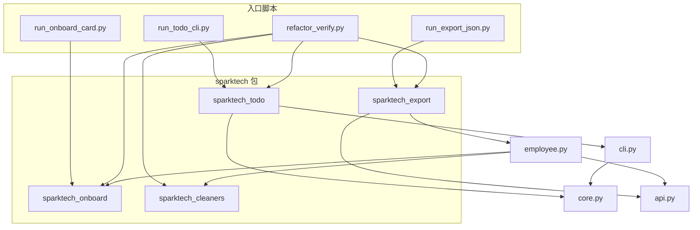

# Day 6 架构与设计 · 四包划分与 import 规范

## 1. 设计原则

张工在评审会上强调三条：

1. **纯函数优先**：`core.py` / `cleaners.py` 只做「输入 → 输出」，不 `print`  
2. **边界清晰**：交互（CLI）、IO（读写文件）、业务逻辑三层分离  
3. **单向依赖**：`export` 可依赖 `cleaners` 和 `onboard`，但 `cleaners` 不得依赖 `export`  

## 2. 包依赖图



## 3. 模块职责表

| 包 | 模块 | 职责 | 副作用 |
|----|------|------|--------|
| `sparktech_onboard` | `constants.py` | 文案与业务常量 | 无 |
| | `card.py` | 卡片采集与渲染 | `collect_inputs` 有 input |
| `sparktech_cleaners` | `constants.py` | CaseMode 枚举 | 无 |
| | `cleaners.py` | 字符串变换 | `load_sensitive_words` 读文件 |
| `sparktech_todo` | `core.py` | 待办 CRUD 纯函数 | 修改传入的 list（可变状态） |
| | `cli.py` | 终端菜单循环 | input/print |
| `sparktech_export` | `api.py` | JSON 解析 | `load_mock_response` 读文件 |
| | `employee.py` | 清洗与导出 | `write_employees_json` 写文件 |

## 4. 与 Day 1–5 文件映射

| 原文件 | 新位置 | 变更说明 |
|--------|--------|----------|
| `day01/constants.py` | `sparktech_onboard/constants.py` | 原样迁移 |
| `day01/personal_info_card.py` | `sparktech_onboard/card.py` | 相对 import；新增 `card_to_dict` |
| `day02/cleaners.py` | `sparktech_cleaners/cleaners.py` | 相对 import constants |
| `day02/data/sensitive_words.txt` | `sparktech_cleaners/data/` | 复制 |
| `day04/todo_manager.py` | `sparktech_todo/core.py` + `cli.py` | 拆分纯函数与交互 |
| `day05/parse_api.py` | `sparktech_export/api.py` | mock 路径改指向 `code/data/` |
| `day05/export_employees_json.py` | `sparktech_export/employee.py` | import 包而非 sys.path |

## 5. import 规范

### 5.1 包内（相对导入）

```python
# sparktech_onboard/card.py
from .constants import COMPANY_NAME

# sparktech_export/employee.py
from .api import parse_employees_from_file
from sparktech_cleaners import strip_edges
from sparktech_onboard import DEFAULT_DEPARTMENT
```

### 5.2 入口脚本（绝对导入 + path）

```python
import sys
from pathlib import Path
sys.path.insert(0, str(Path(__file__).resolve().parent))

from sparktech_export import export_employees_from_mock
```

> Day 10 将学习正式安装 editable package，届时可删除 `sys.path.insert`。

### 5.3 公开 API（`__init__.py`）

每个包的 `__all__` 列出允许外部 `from package import *` 的名称。培训生代码审查时，**只允许 import `__all__` 中的符号**。

## 6. 函数分层模式（重点）

```text
┌─────────────────────────────────────┐
│  CLI 层 (cli.py / run_*.py)         │  input / print / while
├─────────────────────────────────────┤
│  业务层 (core.py / card.py / ...)   │  纯逻辑，可单测
├─────────────────────────────────────┤
│  IO 层 (api.py / write_* )          │  读写文件，边界集中
└─────────────────────────────────────┘
```

**Day 4 反例**：`complete_todo` 里 `print` → Day 6 改为返回 `(bool, str)`，由 `cli.py` 打印。

## 7. 数据流：JSON 导出

```text
mock_api_response.json
        │
        ▼ load_mock_response()
   root: dict
        │
        ▼ extract_employees()
   raw: list[dict]
        │
        ▼ clean_employee() × N
        │    ├─ sparktech_cleaners.strip_edges
        │    ├─ sparktech_cleaners.normalize_case
        │    └─ sparktech_onboard.DEFAULT_DEPARTMENT
        ▼
   cleaned: list[dict]
        │
        ▼ write_employees_json()
employees_clean.json
```

## 8. 扩展预留

| 位置 | Day 14 扩展 |
|------|-------------|
| `sparktech_onboard/card_to_dict` | 助手 `/onboard` 子命令输出 JSON |
| `sparktech_cleaners.apply_pipeline` | 清洗用户 Prompt |
| `sparktech_todo.core` | Agent `create_task` tool |
| `sparktech_export` | 批量导入员工到助手上下文 |

---

**状态**：✅ 架构设计定稿
