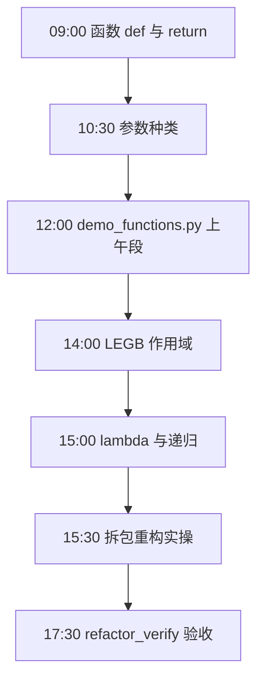
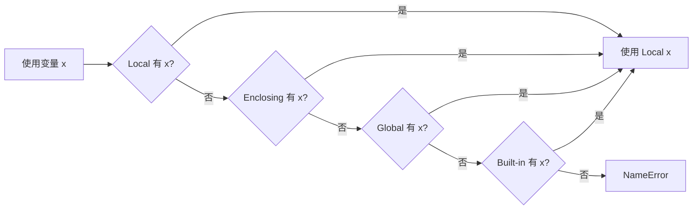
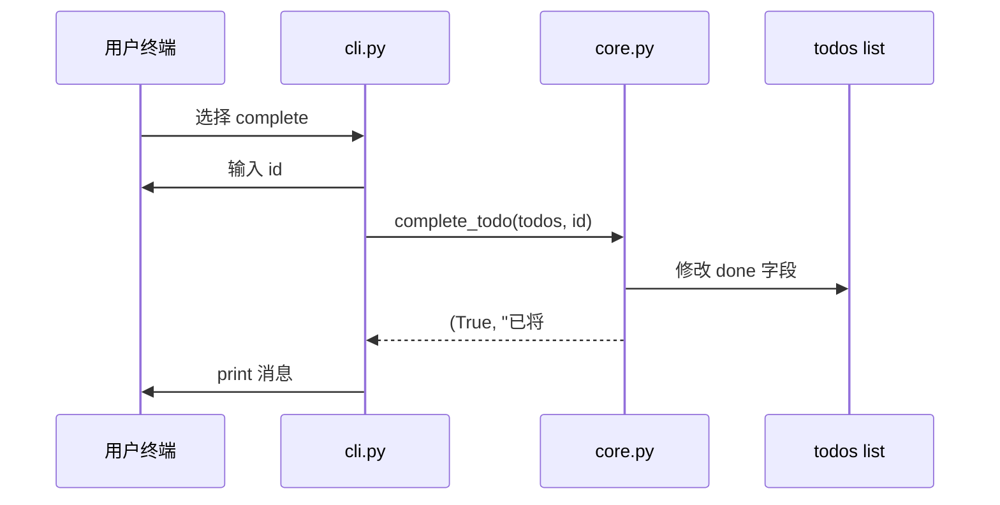
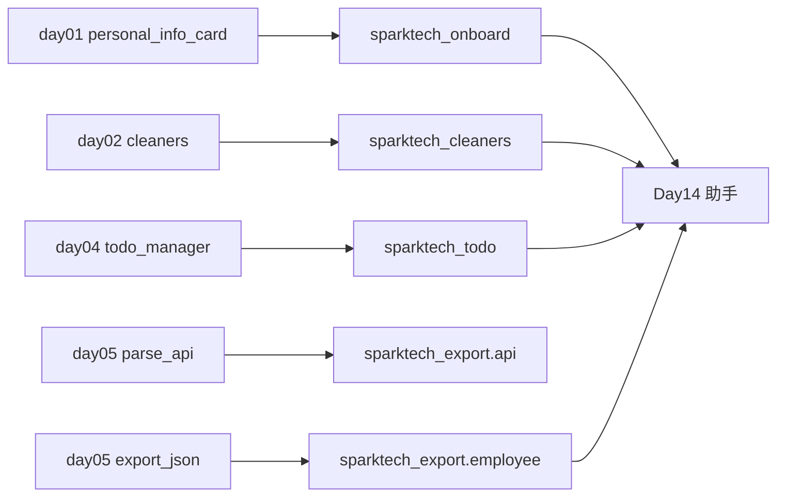

# Day 6 流程图与示意图

## 1. 一日学习流程



## 2. 函数调用栈示意

```text
run_export_json.py
    │
    ├─ export_employees_from_mock()
    │       │
    │       ├─ parse_employees_from_file()  [api.py]
    │       │       ├─ load_mock_response()
    │       │       ├─ assert_api_success()
    │       │       └─ extract_employees()
    │       │
    │       ├─ clean_all_employees()
    │       │       └─ clean_employee() × N
    │       │               ├─ strip_edges()      ← sparktech_cleaners
    │       │               ├─ normalize_case()   ← sparktech_cleaners
    │       │               └─ DEFAULT_DEPARTMENT ← sparktech_onboard
    │       │
    │       └─ write_employees_json()
    │
    └─ build_export_report() → print
```

## 3. LEGB 作用域查找



## 4. 参数种类对照

```text
def demo(a, b, c=1, *args, key_only, **kwargs):

调用示例：
    demo(1, 2)                    → a=1, b=2, c=1
    demo(1, 2, 3)                 → a=1, b=2, c=3
    demo(1, 2, c=3)               → 关键字改 c
    demo(1, 2, 3, 4, 5)           → args=(4, 5)
    demo(1, 2, key_only="x")      → 必须关键字
    demo(1, 2, extra="y")         → kwargs={'extra':'y'}
```

## 5. 待办 CLI 与 core 分层



## 6. 递归 factorial(3) 展开

```text
factorial(3)
  → 3 * factorial(2)
        → 2 * factorial(1)
              → 1          ← 基线条件
        → 2 * 1 = 2
  → 3 * 2 = 6
```

## 7. 包目录树（验收用）

```text
day06/code/
├── sparktech_onboard/
│   ├── __init__.py
│   ├── constants.py
│   └── card.py
├── sparktech_cleaners/
│   ├── __init__.py
│   ├── constants.py
│   ├── cleaners.py
│   └── data/sensitive_words.txt
├── sparktech_todo/
│   ├── __init__.py
│   ├── core.py
│   └── cli.py
├── sparktech_export/
│   ├── __init__.py
│   ├── api.py
│   └── employee.py
├── data/mock_api_response.json
├── output/employees_clean.json
├── demo_functions.py
├── refactor_verify.py
├── run_onboard_card.py
├── run_todo_cli.py
└── run_export_json.py
```

## 8. Day 1–5 → Day 6 迁移路径



---

**状态**：✅ 流程图定稿
