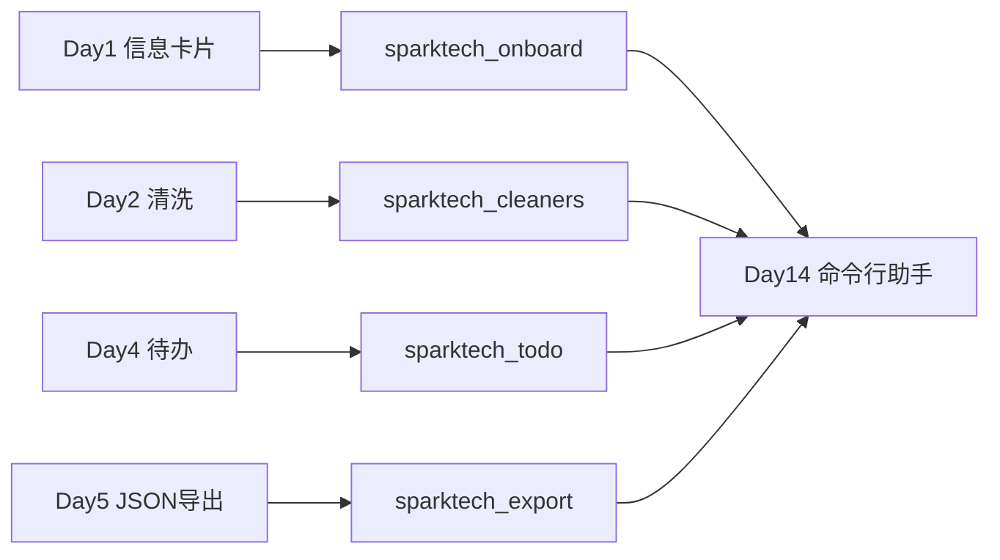

# Day 6 · 函数与作用域 · Day 1–5 脚本包化重构

> **旁白（讲师口吻）**  
> 周五下午，张工在群里甩出一张 Code Review 截图：五个 `.py` 单文件脚本堆在 `code/` 根目录，函数互相 `sys.path.insert` 硬蹭 Day 2 的 `cleaners.py`。  
> 他在语音里只说了一句：*「Day 14 要上命令行 AI 助手，模块必须能 `import`。今天把 **函数** 写规范，把 **Day 1–5 的小项目拆成包**——下周一我验收目录结构。」*  
> 上午学「怎么写函数」；下午学「函数活在哪一层作用域」；全天动手把 `personal_info_card`、`cleaners`、`todo_manager`、`export_employees_json` 迁进 `sparktech_*` 包。

---

## 今日学习地图

| 时段 | 主题 | 产出物 |
|------|------|--------|
| 09:00–10:30 | 函数定义、`def`、文档字符串、返回值 | `demo_functions.py` 第一节 |
| 10:30–12:00 | 参数：位置 / 关键字 / 默认 / `*args` / `**kwargs` | `demo_functions.py` 第二节 |
| 14:00–15:30 | 作用域 LEGB、`global`/`nonlocal`、lambda | `demo_functions.py` 第三～四节 |
| 15:30–17:30 | 实操：Day 1–5 拆包重构 | `sparktech_*` 四个包 + 验收脚本 |
| 19:00–21:00 | 作业 + Git commit | `homework/day06/` |

## 与前后课程的衔接



| 前序脚本 | Day 6 包 | Day 14 用法 |
|----------|----------|-------------|
| `day01/personal_info_card.py` | `sparktech_onboard` | 助手读取员工 schema |
| `day02/cleaners.py` | `sparktech_cleaners` | Prompt / 用户输入清洗 |
| `day04/todo_manager.py` | `sparktech_todo` | 任务列表 CRUD 工具 |
| `day05/export_employees_json.py` | `sparktech_export` | Mock 数据管道 |

## 今日文件清单

| 文件 | 用途 |
|------|------|
| [01_业务背景.md](./01_业务背景.md) | 张工 Code Review 与包化 deadline |
| [02_需求文档.md](./02_需求文档.md) | 包重构 PRD |
| [03_架构与设计.md](./03_架构与设计.md) | 四包划分与 import 规范 |
| [04_课堂讲义.md](./04_课堂讲义.md) | **主课**（函数 + 作用域 + 重构实操） |
| [05_流程图与示意图.md](./05_流程图与示意图.md) | 调用链与 LEGB 示意图 |
| [06_课后作业.md](./06_课后作业.md) | 必做 / 选做 / 挑战 |
| [07_作业参考答案.md](./07_作业参考答案.md) | 参考答案与讲评要点 |
| [08_补充讲义_作用域与函数式思维.md](./08_补充讲义_作用域与函数式思维.md) | 闭包、纯函数、与 Agent 工具 |
| [code/](./code/) | 演示脚本 + 四个 `sparktech_*` 包 |

## 今日验收标准

- [ ] `demo_functions.py` 六段演示均可运行并口述参数种类  
- [ ] 能画出 LEGB 四层查找顺序  
- [ ] `refactor_verify.py` 四个 `[OK]` 全部通过  
- [ ] `run_export_json.py` 生成 `output/employees_clean.json`  
- [ ] 能解释：为何 `core.py` 不 `print`，`cli.py` 才交互  
- [ ] Git 已提交，commit message 含 `day06`

## 快速开始

```bash
cd day06/code
python3 demo_functions.py          # 上午：函数语法演示
python3 refactor_verify.py       # 下午：包重构验收
python3 run_export_json.py       # 下午：JSON 导出（非交互）
python3 run_onboard_card.py      # 可选：交互式入职卡片
python3 run_todo_cli.py          # 可选：交互式待办 CLI
```

---

**讲师提醒**：重构时先 **复制逻辑、改 import**，再删 `sys.path` 黑魔法。张工验收的第一眼是目录树，第二眼是 `from sparktech_cleaners import strip_edges` 能不能在项目根直接跑通。

**状态**：✅ Day 6 完整课件已发布
