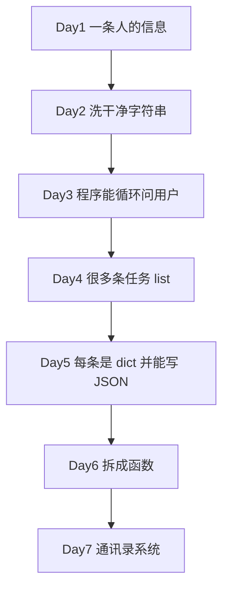

# Day 7 课堂讲义 · Week 1 复盘、周测与通讯录综合实战

> **旁白**：今天是第一周最后一天。上午不赶新语法，把六天的「点」穿成「线」；下午笔试考概念，机试考交付。`address_book.py` 不是新知识点堆叠，而是你已学过的东西的一次总装。

---

## 第一章 · Week 1 知识地图（09:00–10:30）

### 1.1 从「一条信息」到「一个系统」



| Day | 一句话 | 代表文件 |
|-----|--------|----------|
| 1 | 数据有类型，能进能出 | `personal_info_card.py` |
| 2 | 字符串是可加工材料 | `cleaners.py` |
| 3 | 程序能分支、能重复 | `simple_menu.py` |
| 4 | 一批同类记录用 list 管 | `todo_manager.py` |
| 5 | 一条记录是 dict，文件用 JSON | `export_employees_json.py` |
| 6 | 函数让代码可复用可测 | 各日主程序重构 |

### 1.2 通讯录用到的全部语法（对照表）

| 技能 | 在 address_book 中的体现 |
|------|---------------------------|
| 变量 | `contacts`, `next_id`, `dirty` |
| f-string | `format_contact` 输出 |
| `strip` | 姓名、备注清洗 |
| `while True` | 主菜单循环 |
| `if/elif` | 命令路由 |
| `for` | 查找、搜索、统计 |
| `list.append/pop` | 增删联系人 |
| `dict` 键值 | 单条联系人字段 |
| `json.load/dump` | 读写 `contacts.json` |
| `def` + 类型注解 | 全部业务函数 |
| `try/except` | JSON 解析、校验错误 |
| `pathlib.Path` | 跨平台文件路径 |

### 1.3 口试热身（讲师逐题过）

**Q1**：为什么联系人用 `list[dict]` 而不是六个平行 list？

> **参考**：六个 list 要靠相同下标隐式关联，增删时易错位；`dict` 把一条记录字段绑在一起，`list` 装很多条。

**Q2**：`json.load` 和 `json.loads` 区别？

> **参考**：`load` 接收**文件对象**；`loads` 接收 **JSON 字符串**。

**Q3**：Day 4 待办和 Day 7 通讯录最大区别？

> **参考**：通讯录增加 **update 多字段**、**search 关键词**、**JSON 持久化**。

▶ 完整题库：[code/week1_review_quiz.md](./code/week1_review_quiz.md)

---

## 第二章 · 数据模型与 JSON 文件（10:30–11:00）

### 2.1 单条记录

```python
{
    "id": 1,
    "name": "陈晓",
    "phone": "13800138001",
    "email": "chen.xiao@sparktech.cn",
    "department": "大模型应用开发部",
    "notes": "Day1 入职卡片原型负责人",
    "created_at": "2026-07-01T09:00:00+00:00",
    "updated_at": "2026-07-01T09:00:00+00:00",
}
```

### 2.2 文件顶层

必须保存三样东西：

1. `contacts` — 业务数据  
2. `next_id` — 下一个可用编号  
3. `version` / `updated_at` — 元信息（便于排查）

▶ 打开 [code/contacts.json](./code/contacts.json) 对照字段。

### 2.3 加载与保存伪代码

```python
def load_contacts(path):
    if not path.exists():
        return [], 1
    with path.open() as f:
        data = json.load(f)
    return data["contacts"], data["next_id"]

def save_contacts(contacts, next_id, path):
    payload = {"version": "1.0", "next_id": next_id, "contacts": contacts}
    with path.open("w") as f:
        json.dump(payload, f, ensure_ascii=False, indent=2)
```

**讲师强调**：`ensure_ascii=False` 让刘姐用记事本打开也能看见中文部门名。

---

## 第三章 · CRUD 实现要点（11:00–12:00）

### 3.1 Create — add

流程：

1. 读入 → `strip` / 规范化  
2. 校验非空、手机号长度、手机号不重复  
3. 构造 `dict`，`append` 到 `contacts`  
4. `next_id += 1`

```python
record = {
    "id": next_id,
    "name": name,
    "phone": phone,
    # ...
    "created_at": now,
    "updated_at": now,
}
contacts.append(record)
```

### 3.2 Read — list & search

- **list**：排序后遍历打印（Day 4 `list_todos` 同款）  
- **search**：`keyword in field.lower()` 子串匹配（Week 1 不用正则）

```python
def search_contacts(contacts, keyword, field="all"):
    keyword = keyword.strip().lower()
    results = []
    for c in contacts:
        if field == "all":
            text = f"{c['name']} {c['phone']} ...".lower()
            if keyword in text:
                results.append(c)
    return results
```

### 3.3 Update — 部分字段更新

技巧：用 `None` 表示「用户没改这个字段」

```python
def update_contact(contacts, contact_id, *, name=None, phone=None, ...):
    if name is not None:
        item["name"] = validate_name(name)
```

CLI 层：留空不传入，非空才传。

### 3.4 Delete

```python
idx = find_index_by_id(contacts, contact_id)
if idx is not None:
    contacts.pop(idx)
```

与 Day 4 `delete_todo` 同构。

---

## 第四章 · 主循环与自动保存（11:30–12:00）

### 4.1 菜单路由

```python
while True:
    print_menu()
    choice = input("请选择: ").strip().lower()
    if choice in ("0", "quit"):
        save_contacts(...)
        break
    elif choice in ("1", "add"):
        next_id = handle_add(contacts, next_id)
```

支持 **数字** 与 **命令名** 两种输入，与 Day 4 一致。

### 4.2 dirty 标志（教学用）

- 修改数据后 `dirty = True`  
- 手动 `save` 后 `dirty = False`  
- `quit` 时若 `dirty` 则自动保存  

让学员理解：**内存 ≠ 文件**，必须显式序列化。

### 4.3 reload 与确认

重新 `load` 会丢弃未保存修改 → 必须 `input` 确认。  
这是 Day 3 分支 + 产品思维：**破坏性操作要二次确认**。

---

## 第五章 · 下午周测指南（14:00–15:00 笔试）

### 5.1 笔试结构

| 题型 | 题量建议 | 考点 |
|------|----------|------|
| 选择题 | 20 | 类型、语法、JSON |
| 填空题 | 10 | 代码补全 |
| 读代码 | 5 | 输出预测、找 bug |
| 简答 | 2 | list vs dict、持久化流程 |

试卷正文：[code/week1_review_quiz.md](./code/week1_review_quiz.md) 第二、三章。

### 5.2 答题策略

1. 读代码题：在草稿纸 **逐行跟踪变量**  
2. JSON 题：先画 **树形结构** 再写访问路径  
3. 不确定时：想「Day 几讲过」回溯课件  

### 5.3 及格线（讲师课堂公布参考）

| 等级 | 笔试 | 机试 |
|------|------|------|
| 通过 | ≥ 60% | AC 至少过 8/10 |
| 优秀 | ≥ 85% | AC 全过 + 代码有注释 |

未通过：周末完成订正作业，周一前补测。

---

## 第六章 · 机试实操（15:00–17:30）

### 6.1 推荐完成顺序

1. 跑通课堂版 `address_book.py`，理解菜单  
2. 亲手完成一轮：add → list → search → update → save → quit → 重启验证  
3. 若发骨架：先写 `load/save`，再写 `add/delete`，最后 `search/update`  
4. 自测 AC-01～AC-10  

### 6.2 验收演示脚本（讲师用）

```text
1. 启动程序，确认加载 contacts.json 5 条
2. add 新联系人「测试员」
3. search 关键词「测试」
4. update 修改其部门
5. quit 退出
6. 再次启动，确认「测试员」仍在
7. delete 删除「测试员」
8. python3 -m json.tool contacts.json 检查格式
```

### 6.3 常见失分点

| 现象 | 原因 | 修复 |
|------|------|------|
| 重启后数据丢失 | 未 save / 路径错 | 检查 `DEFAULT_DATA_FILE` |
| id 重复 | 未持久化 next_id | 保存顶层 next_id |
| 搜不到 | 忘记 `.lower()` | 统一大小写比较 |
| JSON 报错 | 手写文件语法错 | 用 json.tool 验证 |

---

## 第七章 · 与 Day 8 的衔接

今日 **过程式 + 函数** 写法：

```python
def add_contact(contacts, next_id, name, phone, ...):
    ...
```

Day 8 **面向对象** 预览：

```python
class Contact:
    def __init__(self, id, name, phone, ...):
        ...

class ContactBook:
    def add(self, name, phone, ...):
        ...
```

**今日作业**：阅读 `address_book.py`，用荧光笔标出「将来可以变成方法」的函数。

---

## 第八章 · 答疑速查

| 问题 | 答案 |
|------|------|
| 能否用全局变量代替传参？ | 能，但张工要求函数传 `contacts` 便于 Day 8 封装进类 |
| 搜索要不要正则？ | Week 1 不用，子串足够 |
| 手机号必须 11 位吗？ | 本 PRD 放宽为 7 位数字，便于测试 |
| 作业还要写吗？ | 周测日以订正与总结为主，见 [06_课后作业.md](./06_课后作业.md) |

---

## 第九章 · 今日自检清单

- [ ] 能不看代码口述 `load → CRUD → save` 全流程  
- [ ] 能解释 `next_id` 为何必须写入 JSON  
- [ ] 独立完成 add/search/update/delete 各一次  
- [ ] 笔试错题已记入错题本  
- [ ] Git 提交 Week 1 总结  

**讲师结语**：Week 1 证明你能让 Python 在终端里完成一个小业务。下周开始，同样的通讯录会用 **类** 再写一遍——那时你会体会 OOP 不是语法炫技，而是 **更好的代码组织**。
