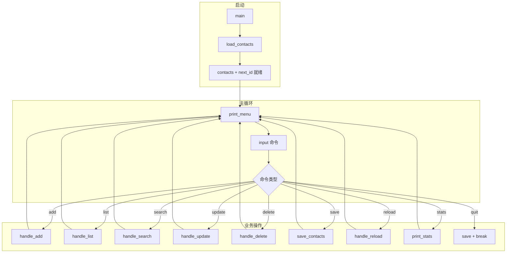
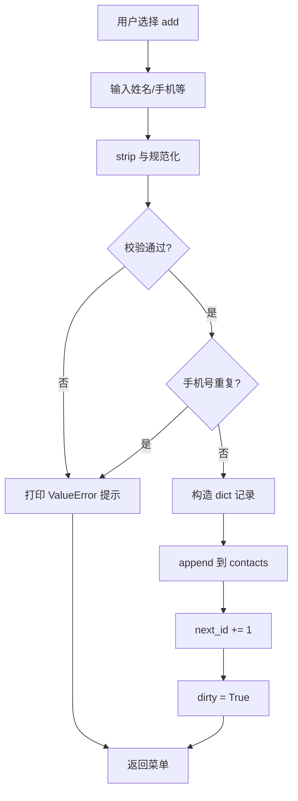
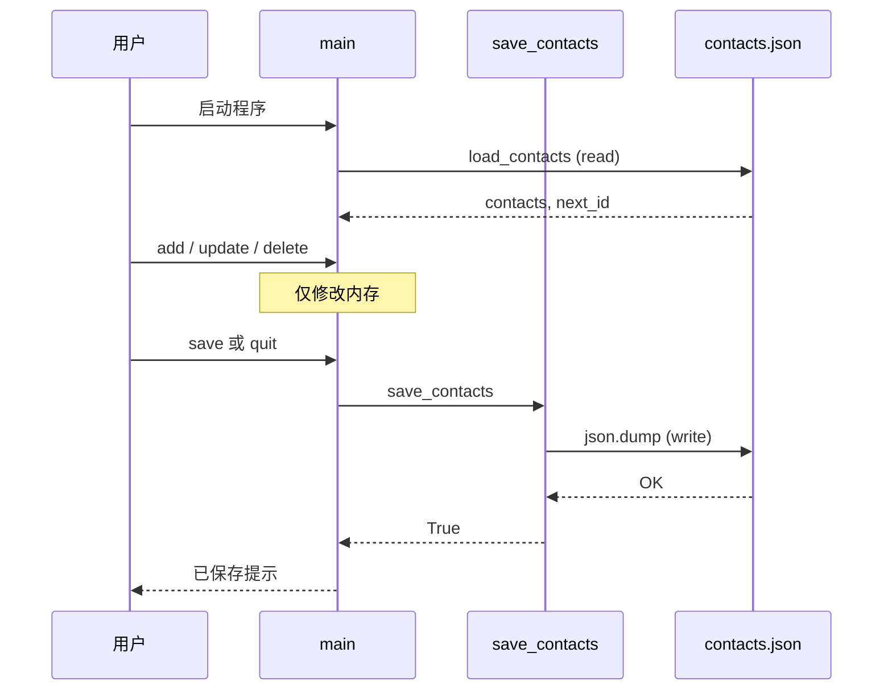
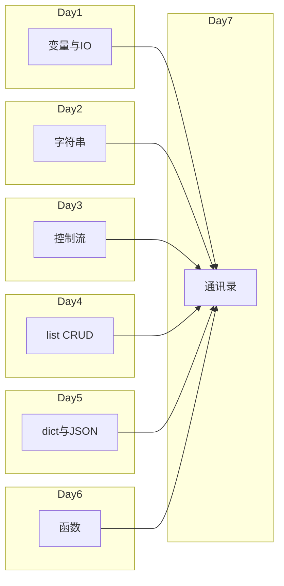
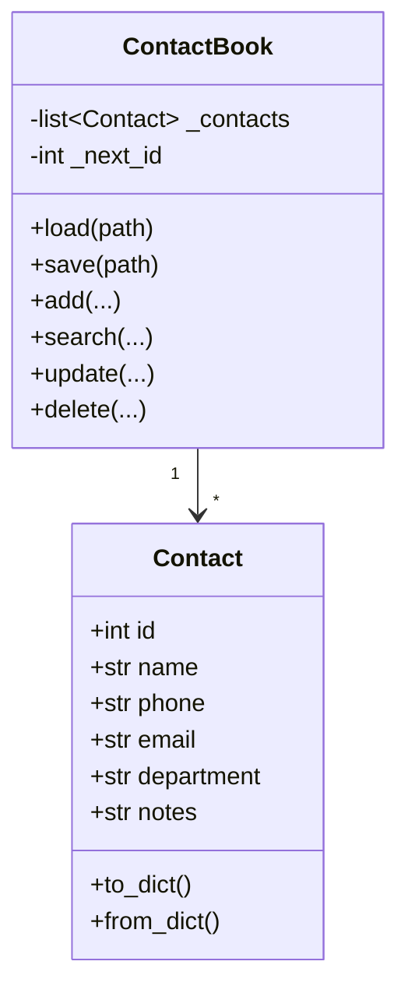

# Day 7 流程图与示意图

## 1. 程序总览



## 2. add 联系人流程



## 3. search 流程

```mermaid
flowchart TD
    A[输入关键词] --> B[选择搜索范围]
    B --> C[keyword.strip.lower]
    C --> D[初始化 results=[]]
    D --> E{遍历 contacts}
    E --> F{field 匹配?}
    F -->|all| G[拼接多字段子串匹配]
    F -->|name/phone/...| H[单字段匹配]
    G --> I{命中?}
    H --> I
    I -->|是| J[append 到 results]
    I -->|否| E
    J --> E
    E -->|结束| K[按 id 排序]
    K --> L[print_contact_table]
```

## 4. JSON 持久化时序



## 5. update 部分字段逻辑

```text
  用户输入 id=3
       │
       ▼
  find_index_by_id ──▶ 找不到 ──▶ 报错返回
       │
       找到 contacts[2]
       │
       ▼
  逐字段询问（留空=跳过）
       │
       ├── 新姓名非空 ──▶ validate_name ──▶ 写入
       ├── 新手机非空 ──▶ 查重 ──▶ 写入
       └── ...
       │
       ▼
  updated_at = now
```

## 6. Week 1 技能依赖图



## 7. 与 Day 4 待办管理器命令对照

```text
  todo_manager          address_book
  ─────────────────────────────────────
  add                   add
  list (+ 过滤)          list (+ 排序)
  complete              (无，改为 update 多字段)
  delete                delete
  stats (完成率)         stats (部门人数)
  (无)                  search
  (无)                  save / reload
  quit (不保存)          quit (自动保存)
```

## 8. 机试验收路径（讲师白板）

```text
  启动 → 有数据
    → add 一条
    → search 命中
    → update 改部门
    → list 可见
    → quit
    → 重启仍在
    → json.tool 通过
    → 满分路径 ✓
```

## 9. Day 8 OOP 重构映射（预告）



今日函数名与明日类方法一一对应，降低迁移成本。
