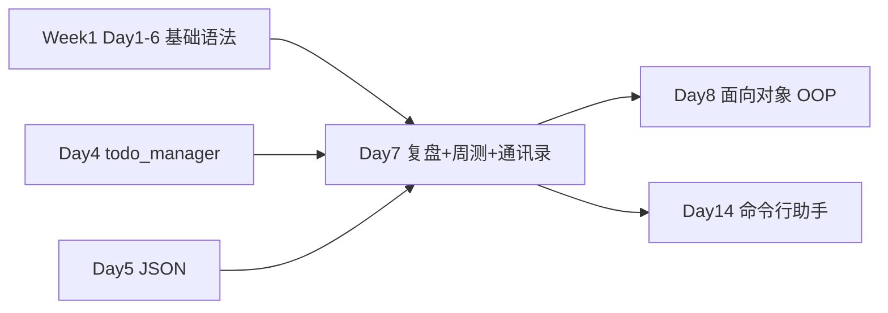

# Day 7 · 第一周收官 · 知识复盘与通讯录综合实战

> **旁白（讲师口吻）**  
> 周五了。HR 刘姐上午发来消息：*「入职季联系人散落在三个 Excel 和五个微信群，下午培训部要周测，你们先把 Week 1 练过的技能串起来——交付一个能 **增删改查、搜索、JSON 落盘** 的通讯录。」*  
> 张工补充：*「上午复盘 + Q&A，下午笔试加机试。`address_book.py` 是 Week 1 的毕业作品；过关了，下周一 Day 8 才正式进入 **面向对象**。」*  
> 今天不赶新课进度，重点是：**把 Day 1～6 变成你能独立交付的一个小系统**。

---

## 今日学习地图

| 时段 | 主题 | 产出物 |
|------|------|--------|
| 09:00–10:30 | Week 1 知识串讲：变量→字符串→控制流→list→dict/JSON→函数 | 复盘笔记 |
| 10:30–12:00 | 答疑 + `week1_review_quiz.md` 口试/笔答 | 错题本 |
| 14:00–15:00 | 周测 · 笔试（概念 + 读代码） | 试卷 |
| 15:00–17:30 | 周测 · 机试 + 通讯录综合实操 | `address_book.py` |
| 19:00–21:00 | 错题订正、Git 提交 Week 1 总结 | `homework/day07/` |

## 与前后课程的衔接

| 前序能力 | 今日用法 |
|----------|----------|
| Day 1 变量、`input`/`print`、f-string | 联系人字段展示与交互采集 |
| Day 2 字符串 `strip`、清洗 | 姓名/手机/邮箱规范化 |
| Day 3 `while`、菜单路由 | 主循环与命令分发 |
| Day 4 `list` CRUD、线性查找 | `contacts` 列表增删改查 |
| Day 5 `dict`、`json.load/dump` | 单条记录结构 + 文件持久化 |
| Day 6 函数拆分（预习/上周） | 模块内函数职责分离 |

## 今日文件清单

| 文件 | 用途 |
|------|------|
| [01_业务背景.md](./01_业务背景.md) | HR 通讯录需求与 Week 1 收官场景 |
| [02_需求文档.md](./02_需求文档.md) | 通讯录 PRD 与周测说明 |
| [03_架构与设计.md](./03_架构与设计.md) | 数据模型、模块划分、持久化设计 |
| [04_课堂讲义.md](./04_课堂讲义.md) | **主课**（复盘 + 周测 + 实操） |
| [05_流程图与示意图.md](./05_流程图与示意图.md) | CRUD、搜索、JSON 流程图 |
| [06_课后作业.md](./06_课后作业.md) | 订正与 Week 1 总结作业 |
| [07_作业参考答案.md](./07_作业参考答案.md) | 作业与部分周测参考答案 |
| [08_补充讲义_第一周复盘与进阶.md](./08_补充讲义_第一周复盘与进阶.md) | 知识图谱、常见坑、Day 8 预告 |
| [code/address_book.py](./code/address_book.py) | **综合实战主程序**（200+ 行） |
| [code/contacts.json](./code/contacts.json) | 示例数据文件 |
| [code/week1_review_quiz.md](./code/week1_review_quiz.md) | 复盘测验与周测试卷 |

## 今日验收标准

- [ ] 能口述 Week 1 六天各自核心产出与技能点  
- [ ] 笔试部分达到及格线（讲师课堂公布）  
- [ ] `address_book.py` 通过 PRD AC-01～AC-10  
- [ ] 退出程序后 `contacts.json` 可正确保存并在重启后加载  
- [ ] 能独立解释：list 存什么、dict 每条字段含义、JSON 文件顶层结构  
- [ ] Git 已提交，commit message 含 `day07` 或 `week1-capstone`

---

**讲师提醒**：周测挂科不丢人，挂科不订正才耽误进度。错题对照 [08_补充讲义](./08_补充讲义_第一周复盘与进阶.md) 与前几日讲义逐条清零；下周一 OOP 会在此基础上重构今日代码。

**状态**：✅ Day 7 完整课件已发布
