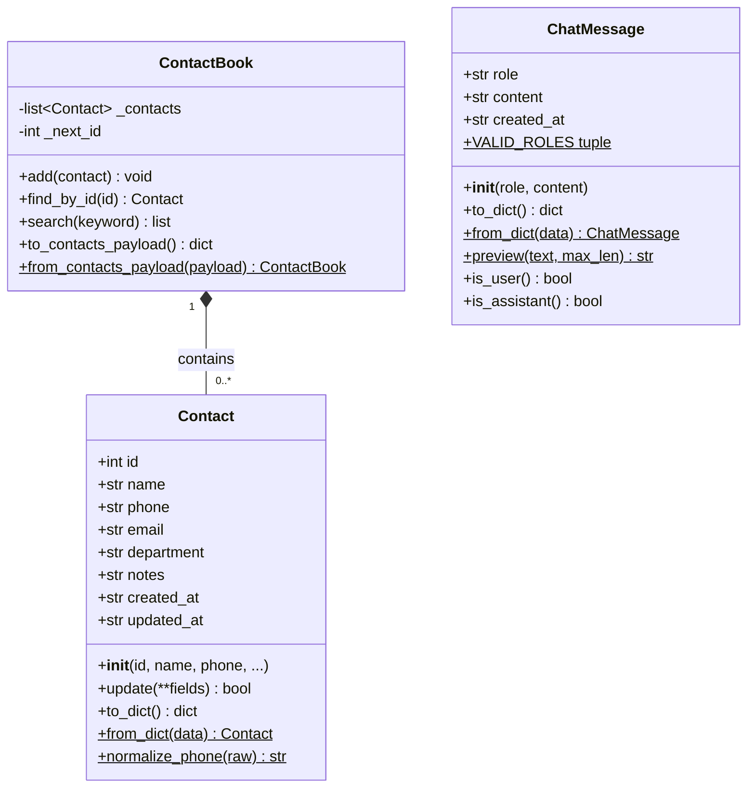
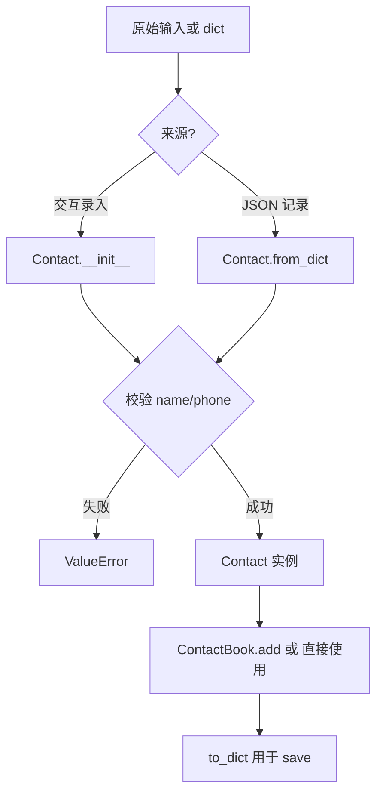
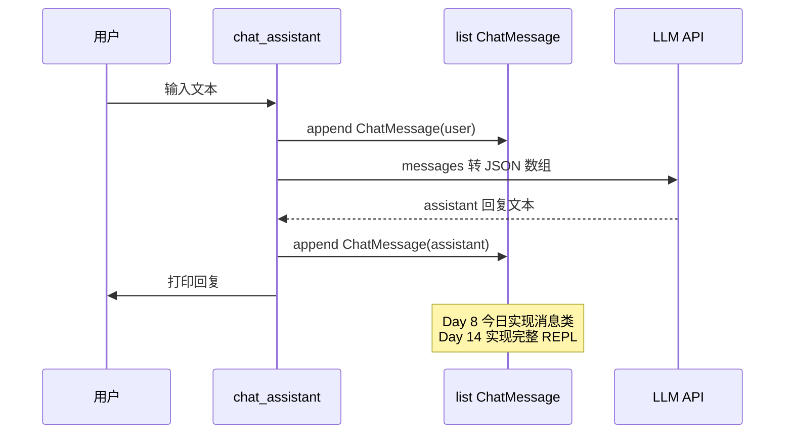

# Day 8 架构与设计 · Contact / ChatMessage 类图与数据流

## 1. 总体架构

```text
┌──────────────────────────────────────────────────────────────────────┐
│                         Day 8 类层（Week 2 基座）                      │
│  ┌─────────────────┐    ┌──────────────────┐    ┌────────────────┐ │
│  │   oop_demo.py   │    │ contact_class.py │    │ chat_message.py│ │
│  │  教学：类与对象   │    │ Contact + Book   │    │ ChatMessage    │ │
│  └────────┬────────┘    └────────┬─────────┘    └───────┬────────┘ │
│           │                      │                       │          │
│           └──────────────────────┼───────────────────────┘          │
│                                  ▼                                   │
│                    classmethod_demo.py（方法分派对照）                 │
└──────────────────────────────────────────────────────────────────────┘
           │                              │
           ▼                              ▼
   day07/contacts.json            Day14 messages.json（未来）
   list[dict] ──from_dict──▶     list[ChatMessage] ──to_dict──▶
```

**设计原则**（张工规范）：

1. **数据与行为内聚**：校验不再散落在 CLI 与全局函数。  
2. **序列化边界清晰**：对外 JSON 仍用 `dict`；类负责 `to_dict` / `from_dict`。  
3. **Day 7 兼容**：`Contact.to_dict()` 键名与 v1.0 一致，旧文件无需迁移。  
4. **Day 14 预埋**：`ChatMessage` 字段与 OpenAI Chat Completions 消息体对齐。

## 2. 类图（Mermaid）



说明：`ContactBook` 在课堂 demo 中轻量出现；完整 CLI 为作业扩展。

## 3. Day 7 → Day 8 重构映射

| Day 7 函数 / 结构 | Day 8 归属 |
|-------------------|------------|
| `validate_name` | `Contact.__init__` / `update` |
| `normalize_phone` | `Contact.normalize_phone`（staticmethod） |
| `format_contact` | `Contact.__str__` |
| `add_contact` 构造 dict | `Contact(...)` + `ContactBook.add` |
| `contacts: list[dict]` | `ContactBook._contacts: list[Contact]` |
| `load_contacts` | `ContactBook.from_contacts_payload` |

## 4. 对象创建数据流



## 5. ChatMessage 在对话中的位置（Day 14 预览）



## 6. 三种方法的设计归属

| 场景 | 推荐类型 | 示例 |
|------|----------|------|
| 读写实例字段 | 实例方法 | `contact.update(phone="...")` |
| 替代构造器、解析外部格式 | classmethod | `Contact.from_dict(d)` |
| 与实例无关的工具函数 | staticmethod | `Contact.normalize_phone(s)` |
| 日志截断、纯计算 | staticmethod | `ChatMessage.preview(text)` |

**反模式**：把所有函数都写成 `@staticmethod` 塞进类里——那不如留在模块级函数。

## 7. 模块职责

| 文件 | 职责 | 运行方式 |
|------|------|----------|
| `oop_demo.py` | 最小类示例：`Employee` / `Dog` | `python3 oop_demo.py` |
| `contact_class.py` | `Contact` + 轻量 `ContactBook` | `python3 contact_class.py` |
| `classmethod_demo.py` | `Temperature` / `DateRange` 对照三种方法 | `python3 classmethod_demo.py` |
| `chat_message.py` | 消息校验、展示、列表 demo | `python3 chat_message.py` |

## 8. JSON 互操作约定

### 8.1 Contact 单条（与 Day 7 相同）

```json
{
  "id": 1,
  "name": "陈晓",
  "phone": "13800138001",
  "email": "chen.xiao@sparktech.cn",
  "department": "大模型应用开发部",
  "notes": "",
  "created_at": "2026-07-01T09:00:00+00:00",
  "updated_at": "2026-07-01T09:00:00+00:00"
}
```

### 8.2 ChatMessage 单条（Day 14 历史文件元素）

```json
{
  "role": "assistant",
  "content": "您好，我是星火智服助手。",
  "created_at": "2026-07-08T10:00:00+00:00"
}
```

## 9. 错误处理策略

| 场景 | 行为 |
|------|------|
| 非法 role | `ValueError`，消息说明合法取值 |
| 空 content | `ValueError` |
| `from_dict` 缺字段 | 使用类默认值，不抛异常 |
| 读取 day07 JSON 失败 | demo 回退内置样例并打印提示 |

## 10. 演进路线

| 天数 | 演进 |
|------|------|
| Day 8 | 手写类、`__init__`、三种方法 |
| Day 9 | `Contact` 子类 / 混入；`EmployeeContact` |
| Day 11 | 异常体系、`@property` |
| Day 14 | `ChatSession` 管理 `list[ChatMessage]` + REPL |
| Day 36+ | 消息类扩展 metadata、token 计数 |
