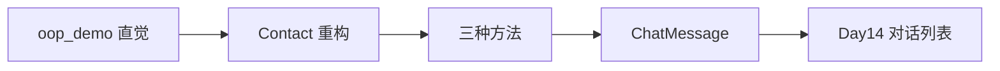

# Day 8 课堂讲义 · 面向对象编程：Contact 重构与 ChatMessage

> **旁白**：Week 1 你们证明了自己能交付小工具；Week 2 张工要你们证明代码**可演进**。今天不引入继承、不碰 API——只把「一条记录」从散落的 `dict` 键升级成有身份的对象。上午弄懂 `class` 与 `__init__`；下午分清三种方法；收工时手里要有能进 Day 14 的 `ChatMessage`。

---

## 第一章 · 为什么 Week 2 从 OOP 开始（09:00–09:30）

### 1.1 Day 7 的「隐痛」

打开 [day07/code/address_book.py](../day07/code/address_book.py)，搜索 `"name"`。你会发现：

- 构造记录时写 `record["name"]`  
- 更新时写 `item["name"]`  
- 搜索时写 `c.get("name", "")`  
- 格式化时写 `item['name']`

**同一个业务概念「姓名」，在代码里出现了几十次字符串键名。** 少写一个字母，Python 不会编译报错，运行到那一行才 `KeyError`。

张工在站会上说的原话：

> 「过程式 + dict 能撑到一千行；再往上，维护成本指数涨。大模型应用里消息、工具调用结果、检索片段全是结构化对象——**先学会用 class 表达一条记录**。」

### 1.2 类与对象：模板与实物

| 概念 | 含义 | 今日例子 |
|------|------|----------|
| **类（class）** | 图纸、模板 | `Contact`、`ChatMessage` |
| **对象（object）** | 根据图纸造出的具体实例 | `Contact(1, "陈晓", "13800138001")` |
| **属性（attribute）** | 对象上的数据 | `contact.name`、`msg.role` |
| **方法（method）** | 对象上的函数 | `contact.update(...)`、`msg.to_dict()` |

类比：类像「入职登记表」空白模板；对象是刘姐手里**已填好**的那一张。

### 1.3 今日路线图



▶ 流程详图：[05_流程图与示意图.md](./05_流程图与示意图.md)

---

## 第二章 · 定义类与创建对象（09:30–10:15）

### 2.1 最小类语法

```python
class Dog:
    """狗 —— 教学用极简类。"""

    def __init__(self, name: str, breed: str) -> None:
        self.name = name      # 实例属性：这条狗的名字
        self.breed = breed    # 实例属性：品种

    def bark(self) -> str:
        """实例方法：需要访问 self.name。"""
        return f"{self.name}（{self.breed}）: 汪汪！"
```

**执行过程**（讲师板书）：

1. `Dog("旺财", "柴犬")` 先创建空对象  
2. Python 自动调用 `Dog.__init__(新对象, "旺财", "柴犬")`  
3. `__init__` 里 `self.xxx = ...` 把数据绑到对象上  
4. 变量 `dog` 持有该对象的引用  

### 2.2 `self` 到底是什么？

`self` 不是关键字，是**约定俗成的第一个参数名**，代表「当前这个对象」。

```python
dog = Dog("旺财", "柴犬")
dog.bark()
# 等价于 Dog.bark(dog) —— Python 自动把 dog 传给 self
```

学员常问：**定义时要写 `self`，调用时为什么不传？**  
答：点号调用时 Python 自动绑定；只有故意用类名调用时才显式传对象。

### 2.3 属性访问：点号 vs 方括号

| 写法 | 适用于 |
|------|--------|
| `contact.name` | 类实例属性 |
| `record["name"]` | dict 键 |

今日重构的目标之一：**业务代码里尽量少出现 `["phone"]` 这种魔法字符串**。

### 2.4 跟打：oop_demo.py

打开 [code/oop_demo.py](./code/oop_demo.py)，重点看：

1. `Employee` 类：工号、姓名、部门  
2. 构造两个员工对象，比较 `id()` 不同 → **不同对象**  
3. `introduce()` 实例方法使用 `self.dept`  

**课堂练习（3 分钟）**：给 `Employee` 增加 `years` 属性，并实现 `is_senior()`：工龄 ≥3 返回 `True`。

<details>
<summary>参考实现</summary>

```python
def is_senior(self) -> bool:
    return self.years >= 3
```

</details>

---

## 第三章 · `__init__` 构造与校验内聚（10:15–11:00）

### 3.1 为什么校验要放进 `__init__`？

Day 7 的 `validate_name` 在 `add_contact` 里调用——**可以工作**，但：

- 若有人手写 `record = {"name": ""}` 绕过函数，脏数据进列表  
- 校验逻辑与数据结构分离，新人不知道「合法联系人」的定义在哪  

OOP 思路：**能创建出来的对象，默认就是合法的**（失败则抛异常，对象不存在）。

### 3.2 Contact 构造器设计

```python
class Contact:
    def __init__(
        self,
        contact_id: int,
        name: str,
        phone: str,
        email: str = "",
        department: str = "未分配",
        notes: str = "",
        created_at: str | None = None,
        updated_at: str | None = None,
    ) -> None:
        self.id = contact_id
        self.name = self._validate_name(name)
        self.phone = self._validate_phone(phone)
        self.email = email.strip().lower()
        # ...
```

注意：

- `contact_id` 参数映射到属性 `self.id`（避免与内置 `id()` 混淆）  
- 校验可拆私有方法 `_validate_name`，**对外仍是一个类**  

### 3.3 私有方法约定：单下划线

Python 没有真正的 `private`。单下划线 `_validate_name` 表示「内部实现，外部请勿依赖」。  
双下划线 `__foo` 会名称改写（name mangling），今日不展开，Day 9 再讲。

### 3.4 `__str__` 与 `print`

```python
def __str__(self) -> str:
    return f"[#{self.id}] {self.name} | {self.phone} | {self.department} | ..."
```

定义后：

```python
print(contact)   # 自动调用 __str__
```

对应 Day 7 的 `format_contact(dict)`——**展示逻辑也进类里**。

### 3.5 跟打：contact_class.py 前半

1. 运行 `python3 contact_class.py`  
2. 故意构造 `Contact(99, "", "123")`，观察 `ValueError`  
3. 对比 Day 7 同名校验错误提示是否一致  

---

## 第四章 · 与 Day 7 JSON 互操作（11:00–12:00）

### 4.1 序列化边界

磁盘上的 JSON **永远是 dict / list**；内存里 Week 2 起优先用 **对象**。

转换职责：

- `to_dict()` → 落盘、给 `json.dump`  
- `from_dict()` → 读盘、从 API 解析  

### 4.2 `to_dict` 实例方法

```python
def to_dict(self) -> dict:
  return {
      "id": self.id,
      "name": self.name,
      "phone": self.phone,
      # ... 键名与 day07 完全一致
  }
```

**讲师强调**：键名不改，刘姐的 `contacts.json` 无需批量迁移。

### 4.3 `from_dict` 类方法（预告下午）

```python
@classmethod
def from_dict(cls, data: dict) -> Contact:
    return cls(
        contact_id=int(data.get("id", 0)),
        name=data.get("name", ""),
        phone=data.get("phone", ""),
        # ...
    )
```

`cls` 是类本身（这里是 `Contact`）。  
用 `@classmethod` 的原因：**调用者还没对象**，工厂从 dict「生产」一个。

### 4.4 读取 day07 样例

```python
import json
from pathlib import Path

path = Path(__file__).resolve().parents[2] / "day07" / "code" / "contacts.json"
with path.open(encoding="utf-8") as f:
    payload = json.load(f)
first = Contact.from_dict(payload["contacts"][0])
print(first)
```

### 4.5 ContactBook 轻量容器

`contact_class.py` 内含简易 `ContactBook`：

- 内部 `list[Contact]` 而非 `list[dict]`  
- `add` 时 `self._next_id` 自增  
- `to_contacts_payload()` 生成 Day 7 兼容顶层 JSON  

完整 CLI 是作业选做；今日理解 **「容器 + 元素类」** 即可。

### 4.6 上午小结口试

1. `Contact` 与 `dict` 各如何表示「陈晓的手机号」？  
2. 为何 `to_dict` 键名必须跟 Day 7 一致？  
3. 非法姓名是在哪一层被拦截的？

---

## 第五章 · 三种方法分派（14:00–15:00）

### 5.1 实例方法（最常见）

```python
def update(self, *, name: str | None = None, phone: str | None = None) -> None:
    if name is not None:
        self.name = self._validate_name(name)
    # ...
    self.updated_at = datetime.now(timezone.utc).isoformat()
```

- 第一个参数 `self`  
- 可读写 `self.xxx`  
- 通过 `实例.方法()` 调用  

### 5.2 类方法 `@classmethod`

```python
@classmethod
def from_dict(cls, data: dict) -> Contact:
    return cls(...)
```

- 第一个参数 `cls`（类对象）  
- 常用于**替代构造器**、解析多种输入格式  
- 通过 `Contact.from_dict(d)` 调用，**不需要先有实例**  

还可用于：

```python
@classmethod
def create_guest(cls) -> Contact:
    """工厂：创建占位联系人。"""
    return cls(0, "访客", "10000000000", department="未分配")
```

### 5.3 静态方法 `@staticmethod`

```python
@staticmethod
def normalize_phone(raw: str) -> str:
    digits = "".join(ch for ch in raw if ch.isdigit())
    return digits
```

- 无 `self` / `cls`  
- 逻辑上属于 `Contact`「电话号码处理」范畴，但不访问实例状态  
- 也可写成模块级函数；放在类里是**命名空间归类**  

### 5.4 对照实验：classmethod_demo.py

[code/classmethod_demo.py](./code/classmethod_demo.py) 中 `Temperature` 类：

| 方法 | 作用 |
|------|------|
| `celsius` 属性 + `to_fahrenheit` 实例方法 | 依赖当前温度值 |
| `from_fahrenheit` classmethod | 从华氏「工厂生产」摄氏对象 |
| `is_valid_value` staticmethod | 纯范围判断 |

**课堂实验**：在交互式终端依次执行：

```python
from classmethod_demo import Temperature
t = Temperature(25)
Temperature.from_fahrenheit(77)
Temperature.is_valid_value(100)
```

观察哪种调用需要已有实例。

### 5.5 选型决策表

| 问题 | 选择 |
|------|------|
| 要不要读/写 `self.xxx`？ | 实例方法 |
| 要不要构造新实例，输入多种格式？ | classmethod |
| 要不要访问类或实例状态？ | 若都不要 → staticmethod 或模块函数 |

**反模式**：类里十个 staticmethod、零个实例方法——那是假 OOP。

---

## 第六章 · ChatMessage：星火智服消息单元（15:00–16:30）

### 6.1 业务背景

小陈给的 Day 14 原型需求片段：

```text
  多轮对话 = 有序消息列表
  每条消息 = role + content
  role 仅 system | user | assistant
  要能打印、要能 JSON 持久化
```

与 OpenAI Chat Completions 的 `messages` 数组同构——日后接 API 无需改字段名。

### 6.2 类定义要点

```python
class ChatMessage:
    VALID_ROLES: tuple[str, ...] = ("system", "user", "assistant")

    def __init__(self, role: str, content: str) -> None:
        self.role = self._normalize_role(role)
        self.content = self._validate_content(content)
        self.created_at = datetime.now(timezone.utc).isoformat()
```

### 6.3 role 白名单校验

```python
def _normalize_role(self, role: str) -> str:
    role = role.strip().lower()
    if role not in self.VALID_ROLES:
        allowed = ", ".join(self.VALID_ROLES)
        raise ValueError(f"非法 role「{role}」，允许值: {allowed}")
    return role
```

**为何不用随便的 str？**  
产品、API、日志三端要对齐枚举；`bot`、`ai` 等别名今日拒绝，Day 11 可用 classmethod 做别名映射。

### 6.4 content 非空

用户只敲空格不算有效消息：

```python
def _validate_content(self, content: str) -> str:
    text = content.strip()
    if not text:
        raise ValueError("消息 content 不能为空。")
    return text
```

### 6.5 `__str__` 与日志友好

```python
def __str__(self) -> str:
    preview = ChatMessage.preview(self.content, max_len=40)
    return f"[{self.role}] {preview}"
```

长文截断用 staticmethod `preview`，供类内外复用。

### 6.6 组装对话列表

```python
messages: list[ChatMessage] = [
    ChatMessage("system", "你是星火智服内部助手，回答简洁专业。"),
    ChatMessage("user", "通讯录数据存在哪里？"),
    ChatMessage("assistant", "Week1 存在 contacts.json；Day8 起用 Contact 类封装。"),
]

for msg in messages:
    print(msg)

payload = [m.to_dict() for m in messages]
```

这就是 Day 14 `chat_assistant` 内核的雏形——今日无 API，有 **数据结构**。

### 6.7 与 Day 3 REPL 的衔接

Day 3 [simple_menu.py](../day03/code/simple_menu.py) 已有：

```python
while True:
    cmd = input("> ")
    if cmd == "/exit":
        break
```

Day 14 将把 `else` 分支改为：append user 消息 → 调 API → append assistant 消息。  
今日作业 `mini_repl` 用占位 assistant 预演该分支。

---

## 第七章 · 手把手实操清单（16:30–17:00）

### 7.1 环境检查

```bash
cd day08/code
python3 -m py_compile oop_demo.py contact_class.py classmethod_demo.py chat_message.py
echo OK
```

### 7.2 实操步骤

| 步骤 | 动作 | 预期 |
|------|------|------|
| 1 | `python3 oop_demo.py` | 两只狗 bark 输出不同 |
| 2 | `python3 contact_class.py` | 打印从 day07 加载的联系人 |
| 3 | 修改手机后 `print(contact)` | `updated_at` 变化 |
| 4 | `python3 classmethod_demo.py` | 三种方法演示无报错 |
| 5 | `python3 chat_message.py` | 三轮对话 + JSON 片段 |
| 6 | 构造非法 `ChatMessage("bot", "hi")` | ValueError |

### 7.3 与讲师代码 diff 的建议

- 校验错误信息是否中文、是否带字段名  
- `to_dict` 是否缺键  
- 是否误把 `classmethod` 写成 `self` 第一个参数  

---

## 第八章 · 常见踩坑（讲师念稿）

### 8.1 `__init__` 里 `return contact`（错）

`__init__` 应返回 `None`。返回对象不会替换构造结果。

### 8.2 类属性 vs 实例属性

```python
class Foo:
    items = []  # 危险：所有实例共享同一 list！

    def __init__(self):
        self.items = []  # 正确：每个实例自己的列表
```

`ContactBook._contacts` 必须是实例属性。

### 8.3 可变默认参数

```python
def __init__(self, tags: list = []):  # 错
```

今日 Contact 未用 list 默认参数；若需要，用 `None` 哨兵。

### 8.4 忘记 `@classmethod` 装饰器

```python
def from_dict(cls, data):  # 缺少装饰器时 cls 只是普通参数名
```

调用 `Contact.from_dict(d)` 会报错。

### 8.5 dict 与对象混用

```python
contacts.append({"name": "x"})  # Day 7
contacts.append(Contact(...))   # Day 8
# 同一 list 不要混放两种类型
```

---

## 第九章 · Day 14 衔接预告

| Day 8 今日 | Day 14 用法 |
|------------|-------------|
| `ChatMessage` | `messages` 列表元素 |
| `to_dict` / `from_dict` | `history.json` 读写 |
| `Contact` | `/contact 张三` 子命令查询 HR 数据（扩展） |
| `while` REPL 作业 | 完整 `chat_assistant.py` 主循环 |
| Day 6 包结构 | `from sparktech_chat.message import ChatMessage` |

张工：「Day 8 的类要**能 import**；Day 14 不许复制粘贴整段类定义。」

---

## 第十章 · 今日验收口诀

```text
  类是模板，对象是实例；
  __init__ 构造，__str__ 展示；
  改自己用实例方法，造对象用 classmethod，纯工具用 staticmethod；
  Contact 承接 Day7，ChatMessage 通向 Day14。
```

▶ 作业：[06_课后作业.md](./06_课后作业.md)  
▶ 答案：[07_作业参考答案.md](./07_作业参考答案.md)  
▶ 进阶：[08_补充讲义_OOP进阶与Day14衔接.md](./08_补充讲义_OOP进阶与Day14衔接.md)

---

## 附录 A · 自测题（含答案）

**1.** 下列哪项是类方法？  
A. `contact.update()` B. `Contact.from_dict()` C. `contact.to_dict()`  
→ **B**

**2.** `ChatMessage.VALID_ROLES` 应定义为类属性还是实例属性？  
→ **类属性**（所有消息共享同一套合法 role）

**3.** Day 7 的 `next_id` 在 Day 8 应放在哪？  
→ `ContactBook._next_id` 实例属性，持久化逻辑仍在 JSON 顶层

**4.** 为何 `print(msg)` 能工作？  
→ 调用 `ChatMessage.__str__`

**5.** staticmethod 能否访问 `self.name`？  
→ **不能**，没有 self

---

## 附录 B · 代码阅读：Day 7 add 对比 Day 8

Day 7 片段：

```python
record = {
    "id": next_id,
    "name": name,
    "phone": phone,
    ...
}
contacts.append(record)
```

Day 8 等价：

```python
contact = Contact(next_id, name, phone, email=email, ...)
book.add_contact(contact)  # 或 book.add(name, phone, ...)
```

**少的是键名字符串；多的是类型与校验封装。**

---

## 附录 C · 术语表

| 术语 | 英文 | 说明 |
|------|------|------|
| 封装 | encapsulation | 数据与操作绑在类内 |
| 实例 | instance | 具体对象 |
| 构造器 | constructor | 通常指 `__init__` |
| 工厂方法 | factory method | 常见为 classmethod |
| 序列化 | serialize | 对象 → dict/JSON |

---

## 附录 D · 延伸阅读（本周可选）

- Python 官方教程：[Classes](https://docs.python.org/3/tutorial/classes.html)  
- Day 9 预习：继承 `EmployeeContact(Contact)`  
- 补充讲义：`dataclass` 与手写类对比  

---

## 附录 E · 手把手代码走读：Contact 完整生命周期

下面用一段连贯脚本把上午与下午知识点串起来。建议在 `day08/code` 目录打开 Python 交互式终端跟打。

```python
from contact_class import Contact, ContactBook
from chat_message import ChatMessage

# 1. 直接构造 —— __init__ 内校验
c = Contact(1, "  陈晓  ", "138 0013 8001", department="大模型应用开发部")
print(c)  # __str__

# 2. 实例方法修改 —— update 刷新 updated_at
c.update(phone="13900139000")
print(c.phone)

# 3. 序列化 —— 与 Day 7 JSON 字段一致
as_dict = c.to_dict()
assert as_dict["name"] == "陈晓"  # strip 在构造时已完成

# 4. 反序列化 —— classmethod 工厂
c2 = Contact.from_dict(as_dict)
print(c2)

# 5. 静态方法 —— 不创建对象也可清洗手机号
digits = Contact.normalize_phone("131-0000-1111")
print(digits)

# 6. 容器 —— ContactBook 管理多个 Contact
book = ContactBook()
book.add("韩梅梅", "13900139002", department="人力资源部")
print(book.search("韩"))

# 7. 对话消息 —— Day 14 预埋
msgs = [
    ChatMessage("system", "你是星火智服。"),
    ChatMessage("user", "Contact 和 dict 有什么区别？"),
    ChatMessage("assistant", "Contact 把字段和校验封装在类里，dict 只是裸数据。"),
]
for m in msgs:
    print(m)
```

**走读问题**（讲师可点名）：

1. 第 1 步 `name` 传入带空格，最终 `c.name` 是什么？为什么？  
2. 第 4 步 `from_dict` 返回的新对象与 `c` 是同一个吗？  
3. 第 5 步为何用 `Contact.normalize_phone` 而不是 `c.normalize_phone`？两种写法今天都能用，哪种更表达「与实例无关」？  
4. 若 `msgs` 要写入 JSON 文件，应调用哪个方法序列化每一条？

参考答案：1. `"陈晓"`，`_validate_name` 内 `strip`；2. 不是，`from_dict` 构造新实例；3. 静态方法强调工具属性，实例调用亦可；4. `to_dict()`。

---

## 附录 F · Day 7 函数 → Day 8 方法对照表（复印贴墙版）

| Day 7 `address_book.py` | Day 8 `contact_class.py` | 方法类型 |
|-------------------------|--------------------------|----------|
| `strip_field` | `Contact._strip` 或内联 | staticmethod / 私有 |
| `normalize_phone` | `Contact.normalize_phone` | staticmethod |
| `normalize_email` | `Contact._normalize_email` | staticmethod |
| `validate_name` | `Contact._validate_name` | 私有，供 `__init__` / `update` |
| `validate_phone` | `Contact._validate_phone` | 私有 |
| `format_contact` | `Contact.__str__` | 实例方法 |
| `add_contact` | `ContactBook.add` | 实例方法 |
| `find_index_by_id` | `ContactBook.find_by_id` | 实例方法 |
| `search_contacts` | `ContactBook.search` | 实例方法 |
| `load_contacts` | `ContactBook.load` | classmethod 或模块函数 |
| `save_contacts` | `ContactBook.save` | 实例方法 |

重构时**业务规则不变、调用姿势变**：从「函数 + 全局 list」到「对象 + 容器类」。

---

## 附录 G · 课堂白板 Q&A 扩展（10 题）

**Q6.** 能否不写 `__init__`，直接 `c = Contact()` 后 `c.name = "x"`？  
→ 语法上可以，但失去构造期校验；培训项目要求必须走 `__init__`。

**Q7.** `classmethod` 能否调用 `cls(...)` 创建子类实例？  
→ 能，且这是继承场景下工厂方法强大的原因（Day 9）。

**Q8.** `ChatMessage.VALID_ROLES` 写成 list 还是 tuple？  
→ 今日用 `tuple`，表达不可变常量序列。

**Q9.** 一个 Python 文件里可以定义多个 class 吗？  
→ 可以；`contact_class.py` 含 `Contact` 与 `ContactBook`。

**Q10.** Day 14 API 返回的 JSON 里 `role` 是大写 `USER` 怎么办？  
→ 在 `_normalize_role` 里 `.lower()`；若需兼容别名，用 classmethod `from_api_role`（选做）。

**Q11.** `list[Contact]` 能直接 `json.dump` 吗？  
→ 不能，需 `[c.to_dict() for c in contacts]`。

**Q12.** 静态方法是否「不如」模块级函数？  
→ 非也；归属 `Contact` 命名空间便于发现与文档分组。

**Q13.** `self` 可以改名吗？  
→ 可以但不推荐；团队可读性优先。

**Q14.** 对象放在 list 里，如何按姓名排序？  
→ `sorted(contacts, key=lambda c: c.name)`，点号访问属性。

**Q15.** Week 1 的 `dict` 是否「错了」？  
→ 没有；它是正确阶段的正确工具。Week 2 是在此基础上的抽象升级。

---

## 附录 H · 晚自习 Checklist（21:00 前）

- [ ] 四个 `.py` 均能编译运行  
- [ ] 能白板画出 `Contact` 三个方法类型各一例  
- [ ] 能向室友解释 `ChatMessage` 为何限制三种 role  
- [ ] 作业 B3/B4 至少完成其一  
- [ ] 浏览 Day 7 `address_book.py` 任选一函数，说出它将迁入类的哪个方法  

**本讲义完。祝 Week 2 开个好头。**
