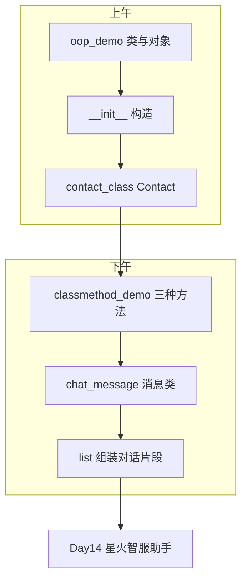
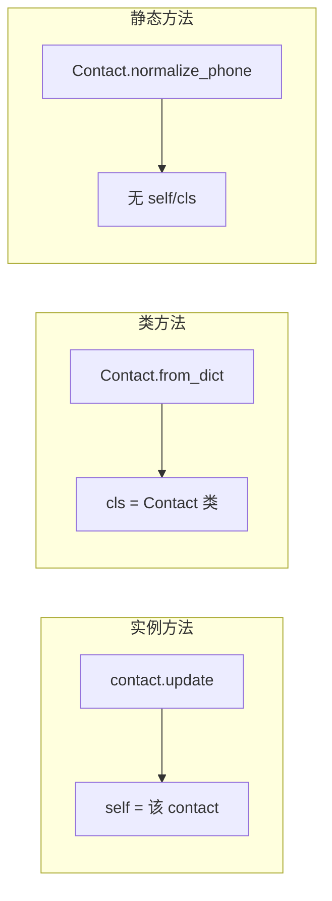
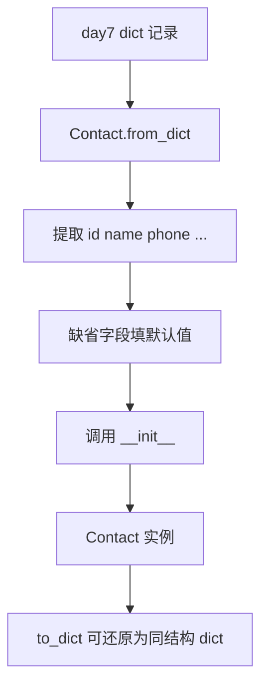
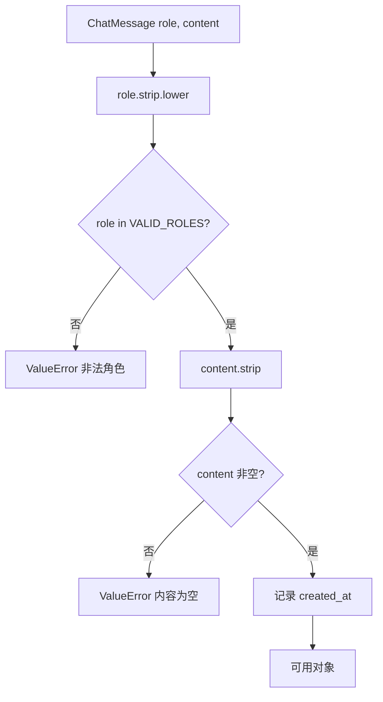
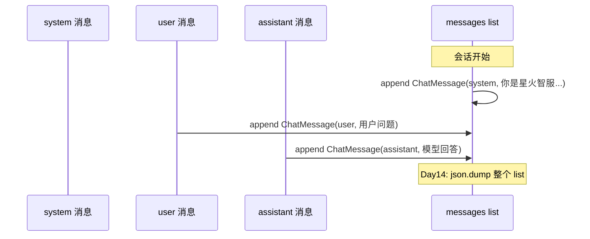
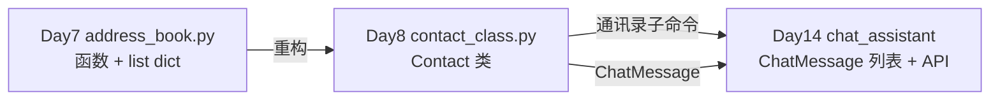
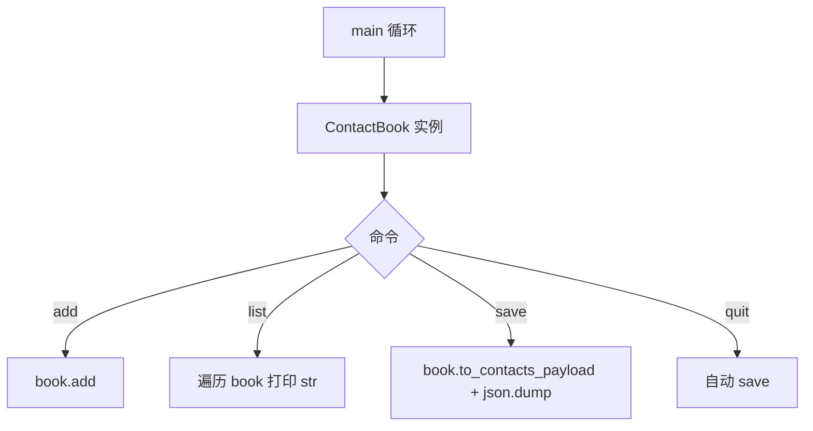

# Day 8 流程图与示意图

## 1. 学习路径总览



## 2. 从 dict 到对象的思维转换

```text
  Day 7 过程式                    Day 8 面向对象
  ─────────────                  ──────────────
  record = {"name": "陈晓", ...}   contact = Contact(1, "陈晓", "138...")
  record["name"]                   contact.name
  validate_name(record["name"])    在 __init__ 内校验
  format_contact(record)           str(contact)
```

## 3. 对象实例化流程

```mermaid
flowchart TD
    A[调用 Contact(1, 陈晓, 13800138001)] --> B[Python 分配内存]
    B --> C[创建空对象]
    C --> D[调用 __init__(self, ...)]
    D --> E[self.id = 1 等赋值]
    E --> F[normalize_phone 校验]
    F --> G{合法?}
    G -->|否| H[raise ValueError]
    G -->|是| I[返回 contact 引用给调用方]
```

## 4. 方法分派（谁接收第一个参数）



| 装饰器 | 第一个参数 | 典型用途 |
|--------|------------|----------|
| 无 | `self` | 改自己的字段 |
| `@classmethod` | `cls` | 工厂、`from_json` |
| `@staticmethod` | 无 | 纯工具、与类概念相关但不访问类/实例状态 |

## 5. Contact.from_dict 流程



## 6. ChatMessage 校验流程



## 7. 对话消息累积（Day 14 预习）



## 8. ContactBook 轻量容器

```text
  ContactBook
  ├── _contacts: [Contact, Contact, ...]
  ├── _next_id: int
  ├── add(name, phone, ...)  → 构造 Contact 并 append
  ├── find_by_id(id)         → 线性查找
  ├── search(keyword)        → 遍历 __str__ 或字段
  └── to_contacts_payload()  → 与 day07 JSON 顶层兼容
```

## 9. Day 7 / Day 8 / Day 14 三代架构



## 10. 课堂实操时间轴（讲师用）

```text
  09:00  oop_demo 讲解 + 学员跟打
  10:00  contact_class Contact 字段与 __init__
  11:00  from_dict 读取 day07 JSON 演示
  14:00  classmethod_demo 三种方法对照实验
  15:00  chat_message 实现与 role 白名单
  16:30  组装三轮对话 list，打印 __str__
  17:00  答疑 + 作业说明
```

## 11. 常见误区示意图

```text
  误区 1：把类当函数库，全是 @staticmethod
         → 应把「改自己状态」写成实例方法

  误区 2：__init__ 里 return 对象（错误）
         → __init__ 应 return None，构造由 Python 完成

  误区 3：contact.name 写成 contact["name"]
         → 对象用点号访问属性

  误区 4：classmethod 里用 self
         → 第一个参数是 cls
```

## 12. 作业扩展 ContactBook CLI（选做预览）



与 Day 7 菜单同构，但内存中已是 `list[Contact]` 而非 `list[dict]`。
