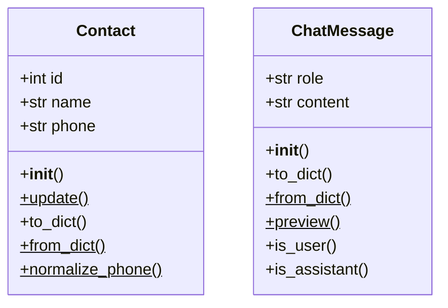

# Day 8 作业参考答案 · OOP 概念与双类实战

> 书面题鼓励用自己的话作答；下列为要点与可运行参考代码。

---

## B1 概念速答要点

### 1. 类与对象

- **类**：描述一类事物的模板（如 `Contact`、`ChatMessage`）。  
- **对象**：类的具体实例（如 `Contact(1, "陈晓", "13800138001")`）。

### 2. `self`

代表**当前实例**。实例方法第一个参数必须是 `self`，以便在方法内访问 `self.name` 等属性。调用 `contact.update()` 时 Python 自动把 `contact` 传给 `self`。

### 3. classmethod vs staticmethod

| 类型 | 场景 | 今日例子 |
|------|------|----------|
| `@classmethod` | 从 dict/JSON 构造对象；工厂 | `Contact.from_dict(data)` |
| `@staticmethod` | 不访问实例/类状态的工具 | `Contact.normalize_phone(raw)` |

### 4. `__init__` vs `__str__`

- `__init__`：创建对象时自动调用，用于初始化属性。  
- `__str__`：`print(obj)` 或 `str(obj)` 时调用，返回人类可读字符串。

---

## B3 contact_lab.py 参考

```python
# -*- coding: utf-8 -*-
"""B3 参考答案：Contact 与 Day 7 JSON 互操作。"""

from __future__ import annotations

import json
import sys
from pathlib import Path

# 将 day08/code 加入路径以便 import
CODE_DIR = Path(__file__).resolve().parents[2] / "day08" / "code"
sys.path.insert(0, str(CODE_DIR))

from contact_class import Contact  # noqa: E402

DAY07_JSON = Path(__file__).resolve().parents[2] / "day07" / "code" / "contacts.json"

FALLBACK = {
    "id": 1,
    "name": "陈晓",
    "phone": "13800138001",
    "email": "chen.xiao@sparktech.cn",
    "department": "大模型应用开发部",
    "notes": "示例",
    "created_at": "2026-07-01T09:00:00+00:00",
    "updated_at": "2026-07-01T09:00:00+00:00",
}


def load_first_record() -> dict:
    if DAY07_JSON.is_file():
        with DAY07_JSON.open(encoding="utf-8") as f:
            payload = json.load(f)
        return payload["contacts"][0]
    print(f"提示：未找到 {DAY07_JSON}，使用内置样例。")
    return FALLBACK


def main() -> None:
    record = load_first_record()
    contact = Contact.from_dict(record)
    print(contact)
    contact.update(department="产品部")
    assert contact.to_dict()["department"] == "产品部"
    print("department =", contact.to_dict()["department"])


if __name__ == "__main__":
    main()
```

---

## B4 dialog_demo.py 参考

```python
# -*- coding: utf-8 -*-
"""B4 参考答案：三轮 ChatMessage + JSON 导出。"""

from __future__ import annotations

import json
import sys
from pathlib import Path

CODE_DIR = Path(__file__).resolve().parents[2] / "day08" / "code"
sys.path.insert(0, str(CODE_DIR))

from chat_message import ChatMessage  # noqa: E402


def main() -> None:
    messages = [
        ChatMessage("system", "你是星火智服内部助手，回答简洁专业。"),
        ChatMessage("user", "通讯录存在哪？"),
        ChatMessage(
            "assistant",
            "Week1 在 contacts.json，Day8 起用 Contact 类管理。",
        ),
    ]
    for m in messages:
        print(m)

    out = Path(__file__).parent / "dialog_sample.json"
    out.write_text(
        json.dumps([m.to_dict() for m in messages], ensure_ascii=False, indent=2),
        encoding="utf-8",
    )
    print(f"已写入 {out}")


if __name__ == "__main__":
    main()
```

---

## B5 类图参考（Mermaid）



注：`$` 在部分渲染器中表示 static/class，作业中用文字标注即可。

---

## X1 ContactBook 参考骨架

```python
class ContactBook:
    def __init__(self) -> None:
        self._contacts: list[Contact] = []
        self._next_id = 1

    def add(self, name: str, phone: str, **kwargs: str) -> Contact:
        c = Contact(self._next_id, name, phone, **kwargs)
        self._contacts.append(c)
        self._next_id += 1
        return c

    def find_by_id(self, contact_id: int) -> Contact | None:
        for c in self._contacts:
            if c.id == contact_id:
                return c
        return None

    def search(self, keyword: str) -> list[Contact]:
        kw = keyword.strip().lower()
        if not kw:
            return list(self._contacts)
        return [c for c in self._contacts if kw in str(c).lower()]
```

完整实现见 [code/contact_class.py](./code/contact_class.py)。

---

## C2 mini_repl.py 参考

```python
# -*- coding: utf-8 -*-
"""C2 挑战参考：迷你 REPL，占位 assistant。"""

from __future__ import annotations

import sys
from pathlib import Path

sys.path.insert(0, str(Path(__file__).resolve().parents[2] / "day08" / "code"))
from chat_message import ChatMessage  # noqa: E402


def main() -> None:
    messages: list[ChatMessage] = [
        ChatMessage("system", "你是星火智服内部助手。"),
    ]
    print("输入内容聊天，/history 历史，/exit 退出。")
    while True:
        text = input("> ").strip()
        if text in ("/exit", "exit", "q"):
            break
        if text == "/history":
            for m in messages:
                print(m)
            continue
        if not text:
            continue
        messages.append(ChatMessage("user", text))
        messages.append(ChatMessage("assistant", "【占位】Day14 接 API"))
        print(messages[-1])


if __name__ == "__main__":
    main()
```

---

## 讲评 Rubric

| 维度 | 合格 | 优秀 |
|------|------|------|
| Contact 互操作 | `from_dict` 成功 | 处理缺文件回退 |
| ChatMessage | role 校验正确 | 实现 `preview` 截断 |
| 概念题 | 能区分三种方法 | 能说明 Day7→Day8 演进理由 |
| 代码风格 | 有类型注解 | 私有校验方法拆分清晰 |
