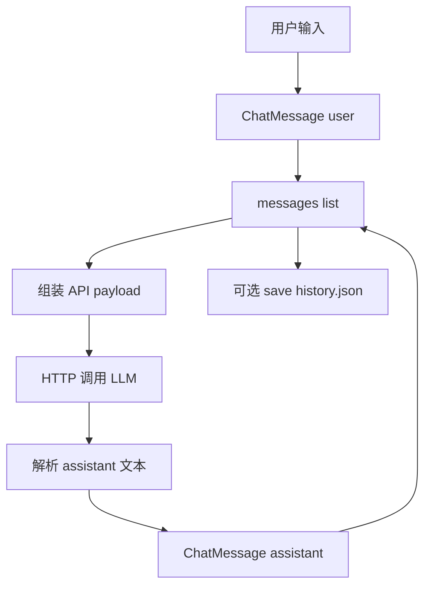

# Day 8 补充讲义 · OOP 进阶与 Day 14 衔接（可选）

> 今日主课已够饱满；本文供学有余力者预习魔法方法、`dataclass` 对比与工程化命名空间。

---

## 一、魔法方法速览（Day 9～11 展开）

| 方法 | 触发时机 | 业务用途 |
|------|----------|----------|
| `__init__` | 构造 | 初始化、校验 |
| `__str__` | `print(obj)` | 用户可见摘要 |
| `__repr__` | 交互式 `repr(obj)` | 开发者调试字符串 |
| `__eq__` | `a == b` | 按 id 或业务键比较 |
| `__len__` | `len(obj)` | `ChatSession` 消息条数 |
| `__getitem__` | `obj[i]` | 让会话像列表一样索引消息 |

### `__repr__` 与 `__str__` 区别

```python
def __repr__(self) -> str:
    return f"Contact(id={self.id!r}, name={self.name!r})"

def __str__(self) -> str:
    return f"[#{self.id}] {self.name} | {self.phone}"
```

- `__repr__` 目标：**能复制就复制**（理想情况 `eval(repr(c))` 等价）  
- `__str__` 目标：**人话**

---

## 二、`dataclass` 与手写类

Python 3.7+ 提供 `@dataclass` 自动生成 `__init__`、`__repr__`：

```python
from dataclasses import dataclass

@dataclass
class ChatMessageDC:
    role: str
    content: str
```

| 维度 | 手写类（今日） | dataclass |
|------|----------------|-----------|
| 教学价值 | 理解 `self` 与构造过程 | 工程效率 |
| 校验 | 在 `__init__` 手写 | 需 `__post_init__` |
| 张工 Week 2 要求 | ✅ 先手写 | Day 11 可迁移 |

**结论**：培训第一周 OOP 手写；项目稳定后可用 dataclass 减样板代码。

---

## 三、`@property` 预告

把方法伪装成属性：

```python
@property
def display_name(self) -> str:
    return f"{self.name}（{self.department}）"
```

调用：`contact.display_name`（无括号）。  
适合「派生字段」只读展示。

---

## 四、命名空间与 Day 14 包结构

Day 6 已拆 `sparktech_*` 包。Day 14 建议：

```text
sparktech_chat/
  __init__.py
  message.py      # ChatMessage
  session.py      # ChatSession（list 封装）
  cli.py          # REPL
```

今日 `chat_message.py` 单文件版将迁入 `message.py`，**类名与 `to_dict` 键不变**。

---

## 五、Day 14 消息流完整草图



与 Day 5 JSON、Day 7 持久化同一套路：`[m.to_dict() for m in messages]`。

---

## 六、常见面试 / 口试加题

1. **多态**是什么？（Day 9：`Dog.speak()` vs `Cat.speak()`）  
2. **组合 vs 继承**：`ContactBook` 持有 `list[Contact]` 是组合。  
3. **为何 LLM 应用常用 class 表示 Message？** 校验 role、统一序列化、扩展 token 计数方法。

---

## 七、踩坑补充

### 7.1 在 `__init__` 外修改属性绕过校验

```python
c = Contact(1, "陈晓", "13800138001")
c.name = ""  # Python 不阻止！
```

解决：Day 11 用 `@property` setter 再次校验，或约定只通过 `update()` 修改。

### 7.2 `is` 与 `==`

- `==` 比较值（可自定义 `__eq__`）  
- `is` 比较是否同一对象（`id()` 相同）

### 7.3 循环导入

`contact_class` import `chat_message` 又反向 import 会失败。Day 14 用分层：`message.py` 不 import `cli.py`。

---

## 八、推荐阅读

- 《Fluent Python》第 1 部分：数据模型  
- OpenAI API 文档：Chat Completions `messages` 数组格式  
- 仓库内： [day07/code/address_book.py](../day07/code/address_book.py) 与 [day08/code/contact_class.py](./code/contact_class.py) 逐函数对照阅读

**学完本文可选完成挑战 C1/C2，周二答疑优先排队。**
