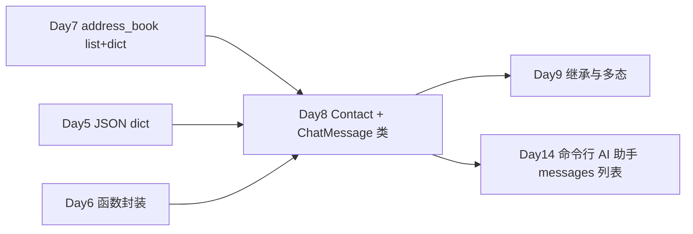

# Day 8 · Week 2 开篇 · 面向对象编程（OOP）基础

> **旁白（讲师口吻）**  
> 周一早会，张工在白板上画了一个方框：*「Week 1 你们用 `list[dict]` 交付了通讯录——能跑，但字段散落、校验重复、Day 14 对话历史又要来一套 `role`/`content` 小 dict。从本周起，**用 class 把「数据 + 行为」绑在一起**。」*  
> 产品部小陈补充：*「星火智服命令行助手原型需要统一的 `ChatMessage` 结构，和 HR 通讯录一样要能校验、能打印、能转 JSON。」*  
> 今天上午学 **类与对象、`__init__`、属性与方法**；下午学 **实例方法、类方法、静态方法**，并动手写出 `Contact` 与 `ChatMessage` 两个核心类。

---

## 今日学习地图

| 时段 | 主题 | 产出物 |
|------|------|--------|
| 09:00–10:30 | 类与对象、属性与方法、`__init__` 构造 | `oop_demo.py` |
| 10:30–12:00 | 从 Day 7 `dict` 记录重构为 `Contact` 类 | `contact_class.py` |
| 14:00–15:30 | 实例方法 vs `@classmethod` vs `@staticmethod` | `classmethod_demo.py` |
| 15:30–17:30 | `ChatMessage` 实战：role/content 校验与展示 | `chat_message.py` |
| 19:00–21:00 | 作业：扩展 `ContactBook`、预习 Day 14 消息列表 | `homework/day08/` |

## 与前后课程的衔接

| 前序能力 | 今日用法 |
|----------|----------|
| Day 7 `dict` 联系人记录 | 升级为 `Contact` 实例，保留字段与校验语义 |
| Day 5 `json` 序列化 | `to_dict()` / `from_dict()` 与 JSON 互转 |
| Day 6 函数职责分离 | 方法归属到类，减少「裸函数 + 全局 list」 |
| Day 3 REPL 菜单 | Day 14 将用 `list[ChatMessage]` 存对话历史 |

## 今日文件清单

| 文件 | 用途 |
|------|------|
| [01_业务背景.md](./01_业务背景.md) | Week 2 启动、张工 OOP 重构指令、星火智服原型 |
| [02_需求文档.md](./02_需求文档.md) | `Contact` / `ChatMessage` PRD 与验收标准 |
| [03_架构与设计.md](./03_架构与设计.md) | 类图、数据流、与 Day 7 / Day 14 对照 |
| [04_课堂讲义.md](./04_课堂讲义.md) | **主课**（OOP 概念 + 重构 + 实操） |
| [05_流程图与示意图.md](./05_流程图与示意图.md) | 对象创建、方法分派、消息流转图 |
| [06_课后作业.md](./06_课后作业.md) | 必做 / 选做 / 挑战分层作业 |
| [07_作业参考答案.md](./07_作业参考答案.md) | 作业参考答案与讲评要点 |
| [08_补充讲义_OOP进阶与Day14衔接.md](./08_补充讲义_OOP进阶与Day14衔接.md) | 魔法方法预览、`dataclass` 对比、踩坑 |
| [code/oop_demo.py](./code/oop_demo.py) | 类与对象、`__init__` 入门演示 |
| [code/contact_class.py](./code/contact_class.py) | Day 7 通讯录 `Contact` 类重构 |
| [code/classmethod_demo.py](./code/classmethod_demo.py) | 三种方法类型对照实验 |
| [code/chat_message.py](./code/chat_message.py) | 星火智服对话消息类（Day 14 预埋） |

## 今日验收标准

- [ ] 能口述：类是模板、对象是实例；`self` 代表「当前对象」  
- [ ] 能独立写出带 `__init__` 的类，并在构造时做字段校验  
- [ ] `Contact.from_dict()` 能正确解析 Day 7 的 `contacts.json` 单条记录  
- [ ] `ChatMessage` 仅接受 `system` / `user` / `assistant` 三种 role  
- [ ] 能解释 `@classmethod` 与 `@staticmethod` 的典型使用场景各举一个  
- [ ] 四个 `.py` 文件均可 `python3 -m py_compile` 通过  
- [ ] Git 已提交，commit message 含 `day08`

---

**讲师提醒**：OOP 不是语法炫技，而是 **把 Day 7 已经写对的业务规则装进类里**。先保证 `Contact` 与 `ChatMessage` 行为正确，再追求花哨设计模式。

**状态**：✅ Day 8 完整课件已发布
