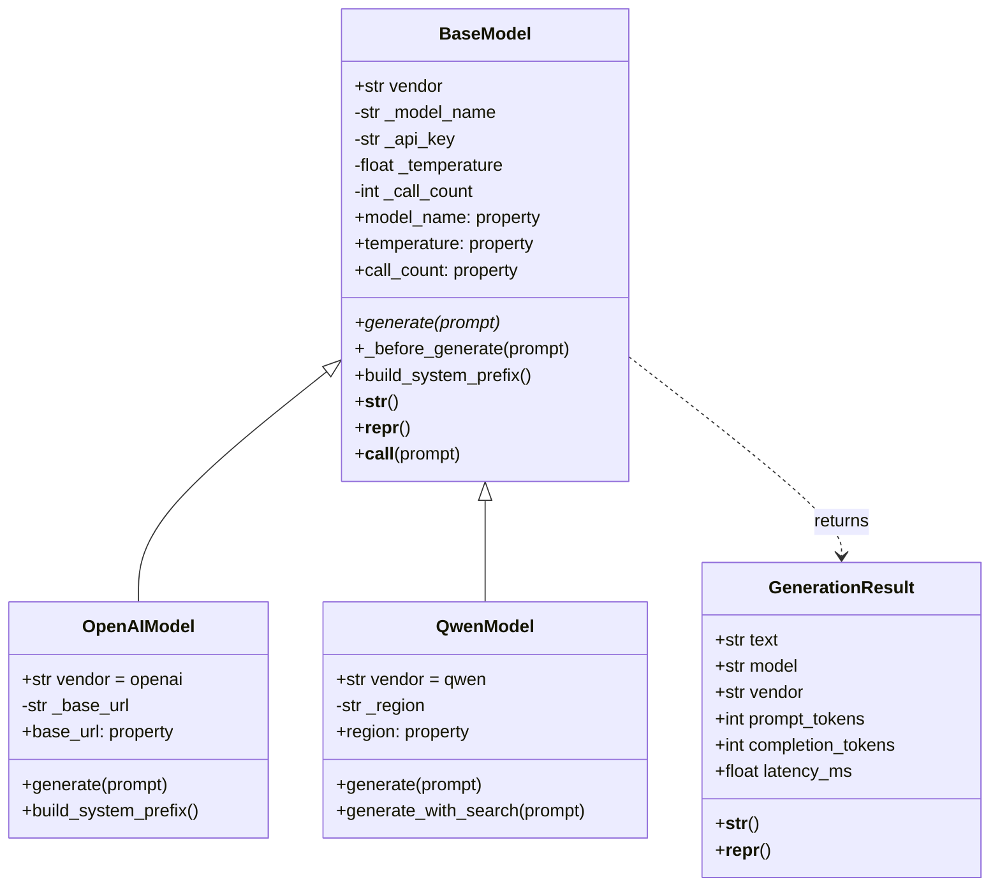
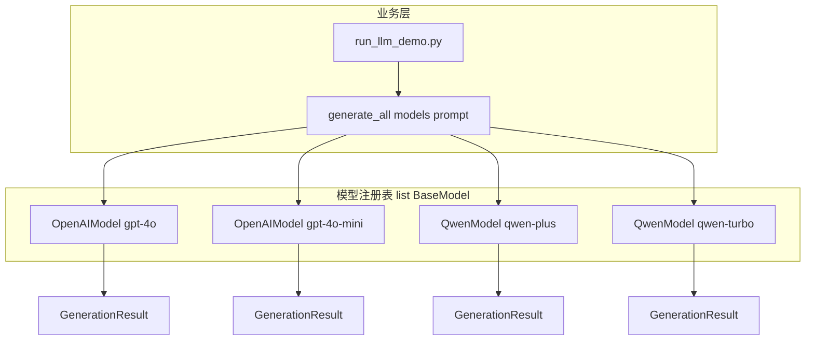

# Day 9 架构与设计 · LLM 适配层类层次与多态路由

## 1. 设计原则

张工在评审会上强调四条：

1. **依赖倒置**：业务层依赖 `BaseModel` 抽象，不依赖具体厂商  
2. **开闭原则**：新增厂商 = 新增子类文件，不改 `generate_all()`  
3. **单一职责**：`BaseModel` 管契约与统计；子类管厂商差异；`GenerationResult` 管返回结构  
4. **可调试性**：必须实现 `__str__` / `__repr__`，日志禁止打印完整 API Key  

## 2. 类图



## 3. 继承链与 `super()` 调用顺序

以 `OpenAIModel("gpt-4o", api_key="sk-x")` 为例：

```text
OpenAIModel.__init__
    │
    ├─ super().__init__(model_name, api_key=..., temperature=..., max_tokens=...)
    │       └─ BaseModel.__init__  → 赋值 _model_name, _api_key, _temperature, _call_count=0
    │
    └─ self._base_url = base_url
```

以 `OpenAIModel.generate(prompt)` 为例：

```text
generate(prompt)
    │
    ├─ super()._before_generate(prompt)   # BaseModel：strip + call_count += 1
    ├─ mock 构造 reply
    └─ return GenerationResult(...)
```

**讲师强调**：`super()` 不是「调用父类」这么简单，而是按 **MRO** 找下一个实现。单继承时等价于 `BaseModel.method(self, ...)`。

## 4. 多态路由架构



核心代码模式：

```python
def generate_all(models: list[BaseModel], prompt: str) -> list[dict]:
    for model in models:
        result = model(prompt)  # 多态：运行时绑定子类 generate
        ...
```

**禁止**在 `generate_all` 内写：

```python
# 反模式
if isinstance(model, OpenAIModel):
    ...
elif isinstance(model, QwenModel):
    ...
```

除非访问 **子类独有能力**（如 `generate_with_search`），否则应只调用基类接口。

## 5. `@property` 设计表

| 属性 | 读 | 写 | 设计理由 |
|------|----|----|----------|
| `model_name` | ✅ | ❌ | 构造后不应随意改名，避免与厂商控制台不一致 |
| `temperature` | ✅ | ✅（校验） | 运行时可调，但必须在合法区间 |
| `call_count` | ✅ | ❌ | 统计字段，只由 `_before_generate` 修改 |
| `is_configured` | ✅ | ❌ | 派生状态：`bool(api_key)` |
| `api_key` | ❌ 不暴露 | — | 安全：永不提供读取完整 Key 的 property |

Qwen 额外 `region`、OpenAI 额外 `base_url`：子类自有 `@property` 只读暴露。

## 6. 魔术方法职责

| 方法 | 调用场景 | 实现要点 |
|------|----------|----------|
| `__str__` | `print(model)`、f-string 默认 | 简短、面向人 |
| `__repr__` | 交互式解释器、日志、`!r` | 精确、最好能看出类名与关键参数 |
| `__call__` | `model(prompt)` | 一行委托 `generate`，统一调用入口 |

`GenerationResult` 同样实现 `__str__` → `text`，便于 `print(result)` 直接看正文。

## 7. 扩展点（Day 15 预留）

| 扩展 | 位置 | Day 15 做法 |
|------|------|-------------|
| 真实 HTTP | 子类 `generate` | `httpx.post` / `openai.OpenAI` |
| 流式 | 新方法 `stream_generate` | 基类默认 `NotImplementedError` |
| 重试 | `BaseModel._before_generate` 或装饰器 | 统一重试策略 |
| 新厂商 | 新文件 `deepseek_model.py` | 注册进 `build_default_registry` |
| 配置加载 | `from_config(dict)` 类方法 | 读 YAML / 环境变量 |

## 8. 与 Day 8 Contact 重构对照

| Day 8 通讯录 | Day 9 LLM |
|--------------|-----------|
| `Contact` 数据类 | `GenerationResult` 数据类 |
| `ContactBook` 管理多条 | `list[BaseModel]` 注册多模型 |
| `book.add()` | `registry.append(OpenAIModel(...))` |
| 实例方法操作自身字段 | `generate` 操作 prompt → 文本 |
| 今日新增：**子类重写** | `OpenAIModel.generate` ≠ `QwenModel.generate` |

## 9. 错误处理约定

| 场景 | 异常 | 消息 |
|------|------|------|
| 基类直接 `generate` | `NotImplementedError` | 子类必须实现 |
| 空 prompt | `ValueError` | prompt 不能为空 |
| temperature 越界 | `ValueError` | 0.0～2.0 |
| 未知厂商 pick | 返回 `None` | 由调用方判断 |

Day 12 将改为自定义异常类 `ModelNotConfiguredError`。

## 10. 目录与 import

今日代码为 **平级模块**（同目录 `import base_model`），与 Day 6 包结构并存：

```text
day09/code/
  base_model.py      ← 无包前缀
  openai_model.py    ← from base_model import BaseModel
```

Day 10 将把 `sparktech_llm` 收进包，并删除入口脚本的 `sys.path.insert`。

---

**状态**：✅ 架构设计定稿
