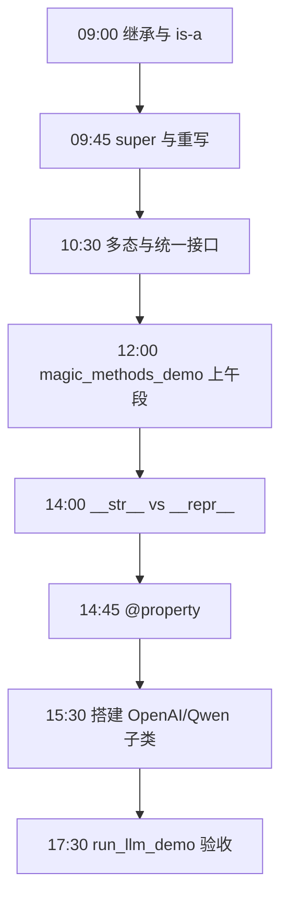
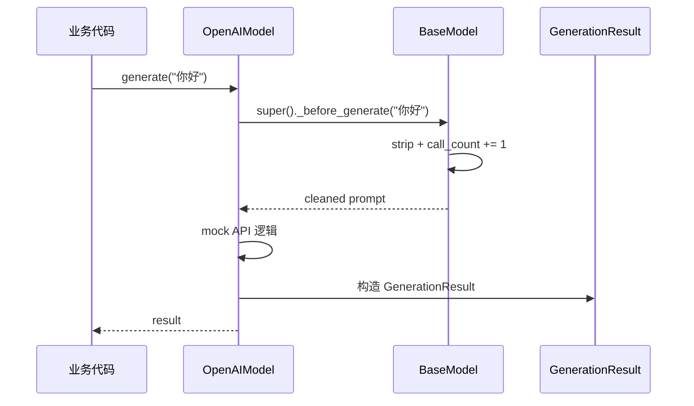
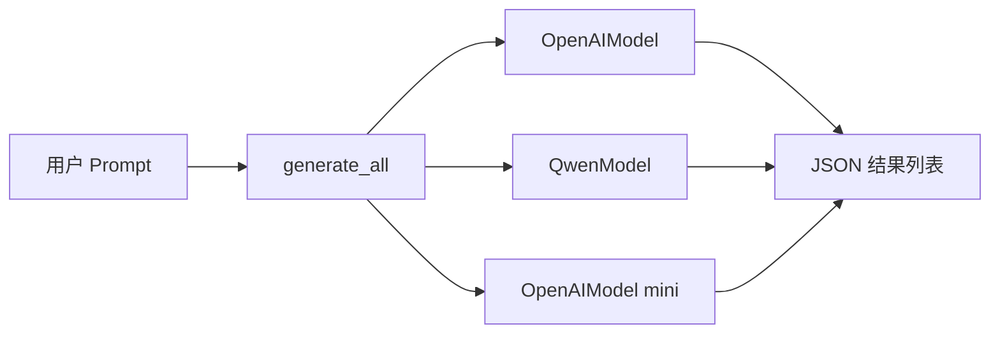
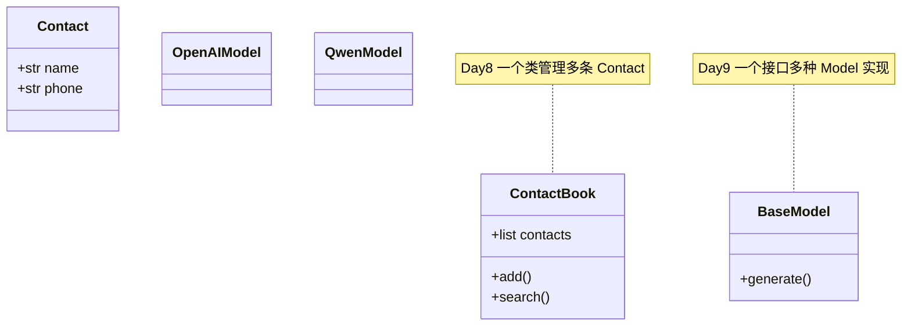

# Day 9 流程图与示意图

## 1. 一日学习流程



## 2. 继承层次（ASCII）

```text
                    BaseModel
                   /         \
                  /           \
          OpenAIModel       QwenModel
                |                 |
         +------+------+    +-----+-----+
         | gpt-4o      |    | qwen-plus |
         | gpt-4o-mini |    | qwen-turbo|
         +-------------+    +-----------+
```

## 3. super() 调用链（generate）



## 4. 多态路由



## 5. __call__ 委托

```text
  model("prompt")
       │
       ▼
  BaseModel.__call__(prompt)
       │
       ▼
  self.generate(prompt)    ← 运行时绑定子类实现
       │
       ▼
  GenerationResult
```

## 6. @property 访问路径

```mermaid
flowchart TB
    subgraph read [读取 model.temperature]
        A1[model.temperature] --> A2[@property getter]
        A2 --> A3[return _temperature]
    end

    subgraph write [赋值 model.temperature = 1.5]
        B1[model.temperature = 1.5] --> B2[@temperature.setter]
        B2 --> B3{0.0 <= v <= 2.0?}
        B3 -->|是| B4[_temperature = v]
        B3 -->|否| B5[ValueError]
    end
```

## 7. __str__ vs __repr__ 决策树

```text
  需要打印对象？
        │
        ├─ 给运维/用户看 → 实现 __str__（简短可读）
        │
        └─ 给开发/日志看 → 实现 __repr__（含类名与关键字段）
                │
                └─ 列表里显示 → 默认用 repr，故 __repr__ 不可省
```

## 8. 反模式 vs 推荐模式

```text
【反模式】
  if vendor == "openai": ...
  elif vendor == "qwen": ...

【推荐】
  for model in models:      # list[BaseModel]
      model.generate(prompt)
```

## 9. Day 15 演进映射

```text
  Day 9 mock                    Day 15 真实
  ─────────────────────────────────────────────
  OpenAIModel.generate    →    openai SDK / httpx
  QwenModel.generate      →    dashscope SDK
  run_llm_demo.py         →    不变
  BaseModel 契约          →    不变
```

## 10. 与 Day 8 Contact 类图对照



---

**状态**：✅ 流程图定稿
