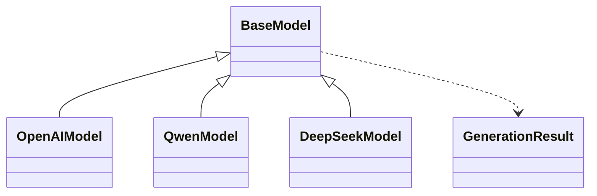

# Day 9 作业参考答案

> 讲评时先让学员自测，再对照要点。答案仅供核对思路，鼓励不同合法实现。

---

## 必做 A 参考答案

### A1. DeepSeekModel

```python
from base_model import BaseModel, GenerationResult


class DeepSeekModel(BaseModel):
    vendor = "deepseek"

    def __init__(
        self,
        model_name: str = "deepseek-chat",
        *,
        api_key: str = "",
        temperature: float = 0.7,
        max_tokens: int = 4096,
    ) -> None:
        super().__init__(
            model_name,
            api_key=api_key,
            temperature=temperature,
            max_tokens=max_tokens,
        )

    def generate(self, prompt: str, **kwargs) -> GenerationResult:
        prompt = super()._before_generate(prompt)
        reply = (
            f"[DeepSeek/{self.model_name}] "
            f"推理 mock：针对「{prompt[:30]}…」给出简洁技术向答复。"
        )
        return GenerationResult(
            text=reply,
            model=self.model_name,
            vendor=self.vendor,
            prompt_tokens=max(1, len(prompt) // 4),
            completion_tokens=max(1, len(reply) // 4),
        )
```

### A2. first_response

```python
from base_model import BaseModel


def first_response(models: list[BaseModel], prompt: str) -> str:
    for model in models:
        result = model.generate(prompt)
        if result.text:
            return result.text
    return ""
```

**讲评**：循环内只调 `model.generate`，体现多态；不要用 `type(model)` 分支。

### A3. 口述参考答案

1. **继承** 让 `OpenAIModel` / `QwenModel` 都成为 `BaseModel` 子类，才能放进 `list[BaseModel]`，循环里统一调用 `generate`。  
2. 业务依赖 `BaseModel` 时，新增厂商不改业务代码，符合 **开闭原则**；依赖具体类会导致切换与测试耦合。

---

## 必做 B 参考答案

### B1. ChatMessage

```python
class ChatMessage:
    def __init__(self, role: str, content: str):
        self._role = role
        self._content = content

    @property
    def role(self) -> str:
        return self._role

    @property
    def content(self) -> str:
        return self._content

    @content.setter
    def content(self, value: str) -> None:
        if not value or not value.strip():
            raise ValueError("content 不能为空")
        self._content = value.strip()

    def __str__(self) -> str:
        return f"[{self._role}] {self._content}"

    def __repr__(self) -> str:
        return f"ChatMessage(role={self._role!r}, content={self._content!r})"
```

### B2. __call__ 实验

```python
from openai_model import OpenAIModel

m = OpenAIModel()
assert callable(m)
m("测")
assert m.call_count == 1
```

### B3. str vs repr

- **日志给用户/运营看**：`str(model)`，简短可读。  
- **调试、异常栈、开发笔记**：`repr(model)`，保留类名与参数便于复现。

---

## 必做 C 参考答案

### C1. run_my_llm_demo 要点

```python
registry: list[BaseModel] = [
    OpenAIModel("gpt-4o-mini"),
    QwenModel("qwen-plus"),
    DeepSeekModel(),
]
results = generate_all(registry, "星火智服 FAQ")
```

### C2. 类图（Mermaid 片段）



---

## 选做 D 参考答案

```python
class LoggingQwenModel(QwenModel):
    def generate(self, prompt: str, **kwargs):
        print(f"[Qwen] start: {prompt[:20]}...")
        result = super().generate(prompt, **kwargs)
        print(f"[Qwen] done: tokens≈{result.completion_tokens}")
        return result
```

---

## 挑战 E 参考答案

```python
from openai_model import OpenAIModel
from qwen_model import QwenModel
from deepseek_model import DeepSeekModel

_REGISTRY = {
    "openai": OpenAIModel,
    "qwen": QwenModel,
    "deepseek": DeepSeekModel,
}


def create_model(vendor: str, **kwargs) -> BaseModel:
    cls = _REGISTRY.get(vendor)
    if cls is None:
        raise ValueError(f"未知 vendor: {vendor}")
    return cls(**kwargs)
```

**讲评**：工厂用 dict 映射类比多态注册；与业务层 `generate` 路由的 if 链是不同层次。

---

## 课堂练习 2 参考答案（Qwen display_name）

```python
@property
def display_name(self) -> str:
    return f"通义·{self.model_name}"

def __str__(self) -> str:
    key_hint = "已配置" if self.is_configured else "未配置 Key"
    return f"{self.display_name} (temp={self.temperature}, {key_hint})"
```

---

**状态**：✅ 参考答案定稿
