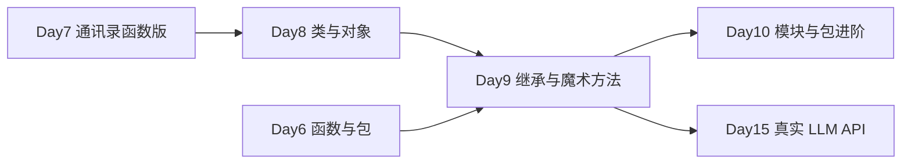

# Day 9 · 继承与多态 · 魔术方法与 LLM 统一接口

> **旁白（讲师口吻）**  
> 周一学了 `class` 与对象；周二上午产品李姐甩来新需求：*「星火智服不能只绑 OpenAI，通义、文心、DeepSeek 都要能切。业务代码别写 `if vendor == 'openai'` 满天飞，给我 **统一接口**。」*  
> 张工在白板上画了一行：`BaseModel → OpenAIModel / QwenModel`，然后说：*「上午搞懂 **继承、多态、super()**；下午搞懂 **`__str__` / `__repr__` / `__call__` / `@property`**。今天交付的 mock 类层次，Day 15 会直接换成真 API。」*

---

## 今日学习地图

| 时段 | 主题 | 产出物 |
|------|------|--------|
| 09:00–10:30 | 继承、`super()`、方法重写 | `magic_methods_demo.py` 第 1～2 节 |
| 10:30–12:00 | 多态、`isinstance`、统一接口设计 | `base_model.py` + 子类 |
| 14:00–15:30 | `__str__` / `__repr__` / `__call__` | `property_demo.py` 第 3～4 节 |
| 15:30–17:30 | `@property` getter/setter、实操 | `openai_model.py` / `qwen_model.py` |
| 19:00–21:00 | 作业 + Git commit | `homework/day09/` |

## 与前后课程的衔接



| 前序能力 | 今日用法 |
|----------|----------|
| Day 8 `class`、`__init__`、实例方法 | `BaseModel` 基类与子类构造 |
| Day 6 函数契约、docstring | `generate()` 作为统一方法签名 |
| Day 5 `dict` / JSON | `GenerationResult` 结构化返回 |
| Day 3 分支 | `isinstance` 按子类能力分支 |

## 今日文件清单

| 文件 | 用途 |
|------|------|
| [01_业务背景.md](./01_业务背景.md) | 多厂商 LLM 统一接口需求 |
| [02_需求文档.md](./02_需求文档.md) | BaseModel 层次 PRD |
| [03_架构与设计.md](./03_架构与设计.md) | 类图、多态路由、扩展点 |
| [04_课堂讲义.md](./04_课堂讲义.md) | **主课**（继承 + 魔术方法 + 实操） |
| [05_流程图与示意图.md](./05_流程图与示意图.md) | 继承链、调用流、property 图 |
| [06_课后作业.md](./06_课后作业.md) | 必做 / 选做 / 挑战 |
| [07_作业参考答案.md](./07_作业参考答案.md) | 参考答案与讲评要点 |
| [08_补充讲义_继承与魔术方法进阶.md](./08_补充讲义_继承与魔术方法进阶.md) | MRO、ABC、与 LangChain 对照 |
| [code/base_model.py](./code/base_model.py) | **抽象基类**（统一接口） |
| [code/openai_model.py](./code/openai_model.py) | OpenAI mock 子类 |
| [code/qwen_model.py](./code/qwen_model.py) | 通义千问 mock 子类 |
| [code/magic_methods_demo.py](./code/magic_methods_demo.py) | 继承 / 多态 / super 演示 |
| [code/property_demo.py](./code/property_demo.py) | @property 与魔术方法演示 |
| [code/run_llm_demo.py](./code/run_llm_demo.py) | 综合路由实操 |

## 今日验收标准

- [ ] 能口述继承、多态、重写、`super()` 的区别与联系  
- [ ] 能解释 `__str__` 与 `__repr__` 的使用场景  
- [ ] 能说明 `@property` 为何优于直接暴露 `_field`  
- [ ] `OpenAIModel` / `QwenModel` 均可通过 `BaseModel` 类型调用 `generate()`  
- [ ] `python3 run_llm_demo.py` 输出四家 mock 结果 JSON  
- [ ] Git 已提交，commit message 含 `day09`

## 快速开始

```bash
cd day09/code
python3 magic_methods_demo.py   # 上午：继承与多态
python3 property_demo.py        # 下午：property 与魔术方法
python3 run_llm_demo.py         # 综合实操
```

---

**讲师提醒**：今天 **不要** 接真实 API Key；mock 的价值是让你把 **类层次** 写对。Day 15 只改 `generate()` 内部实现，业务路由代码一行不动——这就是多态的意义。

**状态**：✅ Day 9 完整课件已发布
