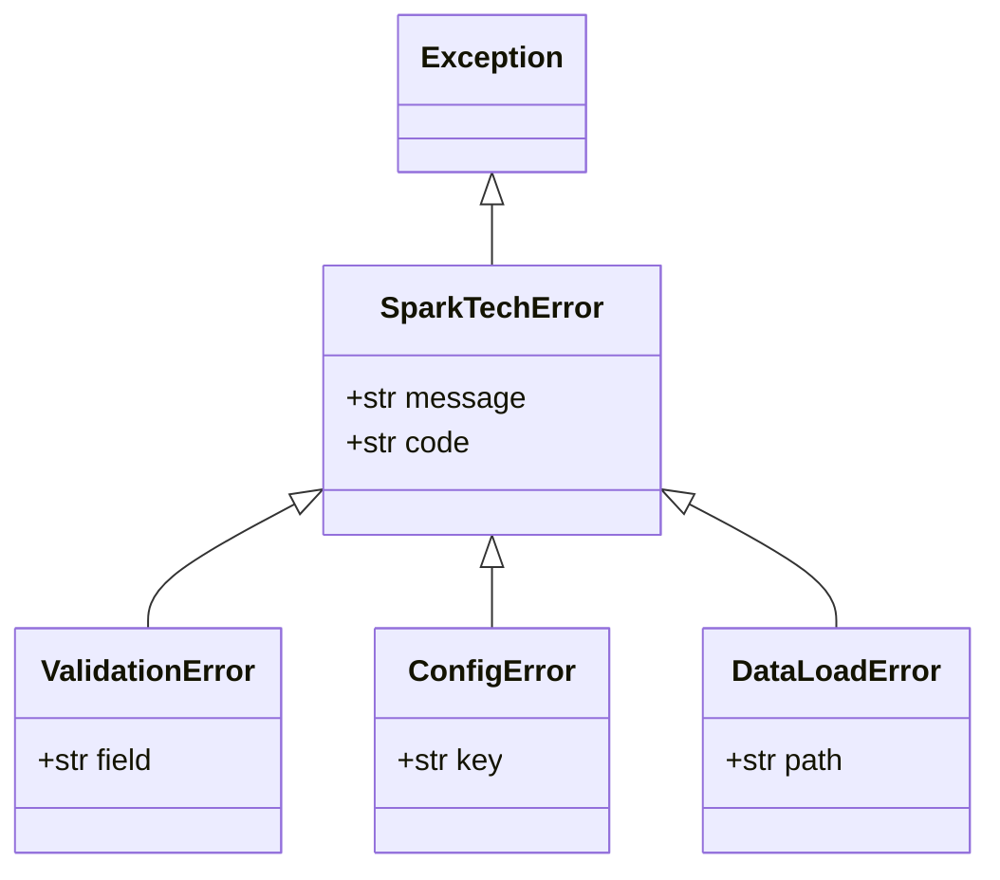
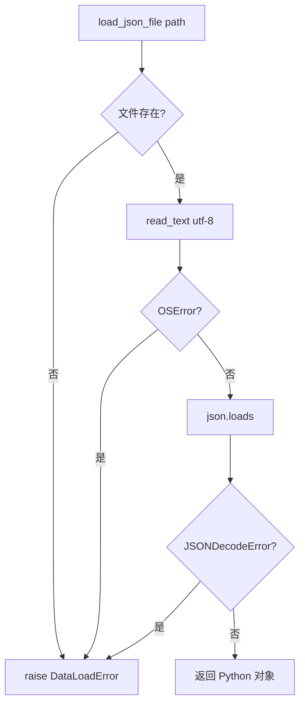

# Day 10 架构与设计 · sparktech 包结构与 import 规范

## 1. 总体架构

```text
┌────────────────────────────────────────────────────────────────────┐
│                         入口层（可执行脚本）                           │
│   demo_imports.py   demo_exceptions.py   verify_package.py          │
│   sys.path.insert(0, code_dir)  ← 教学用，Day 12 删除                │
└────────────────────────────┬───────────────────────────────────────┘
                             │ import
                             ▼
┌────────────────────────────────────────────────────────────────────┐
│                    sparktech/（库包，无副作用导入）                      │
│  ┌──────────────┐   ┌─────────────────────────────────────────┐   │
│  │ exceptions.py│   │              utils/ 子包                 │   │
│  │ 异常层次      │   │  validators.py  │  io.py                │   │
│  └──────▲───────┘   └────────▲────────────────┬───────────────┘   │
│         │                     │                │                    │
│         └─────────────────────┴────────────────┘                    │
│                    __init__.py 重导出公开 API                          │
└────────────────────────────────────────────────────────────────────┘
                             │
                             ▼
                    data/*.json（fixtures）
```

**设计原则**（张工规范）：

1. **库与脚本分离**：`sparktech/` 被 import 时不应执行 CLI 逻辑  
2. **错误用异常**：校验与 IO 失败 `raise`，由调用方 `try/except`  
3. **公开 API 最小化**：`__init__.py` + `__all__` 声明对外符号  
4. **单向依赖**：`utils` → `exceptions`；`exceptions` 不依赖 `utils`  

## 2. 目录树与职责

| 路径 | 类型 | 职责 |
|------|------|------|
| `sparktech/__init__.py` | 包初始化 | 版本号、重导出、 `__all__` |
| `sparktech/exceptions.py` | 模块 | 异常类层次 |
| `sparktech/utils/__init__.py` | 子包初始化 | 导出 validators + io |
| `sparktech/utils/validators.py` | 模块 | 纯函数校验，失败 raise |
| `sparktech/utils/io.py` | 模块 | 文件与环境读取 |
| `demo_imports.py` | 入口 | import 机制教学 |
| `demo_exceptions.py` | 入口 | 异常机制教学 |
| `verify_package.py` | 入口 | 自动化验收 |

## 3. 异常类图



### 3.1 为何需要基类 `SparkTechError`？

```python
try:
    do_something()
except SparkTechError as exc:
    log_business_error(exc.code, exc.message)
except Exception:
    log_unexpected()
```

调用方可以 **一次捕获所有可预期业务错误**，同时让未知错误上浮。

## 4. import 规范

### 4.1 包外（入口脚本）

```python
import sys
from pathlib import Path
sys.path.insert(0, str(Path(__file__).resolve().parent))

from sparktech import validate_phone, ValidationError
```

### 4.2 包内（库代码）

```python
# sparktech/utils/validators.py
from sparktech.exceptions import ValidationError

# sparktech/utils/io.py
from sparktech.exceptions import ConfigError, DataLoadError
```

> 包内优先 **绝对导入** `from sparktech...`；子模块互引可用相对导入 `from .validators import ...`（Day 12 深化）。

### 4.3 禁止写法

| 写法 | 问题 |
|------|------|
| 在 `validators.py` 里 `sys.path.insert` | 库不应修改搜索路径 |
| `from sparktech.utils.validators import *` | 污染命名空间 |
| 循环导入 A→B→A | 启动即失败或半初始化 |

## 5. `if __name__ == "__main__"` 模式

```python
def main() -> None:
    ...

if __name__ == "__main__":
    main()
```

| 运行方式 | `__name__` 值 | 行为 |
|----------|---------------|------|
| `python demo_imports.py` | `"__main__"` | 执行 `main()` |
| `import demo_imports` | `"demo_imports"` | 仅加载函数，不自动跑 demo |
| `python -m demo_imports` | `"__main__"` | 模块方式运行，路径更一致 |

## 6. 虚拟环境架构

```text
  系统 Python (/usr/bin/python3)
        │
        │  python3 -m venv .venv
        ▼
  .venv/bin/python  ← 项目隔离解释器
        │
        │  pip install -r requirements.txt
        ▼
  .venv/lib/python3.x/site-packages/
        ├── requests/
        └── dotenv/
```

| 概念 | 说明 |
|------|------|
| `venv` | 复制/链接解释器，独立 `site-packages` |
| `pip` | 向**当前激活**的 Python 装包 |
| `requirements.txt` | 可复现依赖清单 |
| `.venv/` | 不入 Git；每人本地生成 |

## 7. 数据流：load_json_file



## 8. 与 Day 6 四包映射（收敛方向）

| Day 6 包 | Day 10 落点（本日子集） | 完整迁移 |
|----------|-------------------------|----------|
| `sparktech_cleaners.strip_edges` | 作业选做 | 作业 |
| `sparktech_onboard` 校验逻辑 | `utils/validators.py` | 作业 |
| `sparktech_export` JSON 加载 | `utils/io.py` | 作业 |
| 四包并行命名 | 统一 `sparktech/` | 今日 ✅ |

## 9. Day 14 衔接预览

```python
from sparktech import ValidationError, validate_phone, load_json_file

def handle_add_contact(raw: dict) -> dict:
    name = validate_name(raw["name"])
    phone = validate_phone(raw["phone"])
    return {"name": name, "phone": phone}
```

助手各子命令 import **同一** `sparktech` 包——今日目录即明日工具库。

## 10. 常见设计决策

| 决策 | 选择 | 原因 |
|------|------|------|
| 异常 vs 返回元组 | 异常 | 错误路径不污染正常返回值类型 |
| `utils` 子包 vs 扁平模块 | 子包 | 后续可增 `utils/http.py` 而不臃肿 |
| `requests` 今日未用 | 仍写入 requirements | 环境一次装齐，Day 20 直接用 |
| `load_dotenv` 可选 import | try/except ImportError | 未装 dotenv 时 `get_env` 仍可用系统环境变量 |
