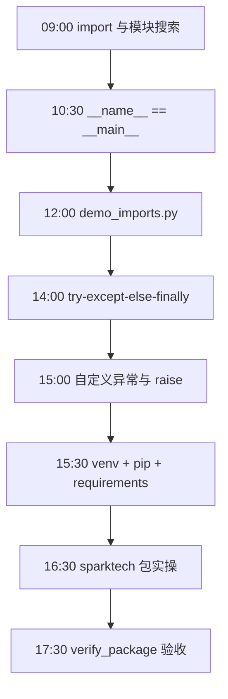
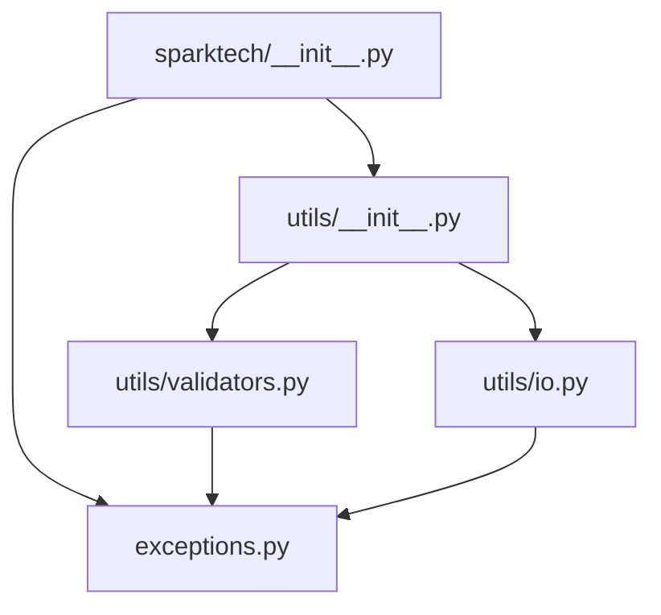
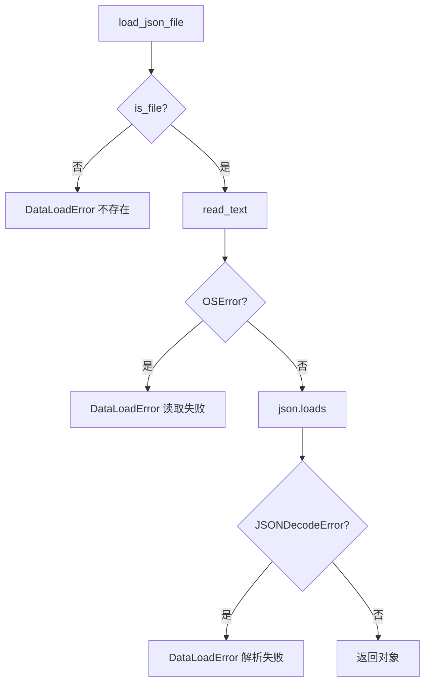

# Day 10 流程图与示意图

## 1. 一日学习流程



## 2. import 查找链

```text
import sparktech
    │
    ▼
sys.path 各目录中是否存在 sparktech/ ？
    │
    ├─ 否 → ModuleNotFoundError
    │
    └─ 是 → 执行 sparktech/__init__.py
              │
              ├─ from .exceptions import ...
              └─ from .utils import ...
                    │
                    ├─ utils/__init__.py
                    ├─ validators.py
                    └─ io.py
```

## 3. 包内依赖（单向）



入口脚本 `demo_*.py` → `sparktech`；`sparktech` 内部不反向依赖 demo。

## 4. try / except / else / finally 时序

```text
        ┌─────────────┐
        │   try 块     │
        └──────┬──────┘
               │
       ┌───────┴───────┐
       │  发生异常？    │
       └───┬───────┬───┘
           │是     │否
           ▼       ▼
    ┌──────────┐  ┌──────────┐
    │ except   │  │  else    │
    └────┬─────┘  └────┬─────┘
         │             │
         └──────┬──────┘
                ▼
         ┌─────────────┐
         │  finally    │  ← 总是执行
         └─────────────┘
```

## 5. 异常传播

```text
validate_name("")
    │
    raise ValidationError("姓名不能为空", field="name")
    │
    ▼
demo_exceptions.demo_catch_hierarchy()
    │
    except ValidationError → 打印 field
    │
    ▼
（若未捕获）→ 栈回溯 traceback → 进程退出
```

## 6. load_json_file 决策树



## 7. 虚拟环境创建流程

```text
setup_venv.sh
    │
    ├─ python3 -m venv .venv
    │       └─ 复制/链接解释器 + 新建 site-packages
    │
    ├─ source .venv/bin/activate
    │       └─ PATH 前置 .venv/bin
    │
    ├─ pip install --upgrade pip
    │
    └─ pip install -r requirements.txt
            ├─ requests
            └─ python-dotenv
```

## 8. 库层 vs 入口层

```text
┌─────────────────────────────────────────┐
│  demo_exceptions.py（入口 / 展示层）       │
│    try:                                 │
│        validate_phone(user_input)       │
│    except ValidationError as e:         │
│        print(用户友好文案)                 │
└──────────────────┬──────────────────────┘
                   │ 调用
                   ▼
┌─────────────────────────────────────────┐
│  sparktech/utils/validators.py（库层）    │
│    if invalid:                          │
│        raise ValidationError(...)       │
│    （不 print）                          │
└─────────────────────────────────────────┘
```

## 9. Day 6 → Day 10 包结构演进

```text
Day 6                          Day 10
─────                          ──────
sparktech_onboard/      ──▶   sparktech/
sparktech_cleaners/            ├── exceptions.py
sparktech_todo/                └── utils/
sparktech_export/                    ├── validators
                                     └── io
```

## 10. 验收检查清单（ASCII）

```text
day10/code/
├── [✓] sparktech/__init__.py      __all__ + __version__
├── [✓] sparktech/exceptions.py    4 个异常类
├── [✓] sparktech/utils/           子包完整
├── [✓] requirements.txt           requests + dotenv
├── [✓] setup_venv.sh              可执行
├── [✓] verify_package.py        4 x [OK]
├── [✓] demo_imports.py
└── [✓] demo_exceptions.py
```
