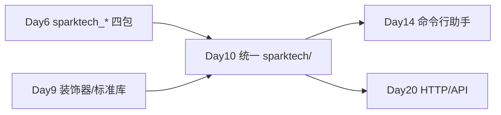

# Day 10 · 模块与包 · 异常处理 · 虚拟环境

> **旁白（讲师口吻）**  
> 周一早上，张工在 Code Review 里标红了一整屏：*「Day 6 四个 `sparktech_*` 包能跑，但不符合公司仓库规范——缺统一 `sparktech/` 命名空间、没有 `exceptions.py`、没有 `requirements.txt`、新人 clone 下来不知道用哪个 Python。」*  
> 他在语音里补了一句：*「上午把 **import 和包** 讲透；下午 **try/except** 和 **venv/pip** 一起上。今天下班前我要看到标准目录树 + 能 `pip install -r requirements.txt` 的说明。」*  
> 今天不学新算法，学 **怎么让代码像工程**——为 Day 14 命令行助手和后续 API 调用打地基。

---

## 今日学习地图

| 时段 | 主题 | 产出物 |
|------|------|--------|
| 09:00–10:30 | import 机制、模块 vs 包、`__init__.py` | `demo_imports.py` 第一节 |
| 10:30–12:00 | 相对/绝对导入、`if __name__ == "__main__"` | `demo_imports.py` 第二节 |
| 14:00–15:30 | `try/except/else/finally`、自定义异常、`raise` | `demo_exceptions.py` |
| 15:30–16:30 | `venv`、`pip`、`requirements.txt` | `setup_venv.sh` + 讲义 |
| 16:30–17:30 | 实操：多文件 `sparktech/` 包结构验收 | `verify_package.py` 全绿 |
| 19:00–21:00 | 作业 + Git commit | `homework/day10/` |

## 与前后课程的衔接



| 前序能力 | 今日升级 |
|----------|----------|
| Day 6 函数 + 拆包 | 统一命名空间 `sparktech/`，不再四个平行包名 |
| Day 5 JSON 读写 | `load_json_file` + `DataLoadError` 友好报错 |
| Day 7 通讯录校验 | `ValidationError` 带 `field` 字段 |
| Day 9 预告 try/except | 今日系统讲授 + 自定义异常类 |

## 今日文件清单

| 文件 | 用途 |
|------|------|
| [01_业务背景.md](./01_业务背景.md) | 张工二次 Code Review 与包规范 deadline |
| [02_需求文档.md](./02_需求文档.md) | `sparktech/` 包 PRD |
| [03_架构与设计.md](./03_架构与设计.md) | 目录树、异常层次、import 规范 |
| [04_课堂讲义.md](./04_课堂讲义.md) | **主课**（import + 异常 + venv） |
| [05_流程图与示意图.md](./05_流程图与示意图.md) | import 查找链、异常传播、venv 流程 |
| [06_课后作业.md](./06_课后作业.md) | 必做 / 选做 / 挑战 |
| [07_作业参考答案.md](./07_作业参考答案.md) | 参考答案与讲评要点 |
| [08_补充讲义_模块与虚拟环境.md](./08_补充讲义_模块与虚拟环境.md) | `pip list`、`.env`、editable install 预告 |
| [code/setup_venv.sh](./code/setup_venv.sh) | 虚拟环境一键脚本 |
| [code/requirements.txt](./code/requirements.txt) | 最小依赖清单 |
| [code/sparktech/](./code/sparktech/) | **统一包**（`exceptions` + `utils/`） |
| [code/demo_imports.py](./code/demo_imports.py) | 上午 import 演示 |
| [code/demo_exceptions.py](./code/demo_exceptions.py) | 下午异常演示 |
| [code/verify_package.py](./code/verify_package.py) | 包结构验收 |

## 今日验收标准

- [ ] 能口述 `import` 时 Python 的模块搜索顺序（含 `sys.path`）  
- [ ] 能解释 `if __name__ == "__main__"` 的作用  
- [ ] 能写出 `try/except/else/finally` 四段各自何时执行  
- [ ] 能定义继承 `SparkTechError` 的自定义异常并 `raise`  
- [ ] 能独立创建 venv、`pip install -r requirements.txt`  
- [ ] `verify_package.py` 四个 `[OK]` 全部通过  
- [ ] Git 已提交，commit message 含 `day10`

## 快速开始

```bash
cd day10/code
bash setup_venv.sh          # 创建 .venv 并安装依赖
source .venv/bin/activate   # 若脚本已 source 可跳过
python demo_imports.py
python demo_exceptions.py
python verify_package.py
```

---

**讲师提醒**：张工验收的第一眼是 `tree sparktech/`，第二眼是 `exceptions.py` 有没有异常基类，第三眼是新人 README 里能不能三步跑起来。`sys.path.insert` 今日仍保留在教学入口脚本里，Day 12 `pyproject.toml` 会换成 `pip install -e .`。

**状态**：✅ Day 10 完整课件已发布
