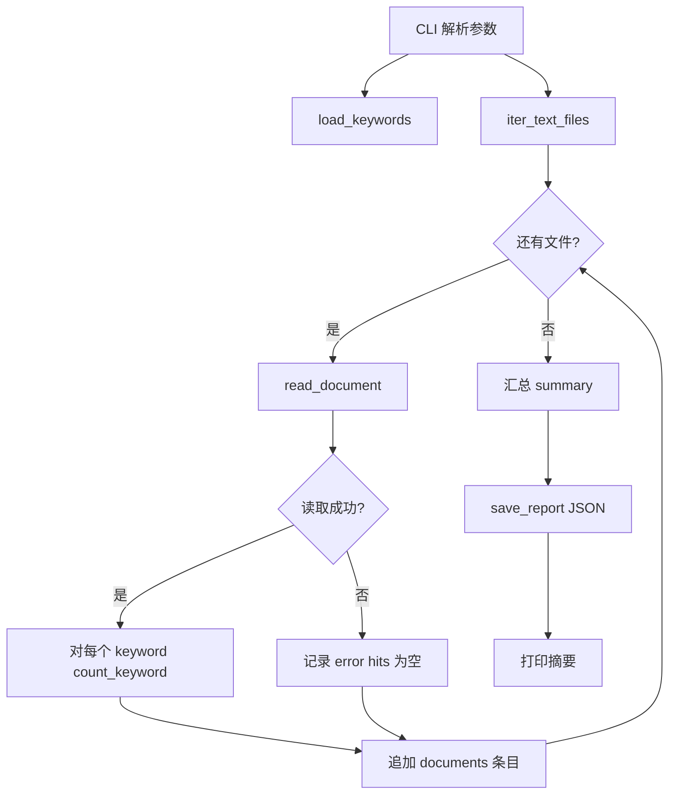

# Day 11 架构与设计 · 文档关键词统计管道

## 1. 总体架构

```text
┌────────────────────────────────────────────────────────────────────┐
│                         入口层（CLI / Demo）                          │
│   doc_keyword_stats.py   file_io_demo.py   pathlib_demo.py          │
│   regex_demo.py   verify_keyword_stats.py                           │
└────────────────────────────┬───────────────────────────────────────┘
                             │
                             ▼
┌────────────────────────────────────────────────────────────────────┐
│                         处理管道（函数模块）                           │
│  load_keywords ──► iter_text_files ──► read_document                 │
│                           │                    │                     │
│                           └──────► count_keyword ◄── re.findall      │
│                                        │                             │
│                                        ▼                             │
│                              scan_documents ──► save_report          │
└────────────────────────────┬───────────────────────────────────────┘
                             │
                             ▼
              data/sample_docs/          output/*.json
              data/keywords.txt
```

**设计原则**（张工规范）：

1. **纯函数优先**：`count_keyword`、`load_keywords` 无副作用，便于单测  
2. **失败隔离**：单文档读失败写入 `error` 字段，不中断批处理  
3. **编码显式**：所有文本 IO 写死 `encoding="utf-8"`  
4. **路径用 pathlib**：新代码禁止 `os.path.join` 堆砌（`os` 仅环境变量等）  

## 2. 模块职责

| 模块/函数 | 职责 |
|-----------|------|
| `load_keywords` | 从 txt/csv 加载关键词列表 |
| `iter_text_files` | `Path.rglob` 收集 `.txt`/`.md` |
| `read_document` | UTF-8 读全文，异常返回错误信息 |
| `count_keyword` | 对单关键词 `re.findall` 计数 |
| `scan_documents` | 组装 `documents` + `summary` |
| `save_report` | 带时间戳 JSON 落盘 |
| `main` | `argparse` 入口 |

## 3. 数据流



## 4. 文件 IO 设计

### 4.1 上下文管理器

```python
with open(path, "w", encoding="utf-8") as f:
    f.write(text)
# 离开 with 块自动 close，异常时也会关闭
```

| 模式 | 含义 | 常用场景 |
|------|------|----------|
| `"r"` | 只读 | 读文档、读配置 |
| `"w"` | 覆盖写 | 写报告、导出 |
| `"a"` | 追加 | 日志（Day 12 `logging`） |
| `"rb"` / `"wb"` | 二进制 | 图片、模型权重（今日不涉及） |

### 4.2 pathlib 读写的等价写法

```python
# 风格 A：传统 with open
with open(path, encoding="utf-8") as f:
    text = f.read()

# 风格 B：Path 快捷方法（推荐只读小文件）
text = path.read_text(encoding="utf-8")
path.write_text(text, encoding="utf-8")
```

**今日规范**：教学 demo 两种都展示；`doc_keyword_stats.py` 读文档用 `read_text`，写 JSON 用 `with open` + `json.dump`。

## 5. 正则统计策略

### 5.1 为何用 `re.escape`

用户关键词可能含 `+`、`?`、`.` 等正则元字符；`re.escape("C++")` 避免误匹配。

### 5.2 中文关键词

```python
pattern = re.escape(keyword)
flags = 0 if case_sensitive else re.IGNORECASE
hits = len(re.findall(pattern, text, flags))
```

中文无空格分词，今日采用 **子串命中**（与 Ctrl+F 一致）。Day 22 可升级为 jieba 分词 + 整词匹配。

### 5.3 大小写

英文关键词默认 `re.IGNORECASE`；`--case-sensitive` 关闭时保留原样。

## 6. 报告 Schema

| 字段 | 类型 | 说明 |
|------|------|------|
| `scanned_at` | ISO8601 字符串 | `datetime.now().isoformat(timespec="seconds")` |
| `docs_dir` | str | 扫描根目录 |
| `total_files` | int | 成功+失败文件总数 |
| `keywords` | list[str] | 使用的关键词 |
| `summary` | dict[str, int] | 各关键词跨文档合计 |
| `documents` | list[object] | 逐文件明细 |
| `documents[].path` | str | 相对 `docs_dir` 的路径 |
| `documents[].char_count` | int | 字符数（失败为 0） |
| `documents[].hits` | dict[str, int] | 该文件各关键词次数 |
| `documents[].error` | str \| null | 读失败原因 |

## 7. 与 Day 10 sparktech 的关系

| Day 10 | Day 11 |
|--------|--------|
| `load_json_file` + `DataLoadError` | 本日自建 `read_document` 错误字段，不强制依赖 sparktech |
| `Path.read_text` 已在 io.py 使用 | 今日系统讲授 |
| 异常抛出 | 批处理场景 **记录错误继续**（策略不同） |

选做作业：将 `read_document` 迁入 `sparktech.utils.io`。

## 8. Day 28 衔接预览

```python
# Day 28 伪代码 — 复用今日 iter_text_files
def load_knowledge_base(root: Path) -> list[Document]:
    docs = []
    for path in iter_text_files(root):
        text, err = read_document(path)
        if text:
            docs.append(Document(page_content=text, metadata={"source": str(path)}))
    return docs
```

今日 **不做分块**；`char_count` 为日后选择 `ChunkSize` 提供参考。

## 9. 常见设计决策

| 决策 | 选择 | 原因 |
|------|------|------|
| 子串匹配 vs 分词 | 子串 | 与业务 Ctrl+F 一致，零基础可验收 |
| 失败抛异常 vs 记录 error | 记录 error | 批处理 200 份不能因 1 份坏文件全停 |
| JSON 报告 vs CSV | JSON | 嵌套 `documents` 结构更清晰 |
| 标准库 only | 是 | 降低环境差异，聚焦语法 |
