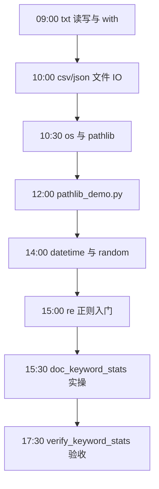
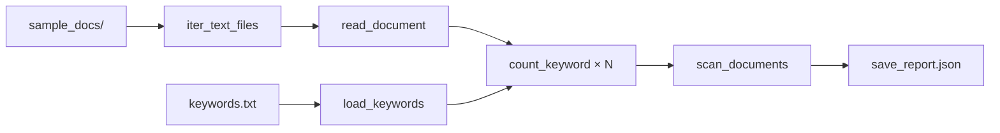
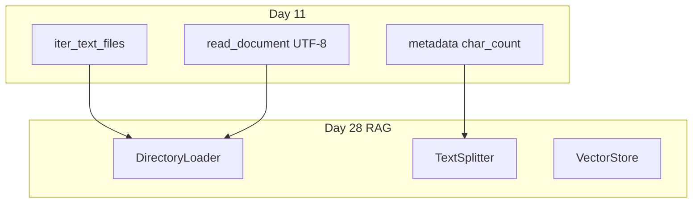

# Day 11 流程图与示意图

## 1. 一日学习流程



## 2. 文件读写与上下文管理器

```text
        ┌─────────────────┐
        │  with open(...) │
        └────────┬────────┘
                 │
                 ▼
        ┌─────────────────┐
        │    __enter__    │  打开文件，返回句柄 f
        └────────┬────────┘
                 │
                 ▼
        ┌─────────────────┐
        │  f.read/write   │  业务代码
        └────────┬────────┘
                 │
         ┌───────┴───────┐
         │  正常或异常？   │
         └───────┬───────┘
                 ▼
        ┌─────────────────┐
        │    __exit__     │  自动 close() 释放句柄
        └─────────────────┘
```

## 3. pathlib 目录遍历

```text
data/sample_docs/
    │
    ├─ faq_refund.txt      ──┐
    ├─ product_guide.md    ──┼─► rglob("*") + suffix in {.txt,.md}
    ├─ service_policy.txt  ──┤
    └─ llm_intro.md        ──┘
                │
                ▼
         sorted(yield Path)
```

## 4. 关键词统计管道



## 5. 单文档处理状态机

```text
    [开始处理文件]
          │
          ▼
    read_document(path)
          │
    ┌─────┴─────┐
    │ 成功？     │
    └─┬───────┬─┘
      │否     │是
      ▼       ▼
  error≠null  对每个 keyword
  hits={}     count_keyword
  char_count=0     │
      │            ▼
      └────► 写入 documents[]
```

## 6. re.findall 计数示意

```text
文本: "大模型可处理工单，大模型需审核。"
关键词: "大模型"

re.findall(re.escape("大模型"), text)
    │
    ▼
["大模型", "大模型"]  → len = 2
```

## 7. JSON 报告结构树

```text
report
├── scanned_at: str
├── docs_dir: str
├── total_files: int
├── keywords: list[str]
├── summary: dict[str, int]
└── documents: list
    └── item
        ├── path: str
        ├── char_count: int
        ├── hits: dict[str, int]
        └── error: str | null
```

## 8. Day 11 → Day 28 能力映射



## 9. 编码决策简图

```text
  打开文本文件
       │
       ▼
  指定 encoding=utf-8 ？ ──否──► 系统默认（风险）
       │
      是
       ▼
  仍 UnicodeDecodeError？
       │
      是 ──► 记录 error，跳过（批处理）
       │
      否
       ▼
  正常统计
```

## 10. CLI 参数流

```text
argv
  │
  ▼
argparse
  ├─ --docs-dir  ──► Path(docs_dir)
  ├─ --keywords  ──► load_keywords()
  ├─ --output-dir ─► mkdir + save_report
  └─ --case-sensitive ─► count_keyword flags
```
