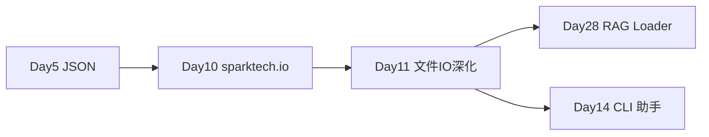

# Day 11 · 文件读写 · pathlib · 正则 · 批量文档关键词统计

> **旁白（讲师口吻）**  
> 周二早上，知识库负责人刘姐把 U 盘递给培训组：*「星火智服内网有 200+ 份 txt/md 制度文档，Day 28 要上 RAG 加载器；在那之前，先给我一份 **关键词命中统计**——哪些文档提到『退款』『大模型』『工单』，各出现几次。」*  
> 张工接话：*「上午把 **文件 IO + 上下文管理器 + UTF-8** 讲透；下午 **os / pathlib / datetime / random / re** 一起上。下班前 `doc_keyword_stats.py` 能批量扫目录、出 JSON 报告。」*  
> 今天是 **RAG 文档处理链** 的第一块砖——只统计、不向量化；但目录遍历、编码、正则分词，全是 Day 28 loader 的前置技能。

---

## 今日学习地图

| 时段 | 主题 | 产出物 |
|------|------|--------|
| 09:00–10:30 | txt/csv/json 读写、`with` 上下文管理器、UTF-8 | `file_io_demo.py` |
| 10:30–12:00 | `os` 与 `pathlib` 路径操作 | `pathlib_demo.py` |
| 14:00–15:30 | `datetime`、`random`、`re` 正则入门 | `regex_demo.py` |
| 15:30–17:30 | 实操：批量文档关键词统计 CLI | `doc_keyword_stats.py` |
| 19:00–21:00 | 作业 + Git commit | `homework/day11/` |

## 与前后课程的衔接



| 前序能力 | 今日升级 |
|----------|----------|
| Day 5 `json.loads` / `json.dump` | 配合 `with open` 与 `ensure_ascii=False` |
| Day 10 `load_json_file` + `Path.read_text` | 系统讲授上下文管理器与编码策略 |
| Day 6 函数拆分 | 关键词统计拆为 `scan` / `count` / `report` |
| Day 9 标准库预告 | 今日落地 `os`、`pathlib`、`re` |

## 今日文件清单

| 文件 | 用途 |
|------|------|
| [01_业务背景.md](./01_业务背景.md) | 星火智服知识库批量统计需求 |
| [02_需求文档.md](./02_需求文档.md) | `doc_keyword_stats` PRD |
| [03_架构与设计.md](./03_架构与设计.md) | 模块划分、数据流、正则策略 |
| [04_课堂讲义.md](./04_课堂讲义.md) | **主课**（文件 IO + 标准库 + 实操） |
| [05_流程图与示意图.md](./05_流程图与示意图.md) | 读写流程、目录遍历、统计管道 |
| [06_课后作业.md](./06_课后作业.md) | 必做 / 选做 / 挑战 |
| [07_作业参考答案.md](./07_作业参考答案.md) | 参考答案与讲评要点 |
| [08_补充讲义_文件IO与正则进阶.md](./08_补充讲义_文件IO与正则进阶.md) | `logging` 预告、大文件、`chardet` |
| [code/file_io_demo.py](./code/file_io_demo.py) | 上午 txt/csv/json 演示 |
| [code/pathlib_demo.py](./code/pathlib_demo.py) | 下午 os/pathlib 演示 |
| [code/regex_demo.py](./code/regex_demo.py) | datetime/random/re 演示 |
| [code/doc_keyword_stats.py](./code/doc_keyword_stats.py) | **主 CLI 工具** |
| [code/verify_keyword_stats.py](./code/verify_keyword_stats.py) | 自动化验收 |
| [code/data/sample_docs/](./code/data/sample_docs/) | 3–4 份样例文档 |

## 今日验收标准

- [ ] 能解释 `with open(..., encoding="utf-8")` 为何必须写编码  
- [ ] 能区分 `os.path` 与 `pathlib.Path` 的推荐用法  
- [ ] 能写出 `re.findall` 统计中文关键词的基本模式  
- [ ] `python doc_keyword_stats.py` 对 `sample_docs/` 输出 JSON 报告  
- [ ] `python verify_keyword_stats.py` 全部 `[OK]`  
- [ ] Git 已提交，commit message 含 `day11`

## 快速开始

```bash
cd day11/code
python file_io_demo.py
python pathlib_demo.py
python regex_demo.py
python doc_keyword_stats.py --docs-dir data/sample_docs
python verify_keyword_stats.py
```

---

**讲师提醒**：刘姐验收的第一眼是 **UTF-8 中文不乱码**，第二眼是 **漏扫文件数为 0**，第三眼是报告里 **每个关键词的 total_hits 可核对**。Day 28 的 `DocumentLoader` 会复用今日 `iter_text_files()` 思路——先统计、后切块。

**状态**：✅ Day 11 完整课件已发布
