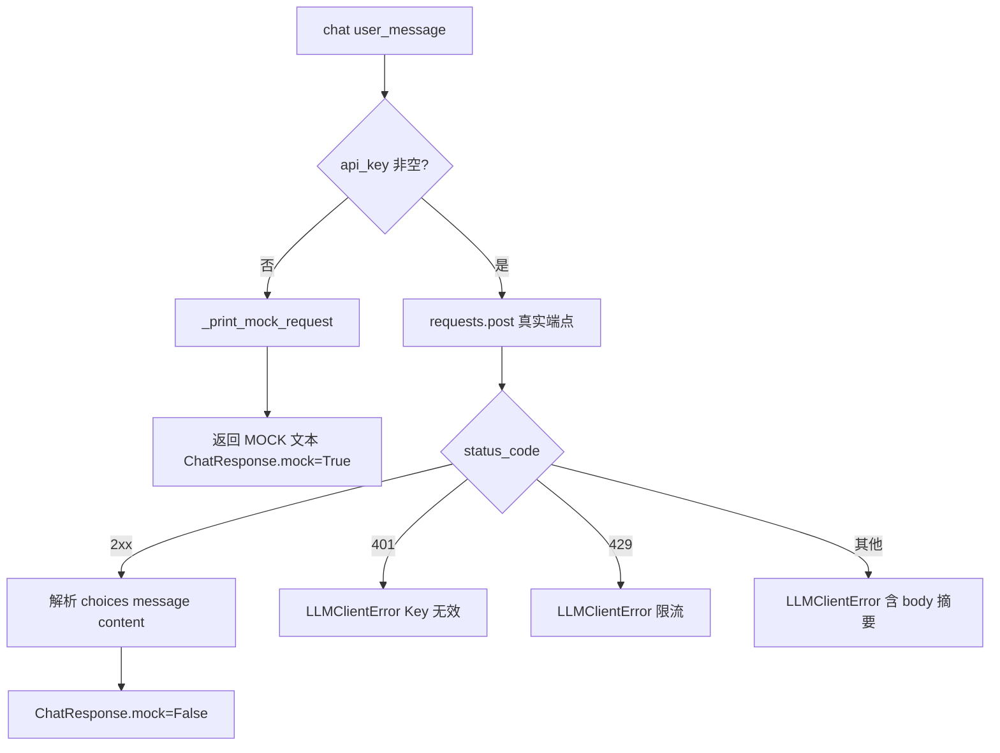
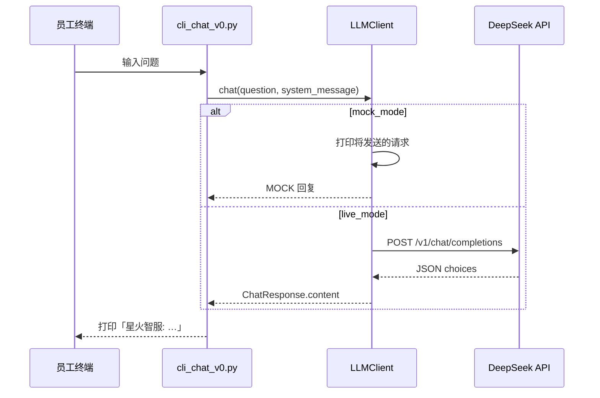

# Day 12 架构与设计 · HTTP 数据流与 LLMClient 模块划分

## 1. 总体架构

```text
┌─────────────────────────────────────────────────────────────────────┐
│                         入口层（CLI / 演示）                           │
│   http_basics_demo.py    llm_client.py __main__    cli_chat_v0.py   │
└──────────────────────────────┬──────────────────────────────────────┘
                               │ import LLMClient
                               ▼
┌─────────────────────────────────────────────────────────────────────┐
│                         llm_client.py（核心库）                        │
│   LLMClient ── build_payload / build_headers ── chat()              │
│        │ mock_mode?                                                 │
│        ├─ True  → _print_mock_request + _mock_chat                  │
│        └─ False → requests.post → parse ChatResponse                │
└──────────────────────────────┬──────────────────────────────────────┘
                               │ HTTPS
                               ▼
                    DeepSeek API (OpenAI 兼容)
                    POST /v1/chat/completions
```

**设计原则**（张工规范）：

1. **CLI 不直接 requests**：所有 HTTP 细节收敛在 `LLMClient`  
2. **配置外置**：Key / Base URL 来自环境变量或构造参数  
3. **mock 一等公民**：无 Key 与有 Key 走同一 `chat()` 接口  
4. **单轮先行**：`messages` 仅 system + user；历史列表 Day 14 扩展  

## 2. HTTP 请求/响应模型（LLM API）

### 2.1 请求结构

```text
POST https://api.deepseek.com/v1/chat/completions
│
├── Headers
│     Authorization: Bearer sk-xxxxxxxx
│     Content-Type: application/json
│
└── Body (JSON)
      {
        "model": "deepseek-chat",
        "messages": [
          {"role": "system", "content": "你是星火智服助手…"},
          {"role": "user",   "content": "VPN 怎么配置？"}
        ],
        "temperature": 0.7,
        "max_tokens": 1024
      }
```

### 2.2 响应结构（简化）

```json
{
  "id": "chatcmpl-xxx",
  "model": "deepseek-chat",
  "choices": [
    {
      "index": 0,
      "message": {
        "role": "assistant",
        "content": "请打开企业门户…"
      },
      "finish_reason": "stop"
    }
  ],
  "usage": {
    "prompt_tokens": 42,
    "completion_tokens": 88,
    "total_tokens": 130
  }
}
```

**解析路径**：`choices[0].message.content`

## 3. 模块职责

| 模块 | 类型 | 职责 |
|------|------|------|
| `http_basics_demo.py` | 演示脚本 | 教学 HTTP，与 LLM 无耦合 |
| `llm_client.py` | 库 | 配置加载、payload 构造、HTTP 调用、响应解析 |
| `cli_chat_v0.py` | 入口 | 参数解析、交互循环、调用 `LLMClient.chat()` |
| `verify_day12.py` | 验收 | 无 Key 自动化检查 |

## 4. mock 模式设计



**为何 mock 要打印完整请求？**

- Code Review 时可核对 `messages` 结构  
- 新人无 Key 也能学习 payload 形态  
- CI 不依赖外网与付费额度  

## 5. 环境变量加载顺序

```text
1. 构造参数 api_key= / base_url=  （显式传入优先）
2. os.getenv("DEEPSEEK_API_KEY")   （系统环境）
3. load_dotenv() → .env 文件       （本地开发）
4. 默认 base_url = https://api.deepseek.com
```

| 变量 | 必填 | 说明 |
|------|------|------|
| `DEEPSEEK_API_KEY` | LIVE 模式必填 | Bearer Token |
| `DEEPSEEK_BASE_URL` | 否 | 私有化部署或代理时修改 |

## 6. CLI v0 交互流



## 7. 与 Day 9 BaseModel 的映射

| Day 9 概念 | Day 12 落点 |
|------------|-------------|
| `BaseModel.generate(prompt)` | `LLMClient.chat(user_message)` |
| `GenerationResult.text` | `ChatResponse.content` |
| mock 哈希回复 | `_mock_chat()` 固定格式回复 |
| `api_key` 构造参数 | 环境变量 + 构造参数 |
| 多态 `OpenAIModel` / `QwenModel` | Day 15 恢复多厂商，内部仍用 HTTP |

## 8. 错误处理策略

| 场景 | 处理 |
|------|------|
| 空 user_message | `raise LLMClientError` |
| 网络超时/断连 | `LLMClientError("网络请求失败")` |
| HTTP 401 | Key 无效提示 |
| HTTP 429 | 限流提示（Day 13 加重试） |
| JSON 结构异常 | 附带响应片段便于排错 |
| 无 Key | mock，不抛错 |

## 9. 安全清单

| 规则 | 原因 |
|------|------|
| `.env` 加入 `.gitignore` | 防止 Key 泄露 |
| 日志脱敏 Key | 截图/录屏安全 |
| 禁止 `print(api_key)` 全量 | 运维审计 |
| `.env.example` 留空 | 模板可公开 |

## 10. Day 14 衔接预览

```python
# Day 14：messages 带历史
messages = [
    {"role": "system", "content": SYSTEM_PROMPT},
    {"role": "user", "content": "VPN 端口是多少？"},
    {"role": "assistant", "content": "默认 443…"},
    {"role": "user", "content": "那 macOS 怎么配？"},  # 追问
]
# LLMClient 将增加 chat_with_history(messages) 或 Session 类
```

今日 `LLMClient.build_messages()` 是两轮历史的子集——先把单轮跑通。

## 11. 常见设计决策

| 决策 | 选择 | 原因 |
|------|------|------|
| 自研 requests vs 官方 SDK | requests | 看清 HTTP 每层，SDK  Day 15 对比 |
| dataclass ChatResponse | 是 | 比裸 dict 更易读 |
| 独立 llm_client.py | 暂不并入 sparktech | Day 15 迁入包结构 |
| httpbin 公网依赖 | 接受 | 标准教学端点；课堂可跳过 |
