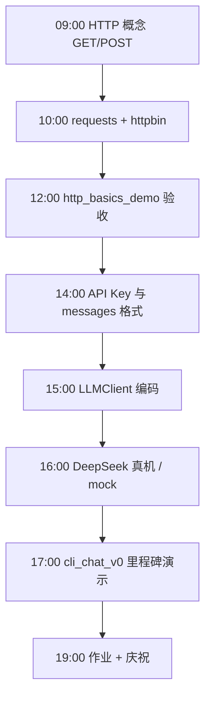
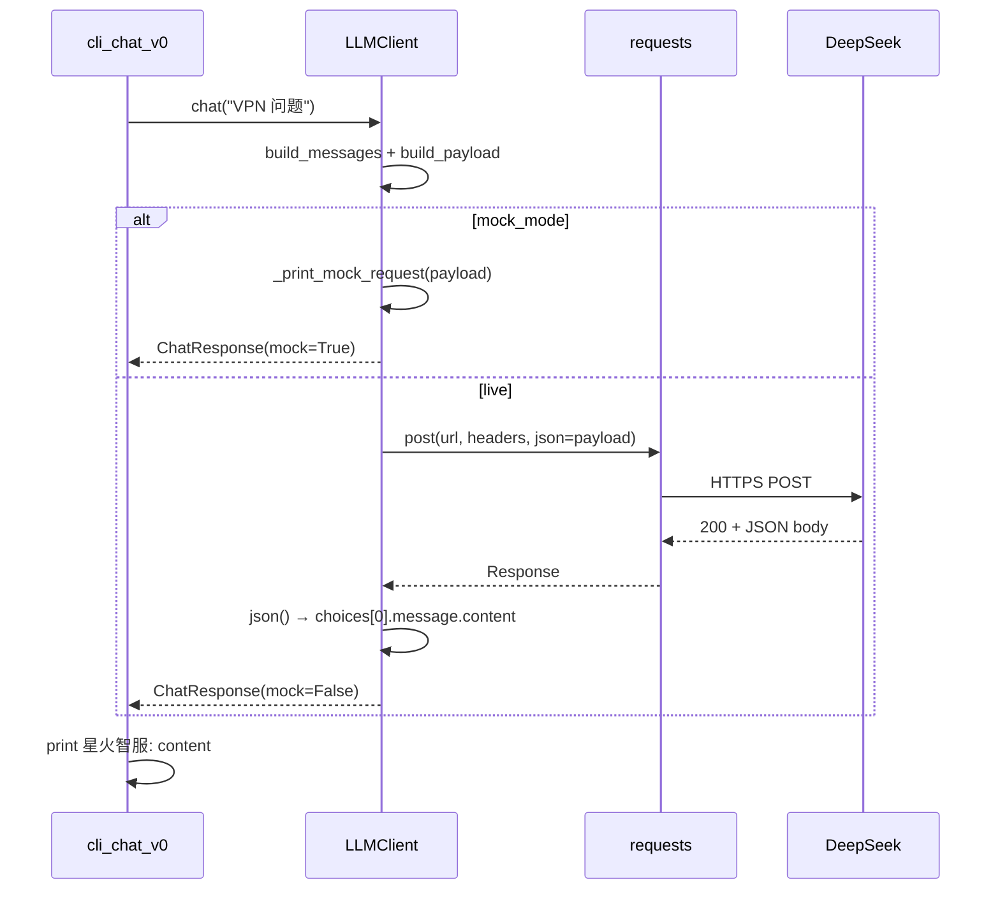
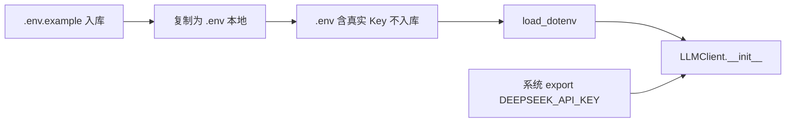

# Day 12 流程图与示意图

## 1. 一日学习流程



## 2. HTTP 方法对照（ASCII）

```text
  GET  /resource?id=1     ──▶  取数据，参数在 URL（查询字符串）
  POST /resource          ──▶  提交数据，body 在请求体（LLM 用这个）

  星火智服 LLM 调用：
  POST https://api.deepseek.com/v1/chat/completions
       └── JSON body: { model, messages, temperature, ... }
```

## 3. 状态码决策树

```text
        收到 HTTP 响应
              │
              ▼
        status_code ?
              │
    ┌─────────┼─────────┬─────────────┐
    │         │         │             │
   2xx       401       429           5xx
    │         │         │             │
    ▼         ▼         ▼             ▼
  解析 JSON  Key 错   限流等待      服务端故障
  choices[0] 检查.env  退避重试     联系厂商/重试
```

## 4. LLM API 完整时序



## 5. messages 列表结构（单轮 vs 多轮）

```text
  Day 12 单轮（今日）:
  ┌──────────────────────────────────────┐
  │ { role: system,  content: 人设 }    │
  │ { role: user,    content: 当前问题 } │
  └──────────────────────────────────────┘

  Day 14 多轮（预告）:
  ┌──────────────────────────────────────┐
  │ { role: system,     content: 人设 }  │
  │ { role: user,       content: 问1 }   │
  │ { role: assistant,  content: 答1 }   │
  │ { role: user,       content: 问2 }   │  ← 追问带上下文
  └──────────────────────────────────────┘
```

## 6. 环境变量与文件关系



## 7. CLI v0 状态机

```text
           ┌─────────┐
           │  启动   │
           └────┬────┘
                ▼
         ┌──────────────┐
    ┌───▶│ 等待用户输入  │◀───┐
    │    └──────┬───────┘    │
    │           │            │
    │     quit/exit/q        │ 继续
    │           ▼            │
    │    ┌──────────┐        │
    │    │   退出   │        │
    │    └──────────┘        │
    │           ▲            │
    │      空行跳过          │
    │                        │
    │    非空问题            │
    │           ▼            │
    │    ┌──────────────┐    │
    └───│ LLMClient.chat│────┘
         └──────────────┘
```

## 8. mock vs LIVE 对比

| 维度 | mock 模式 | LIVE 模式 |
|------|-----------|-----------|
| 触发条件 | 无 `DEEPSEEK_API_KEY` | Key 已配置 |
| 网络 | 不请求 | HTTPS 至 DeepSeek |
| 输出 | 打印将发送的请求 + 模拟回复 | 真实模型文本 |
| 用途 | 课堂、CI、无额度账号 | 里程碑演示、作业真机 |
| `ChatResponse.mock` | `True` | `False` |

## 9. 与 httpbin 演示的对照

```text
  上午 http_basics_demo          下午 llm_client
  ─────────────────────          ─────────────────
  POST httpbin.org/post    ≈     POST api.deepseek.com/.../chat/completions
  headers: User-Agent      ≈     headers: Authorization
  json: { model, messages }≈     json: { model, messages, temperature }
  response.json()["json"]  ≈     response.json()["choices"][0]["message"]
```

## 10. 里程碑庆祝检查点

```text
  [ ] http_basics_demo 四节跑通
  [ ] mock 模式看到完整 POST 结构
  [ ] （可选）LIVE 模式收到第一句 DeepSeek 回复
  [ ] cli_chat_v0 交互退出正常
  [ ] verify_day12 全绿
  [ ] Git commit: feat(day12): 星火智服首次 LLM 集成
```
