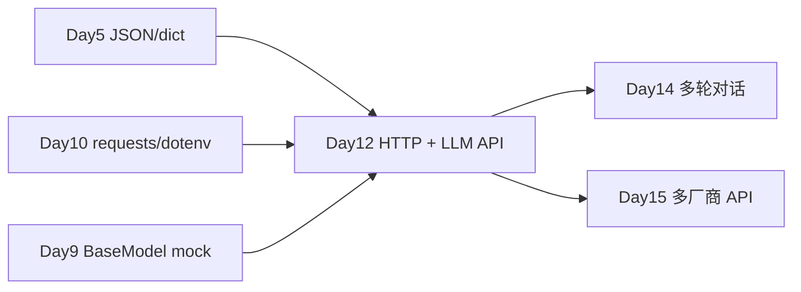

# Day 12 · HTTP 基础与首次 LLM API 调用 · KEY DAY

> **旁白（讲师口吻）**  
> 周五上午，产品李姐在全员群里发了一条消息：*「星火智服 v0.1 里程碑——本周必须打通 **第一条真实大模型回复**。」*  
> 张工转发到培训群：*「上午把 **HTTP GET/POST、状态码、headers、body** 讲透，用 `requests` 打 httpbin；下午 **第一次调 DeepSeek API**，搞懂 API Key、`messages` 格式、解析 `choices[0].message.content`。下班前交付 **命令行单轮问答 v0**。」*  
> 今天是 70 天训练营的 **KEY DAY**——从「写 Python」到「调 AI」的分水岭。

---

## 今日学习地图

| 时段 | 主题 | 产出物 |
|------|------|--------|
| 09:00–10:30 | HTTP 基础：GET/POST、状态码、headers、body | `http_basics_demo.py` |
| 10:30–12:00 | `requests` 库实战（httpbin） | 讲义第二章 |
| 14:00–15:00 | API Key、请求体、`messages` 格式、响应解析 | `llm_client.py` |
| 15:00–16:30 | DeepSeek Chat Completions 真机联调 | `.env` + mock/LIVE 双模式 |
| 16:30–17:30 | 命令行 AI 问答 v0（单轮） | `cli_chat_v0.py` |
| 19:00–21:00 | 里程碑庆祝 + 作业 | `homework/day12/` |

## 与前后课程的衔接



| 前序能力 | 今日升级 |
|----------|----------|
| Day 5 `json.dumps/loads`、dict 构造 | POST body 即 JSON 化的 `messages` |
| Day 10 `requests`、`python-dotenv` | 真实 HTTP 调用 + `.env` 存 Key |
| Day 9 `BaseModel.generate()` mock | `LLMClient.chat()` 真 API 实现 |
| Day 3 交互式 CLI | `cli_chat_v0.py` 单轮问答 |

## 今日文件清单

| 文件 | 用途 |
|------|------|
| [01_业务背景.md](./01_业务背景.md) | 星火智服 × DeepSeek 首次集成里程碑 |
| [02_需求文档.md](./02_需求文档.md) | HTTP 演示 + LLMClient + CLI PRD |
| [03_架构与设计.md](./03_架构与设计.md) | 请求/响应数据流、模块划分 |
| [04_课堂讲义.md](./04_课堂讲义.md) | **主课**（HTTP + requests + DeepSeek API） |
| [05_流程图与示意图.md](./05_流程图与示意图.md) | HTTP 时序、API 调用链、CLI 流程 |
| [06_课后作业.md](./06_课后作业.md) | 必做 / 选做 / 挑战 |
| [07_作业参考答案.md](./07_作业参考答案.md) | 参考答案与讲评要点 |
| [08_补充讲义_HTTP与LLM_API进阶.md](./08_补充讲义_HTTP与LLM_API进阶.md) | 通义千问切换、超时重试、安全清单 |
| [code/http_basics_demo.py](./code/http_basics_demo.py) | 上午 HTTP 演示 |
| [code/llm_client.py](./code/llm_client.py) | **LLMClient** 封装（mock + LIVE） |
| [code/cli_chat_v0.py](./code/cli_chat_v0.py) | 单轮命令行问答 |
| [code/.env.example](./code/.env.example) | 环境变量模板 |
| [code/requirements.txt](./code/requirements.txt) | 依赖清单 |
| [code/setup_venv.sh](./code/setup_venv.sh) | 虚拟环境脚本 |
| [code/verify_day12.py](./code/verify_day12.py) | 无 Key 验收 |

## 今日验收标准

- [ ] 能口述 GET 与 POST 的区别，以及 LLM API 为何用 POST  
- [ ] 能解释 200 / 401 / 429 / 500 状态码在调 API 时的含义  
- [ ] 能说明 `Authorization: Bearer <API_KEY>` 的作用  
- [ ] 能构造 `messages` 列表（system + user）并解析 `choices[0].message.content`  
- [ ] `python verify_day12.py` 三个 `[OK]` 全部通过  
- [ ] 无 API Key 时 `cli_chat_v0.py` 可 mock 运行；有 Key 时可获得真实回复  
- [ ] Git 已提交，commit message 含 `day12`

## 快速开始

```bash
cd day12/code
bash setup_venv.sh
source .venv/bin/activate

# 上午：HTTP 基础（需联网访问 httpbin.org）
python http_basics_demo.py

# 下午：LLM（无 Key 自动 mock）
python llm_client.py "星火智服你好"
python cli_chat_v0.py -q "VPN 连不上怎么办？"

# 配置真实 API（可选）
cp .env.example .env   # 若 setup 未复制
# 编辑 .env 填入 DEEPSEEK_API_KEY
python cli_chat_v0.py

python verify_day12.py
```

---

**讲师提醒**：今日庆祝里程碑，但安全红线不变——**API Key 只放 `.env`，绝不进 Git**。mock 模式不是降级，是 CI 与课堂演示的标配。

**状态**：✅ Day 12 完整课件已发布
