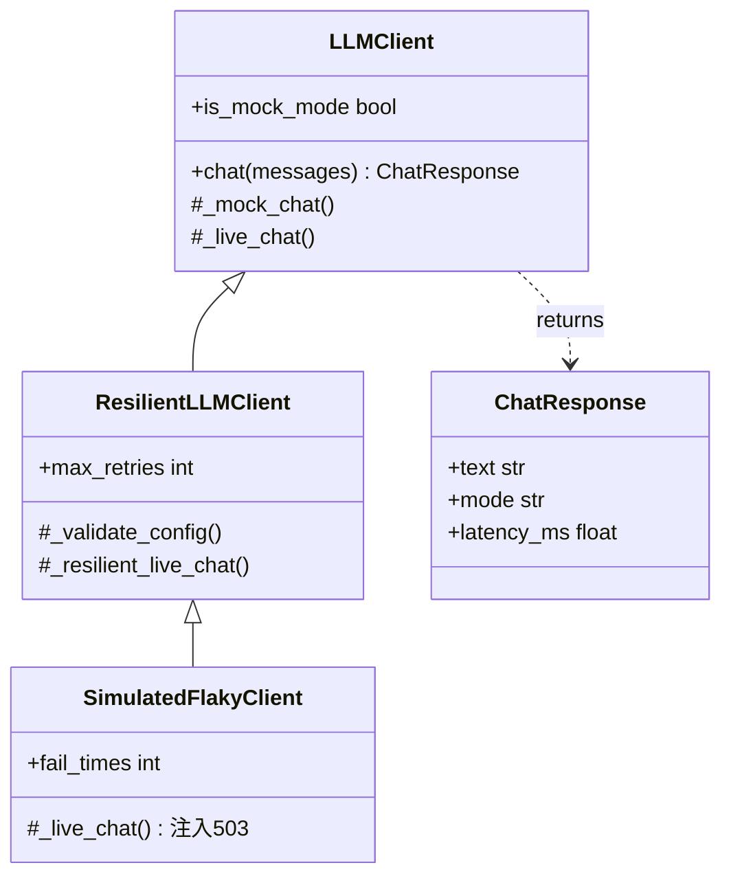
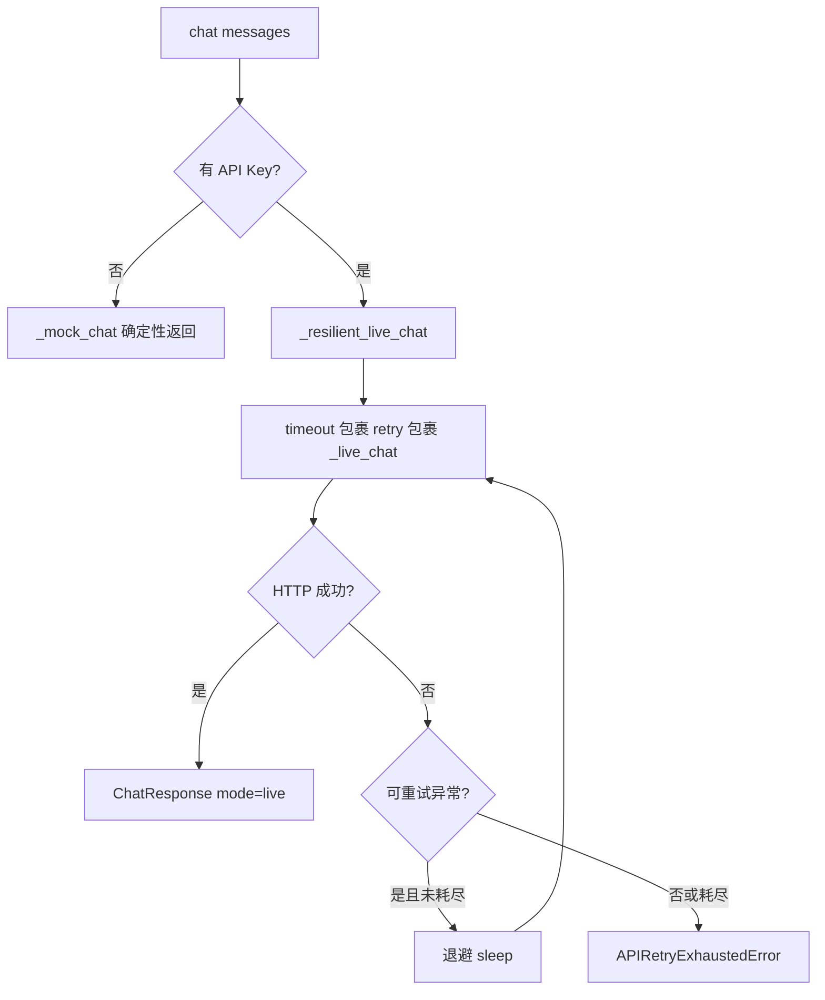

# Day 13 架构与设计 · 装饰器栈与弹性客户端层次

## 1. 总体架构

```text
┌─────────────────────────────────────────────────────────────────────┐
│                         入口层（可执行脚本）                            │
│  decorator_demo / generator_demo / typing_demo / asyncio_intro       │
│  api_decorators / run_resilient_demo / verify_day13                  │
└────────────────────────────┬────────────────────────────────────────┘
                             │ import
                             ▼
┌─────────────────────────────────────────────────────────────────────┐
│                    弹性层 resilient_llm_client.py                     │
│   ResilientLLMClient ──extends──▶ LLMClient (llm_client.py)          │
│        │ live 路径: @timeout @retry                                   │
│        │ mock 路径: 直通 _mock_chat                                   │
└────────────────────────────┬────────────────────────────────────────┘
                             │ uses
                             ▼
┌─────────────────────────────────────────────────────────────────────┐
│                    横切层 api_decorators.py                             │
│   @retry   @timeout   APITimeoutError   APIRetryExhaustedError        │
└────────────────────────────┬────────────────────────────────────────┘
                             │
                             ▼
┌─────────────────────────────────────────────────────────────────────┐
│                    配置层 dotenv + os.environ                          │
│   .env.example → .env（本地，不入库）→ OPENAI_API_KEY                  │
└─────────────────────────────────────────────────────────────────────┘
```

**设计原则**（张工规范）：

1. **开闭原则**：不改 `chat(messages)` 签名，用装饰器增强 live 路径  
2. **失败隔离**：mock 与 live 分支清晰，无 Key 不碰网络  
3. **可观测**：重试时打印 attempt 日志，超时抛出明确异常类型  
4. **重试有界**：指数退避 + 最大次数，避免无限循环  

## 2. 装饰器执行顺序

多个装饰器从下往上包装：

```python
@timeout(2.0)          # 外层：每次 attempt 的总时限
@retry(max_attempts=3) # 内层：失败重试
def _live_chat(...):
    ...
```

等价于：

```python
_live_chat = timeout(2.0)(retry(max_attempts=3)(_live_chat))
```

| 顺序 | 效果 |
|------|------|
| timeout 在外 | 每次重试独立计时，单次调用不超过 2s |
| retry 在外 | 整个重试过程共用一个 timeout 预算（今日不采用） |

## 3. 客户端类图



## 4. 重试决策流



### 4.1 可重试 vs 不可重试

| 异常 | 重试? | 原因 |
|------|-------|------|
| `ConnectionError` | ✅ | 瞬时网络 |
| `LLMHTTPError` 503/502 | ✅ | 上游抖动 |
| `LLMHTTPError` 401/403 | ❌ | 鉴权配置错误 |
| `LLMHTTPError` 400 | ❌ | 请求体错误 |
| `APITimeoutError` | ❌ | 已超时，应降载或告警 |

> 本日 `SimulatedFlakyClient` 统一抛 `LLMHTTPError(503)` 教学；生产应按 `status_code` 细分。

## 5. dotenv 加载链

```text
ResilientLLMClient.__init__
        │
        ▼
load_dotenv_file()
        │
        ├─ code/.env 存在? → load
        ├─ day13/.env 存在? → load
        └─ 否则 load_dotenv() 默认行为
        │
        ▼
resolve_api_key(explicit)
        │
        ├─ 参数 api_key 非空 → 使用
        ├─ os.getenv OPENAI_API_KEY → 使用
        └─ 空 → mock 模式
```

## 6. 生成器与流式架构（预习）

```text
  LLM API (SSE)
       │ chunk
       ▼
  stream_tokens()  ←── Day 13 generator_demo 模拟
       │ yield
       ▼
  for chunk in gen: print(chunk, end="")
       │
       ▼
  Day 20: httpx stream + asyncio
```

## 7. asyncio 边界

| 场景 | 方案 |
|------|------|
| 阻塞 `requests` | `asyncio.to_thread`（今日 asyncio_intro） |
| 原生异步 HTTP | `httpx.AsyncClient`（Day 20） |
| 多请求并行 | `asyncio.gather` |
| 单请求超时 | `asyncio.wait_for` 或 `@timeout` 装饰器 |

**原则**：async 代码里 **不要** 直接调用阻塞 IO；用 `to_thread` 或换异步库。

## 8. 类型契约：messages

```python
class ChatMessage(TypedDict):
    role: Literal["system", "user", "assistant"]
    content: str

def chat(messages: list[ChatMessage]) -> ChatResponse: ...
```

与 OpenAI SDK 请求体对齐，IDE 可自动补全 `role` 字面量。

## 9. Day 14 衔接预览

```python
from resilient_llm_client import ResilientLLMClient

client = ResilientLLMClient(max_retries=3, timeout=20.0)
answer = client.chat([
    {"role": "user", "content": user_input},
])
print(answer.text)
```

Day 14 命令行助手直接 import，无需关心 retry 实现细节。

## 10. 常见设计决策

| 决策 | 选择 | 原因 |
|------|------|------|
| 装饰器 vs 子类重写 | 装饰器挂 live 路径 | 横切逻辑与业务分离 |
| ThreadPoolExecutor timeout | 采用 | 跨平台，教学简单 |
| mock 不走装饰器 | 是 | 避免 sleep 与线程开销 |
| 手写 retry vs tenacity | 手写 | 理解原理后再引库 |
