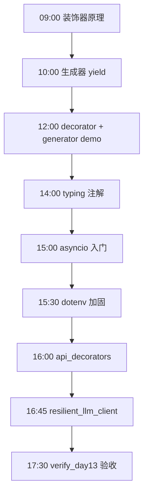
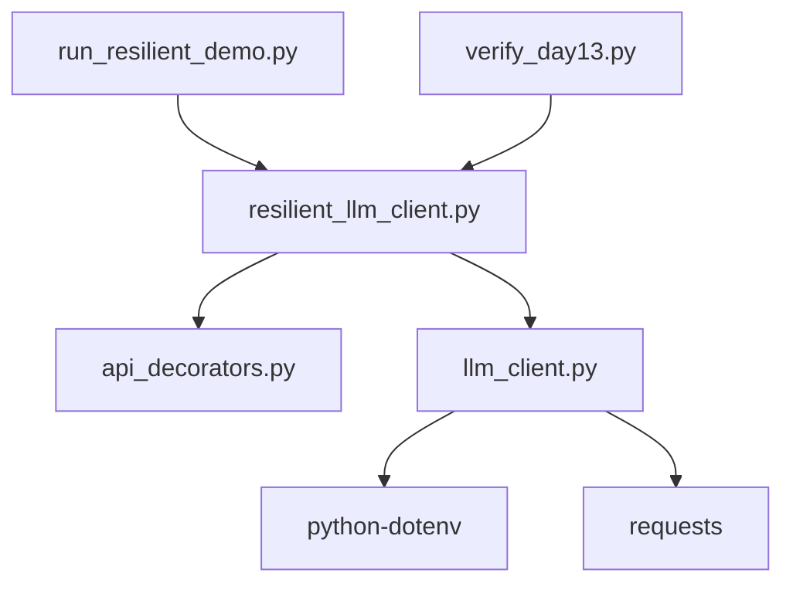

# Day 13 流程图与示意图

## 1. 一日学习流程



## 2. 装饰器包装链

```text
原始函数 _live_chat
        │
        ▼
wrapper_retry = retry(...)(_live_chat)     # 内层
        │
        ▼
wrapper_final = timeout(2.0)(wrapper_retry) # 外层
        │
        ▼
调用 wrapper_final() 时：
  timeout 启动线程
    └─ retry 循环
         └─ _live_chat 实际 HTTP
```

## 3. 生成器状态机

```text
        ┌──────────────┐
        │  next(gen)   │
        └──────┬───────┘
               ▼
        ┌──────────────┐
   ┌───▶│ 执行到 yield │───▶ 产出值，暂停
   │    └──────────────┘
   │            │
   │    next()  │
   │            ▼
   │    ┌──────────────┐
   └───▶│ yield 后继续  │
        └──────┬───────┘
               │ 函数结束
               ▼
        StopIteration
```

## 4. retry 退避时序

```text
attempt 1 ──fail──▶ sleep 0.5s (+jitter)
attempt 2 ──fail──▶ sleep 1.0s (+jitter)
attempt 3 ──ok───▶ 返回结果

若 attempt 3 仍 fail ──▶ APIRetryExhaustedError
```

## 5. chat() 分支

```mermaid
flowchart TD
    M[messages] --> V{validate 非空}
    V -->|空| E1[ValueError]
    V -->|ok| K{is_mock_mode?}
    K -->|是| MOCK[_mock_chat 哈希确定性回复]
    K -->|否| LIVE[_resilient_live_chat]
    LIVE --> R[@timeout @retry]
    R --> HTTP[requests.post]
    HTTP --> OK[ChatResponse live]
    MOCK --> MOK[ChatResponse mock]
```

## 6. asyncio 并发 vs 串行

```text
串行:
  task1 ████████ 0.15s
  task2         ████████ 0.15s
  task3                 ████████ 0.15s
  总计 ≈ 0.45s

gather 并发:
  task1 ████████
  task2 ████████
  task3 ████████
  总计 ≈ 0.15s
```

## 7. dotenv 安全边界

```text
  .env.example  ──git──▶ 仓库（模板）
  .env          ──local──▶ 本机（含真实 Key，gitignore）
  os.environ    ──runtime──▶ 进程读取
```

## 8. 模块依赖



## 9. Day 12 → Day 13 → Day 14

```text
Day 12  LLMClient.chat()     能调 API
   │
   ▼
Day 13  + retry + timeout     能在脏网络存活
   │
   ▼
Day 14  CLI 助手 import       专注业务命令
```
