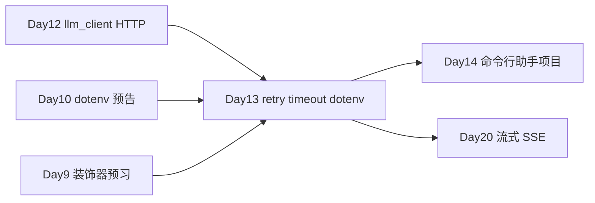

# Day 13 · 装饰器与生成器 · 类型注解 · asyncio · API 弹性加固

> **旁白（讲师口吻）**  
> 周三夜里值班群炸了：*「Day 12 的 LLM 调用上预发就挂——网关 503、偶发超时、有人把 Key 写进代码里被扫出来了。」*  
> 张工在工单里写了三条 P0：*「上午把 **装饰器、生成器** 讲透；下午 **typing + asyncio + dotenv** 一起上。今天下班前给 `llm_client` 加上 **retry、timeout**，无 Key 必须能 **mock 跑通**。Day 14 项目不许裸调 API。」*

---

## 今日学习地图

| 时段 | 主题 | 产出物 |
|------|------|--------|
| 09:00–10:30 | 装饰器原理、`@`、带参装饰器、`functools.wraps` | `decorator_demo.py` |
| 10:30–12:00 | 生成器、`yield`、`yield from`、流式模拟 | `generator_demo.py` |
| 14:00–15:00 | `typing` 注解、TypedDict、Protocol | `typing_demo.py` |
| 15:00–16:00 | `async`/`await`、`gather`、`to_thread` | `asyncio_intro.py` |
| 16:00–17:30 | `python-dotenv`、retry/timeout 装饰器、弹性客户端 | `api_decorators.py` + `resilient_llm_client.py` |
| 19:00–21:00 | 作业 + Git commit | `homework/day13/` |

## 与前后课程的衔接



| 前序能力 | 今日升级 |
|----------|----------|
| Day 12 `LLMClient.chat()` | 叠加 `@retry` / `@timeout` |
| Day 10 `get_env` + dotenv | API Key 加固、`.env.example` |
| Day 6 闭包与高阶函数 | 装饰器三层嵌套 |
| Day 9 `@property` | 与装饰器体系汇合 |

## 今日文件清单

| 文件 | 用途 |
|------|------|
| [01_业务背景.md](./01_业务背景.md) | 生产 API 故障与加固 deadline |
| [02_需求文档.md](./02_需求文档.md) | 弹性客户端 PRD |
| [03_架构与设计.md](./03_架构与设计.md) | 装饰器栈、客户端层次、async 边界 |
| [04_课堂讲义.md](./04_课堂讲义.md) | **主课**（装饰器 → asyncio → 实操） |
| [05_流程图与示意图.md](./05_流程图与示意图.md) | 重试时序、生成器状态机、async 并发 |
| [06_课后作业.md](./06_课后作业.md) | 必做 / 选做 / 挑战 |
| [07_作业参考答案.md](./07_作业参考答案.md) | 参考答案与讲评要点 |
| [08_补充讲义_装饰器与异步进阶.md](./08_补充讲义_装饰器与异步进阶.md) | 装饰器顺序、asyncio 与线程池 |
| [code/decorator_demo.py](./code/decorator_demo.py) | 上午：装饰器演示 |
| [code/generator_demo.py](./code/generator_demo.py) | 上午：生成器演示 |
| [code/typing_demo.py](./code/typing_demo.py) | 下午：类型注解 |
| [code/asyncio_intro.py](./code/asyncio_intro.py) | 下午：async 入门 |
| [code/api_decorators.py](./code/api_decorators.py) | **retry + timeout 装饰器** |
| [code/llm_client.py](./code/llm_client.py) | Day 12 基线客户端（本日依赖） |
| [code/resilient_llm_client.py](./code/resilient_llm_client.py) | **弹性客户端** |
| [code/run_resilient_demo.py](./code/run_resilient_demo.py) | 综合实操入口 |
| [code/verify_day13.py](./code/verify_day13.py) | 验收脚本 |
| [code/requirements.txt](./code/requirements.txt) | 依赖清单 |
| [code/.env.example](./code/.env.example) | 环境变量模板 |

## 今日验收标准

- [ ] 能口述装饰器本质：`func = decorator(func)`，以及 `functools.wraps` 的作用  
- [ ] 能解释 `yield` 与 `return` 的区别，以及生成器的惰性求值  
- [ ] 能写出 `list[ChatMessage]` 风格的类型注解  
- [ ] 能说明 `asyncio.gather` 与 `asyncio.to_thread` 的适用场景  
- [ ] `api_decorators.py` 演示 retry 恢复与 timeout 截断  
- [ ] 无 `OPENAI_API_KEY` 时 `resilient_llm_client.py` mock 模式全绿  
- [ ] `python3 verify_day13.py` 全部 `[OK]`  
- [ ] Git 已提交，commit message 含 `day13`

## 快速开始

```bash
cd day13/code
pip install -r requirements.txt    # 或复用 day10/day12 的 .venv
cp .env.example .env               # 可选：填入真实 Key 测 live 模式

python3 decorator_demo.py
python3 generator_demo.py
python3 typing_demo.py
python3 asyncio_intro.py
python3 api_decorators.py
python3 resilient_llm_client.py
python3 run_resilient_demo.py
python3 verify_day13.py
```

---

**讲师提醒**：今日重点是 **横切关注点**——retry/timeout 用装饰器挂在 Day 12 客户端上，业务代码 `chat(messages)` 签名不变。mock 模式是培训刚需：CI、课堂、没 Key 的同事都能跑。

**状态**：✅ Day 13 完整课件已发布
