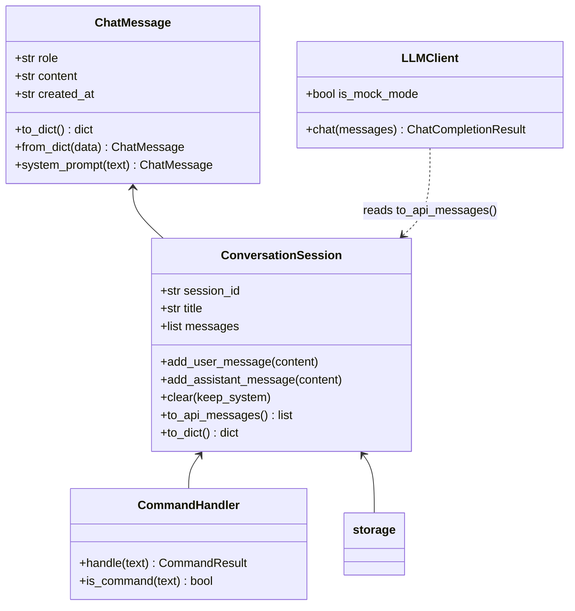
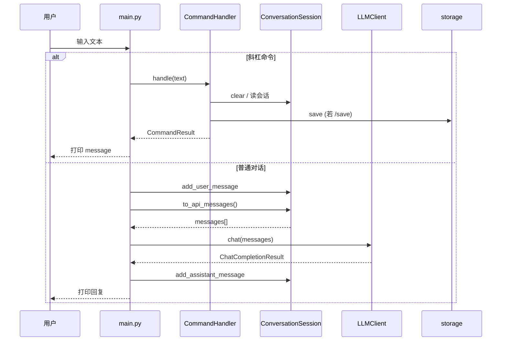

# Day 14 架构与设计 · Stage Project 1

| 属性 | 内容 |
|------|------|
| 文档编号 | ARCH-SPARK-CHAT-014 |
| 版本 | v1.0 |

---

## 1. 系统上下文

```text
                    ┌─────────────────────────────────────┐
                    │           终端用户 / 培训生           │
                    └──────────────────┬──────────────────┘
                                       │ stdin/stdout
                                       ▼
┌──────────────────────────────────────────────────────────────┐
│                      project1/main.py                         │
│  REPL 循环 · 异常边界 · Banner                                │
└───────┬──────────────────┬──────────────────┬────────────────┘
        │                  │                  │
        ▼                  ▼                  ▼
┌───────────────┐  ┌───────────────┐  ┌───────────────────────┐
│ commands.py   │  │ session.py    │  │ llm_client.py         │
│ 斜杠命令分发   │  │ messages 列表  │  │ chat(messages)        │
└───────┬───────┘  └───────┬───────┘  └───────────┬───────────┘
        │                  │                      │
        │                  ▼                      │
        │          ┌───────────────┐              │
        │          │ models.py     │              │
        │          │ ChatMessage   │              │
        │          └───────────────┘              │
        ▼                  ▼                      ▼
┌───────────────┐  ┌───────────────┐      ┌───────────────┐
│ storage.py    │  │ sparktech/    │      │ OpenAI API    │
│ JSON 持久化    │  │ exceptions    │      │ (live 模式)   │
└───────┬───────┘  │ utils.io      │      └───────────────┘
        │          └───────────────┘
        ▼
 data/sessions/*.json
```

---

## 2. 模块职责表

| 模块 | 职责 | 禁止 |
|------|------|------|
| `models.py` | 单条消息校验与序列化 | 调用 LLM、读写文件 |
| `session.py` | 多轮列表管理、API 格式转换 | 直接 `input()` |
| `llm_client.py` | mock/live 对话生成 | 管理斜杠命令 |
| `storage.py` | 会话 JSON 读写 | 业务 REPL 逻辑 |
| `commands.py` | 解析 `/` 命令 | 调用 OpenAI SDK |
| `main.py` | 组装依赖、主循环、顶层异常 | 臃肿业务逻辑 |

**依赖方向**（只允许向下）：

```text
main → commands, session, llm_client, storage
session → models
storage → session, sparktech.exceptions
llm_client → sparktech.utils, openai(可选)
commands → session, storage
```

---

## 3. 核心类图



---

## 4. 主循环时序



---

## 5. 数据流：一轮对话

```text
用户输入 "你好"
    │
    ▼
ChatMessage(role=user, content="你好")
    │ append
    ▼
ConversationSession._messages = [system, user]
    │
    ▼
to_api_messages() → [{"role":"system",...}, {"role":"user",...}]
    │
    ▼
LLMClient.chat(messages)
    │
    ├─ mock → 本地拼接回复
    └─ live → OpenAI SDK
    │
    ▼
ChatMessage(role=assistant, content="...")
    │ append
    ▼
打印 "助手> ..."
```

---

## 6. 与历史课程对照

| 概念 | Day 8 | Day 10 | Day 14 |
|------|-------|--------|--------|
| 消息结构 | `ChatMessage` 类 | — | `models.py` 复用 |
| 异常 | `ValueError` | `SparkTechError` 层次 | `LLMClientError` / `SessionStorageError` |
| 配置 | — | `get_env` + dotenv | `llm_client` 读取 Key |
| LLM | — | — | `chat(messages)` 多轮 |
| 存储 | `to_dict` 预览 | `load_json_file` | `save_session` / `load_session` |

---

## 7. 扩展点（选做预留）

| 扩展 | 建议落点 |
|------|----------|
| `/load xxx.json` | `commands.py` + `storage.load_session` |
| 会话标题自动摘要 | `session.py` 首轮后改 `title` |
| 多 vendor | `llm_client.py` 工厂 + Day 9 `BaseModel` |
| 流式输出 | `llm_client.stream_chat` + `main` 逐字打印 |
| 日志文件 | `sparktech.utils` 新增 `logging_config` |

---

## 8. 技术决策记录（ADR）

| 决策 | 选项 | 结论 | 原因 |
|------|------|------|------|
| LLM 接口 | 单 prompt vs messages | **messages** | 多轮 memory 是 PRD 核心 |
| mock 策略 | 随机 vs 确定性哈希 | **哈希** | 便于课堂复现与评分 |
| 包布局 | 单文件 vs project1/ | **多模块** | 答辩考察工程能力 |
| sys.path | 教学 insert vs pip -e | **insert**（今日） | 与 Day 10 一致，Day 20 再 editable |

---

**设计原则**：*Session 是真相源（single source of truth）；LLM 是无状态函数；Storage 是 Session 的快照。*
