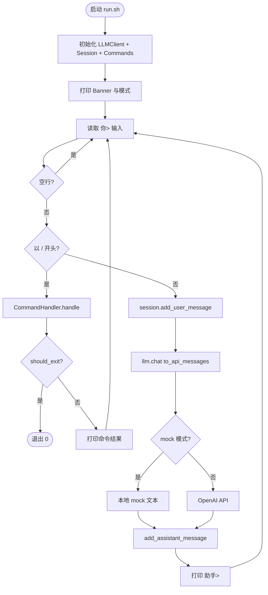
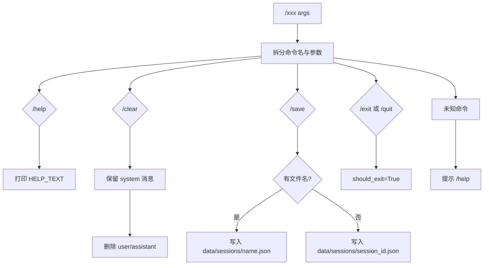
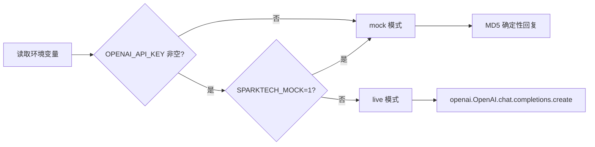
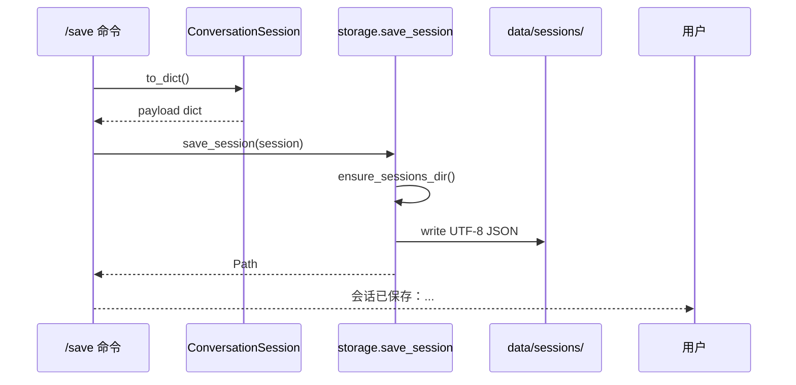
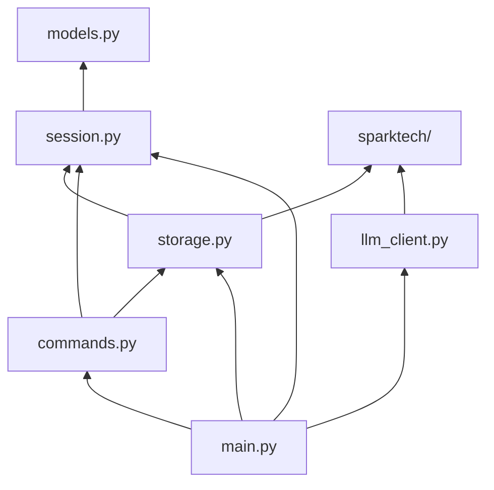
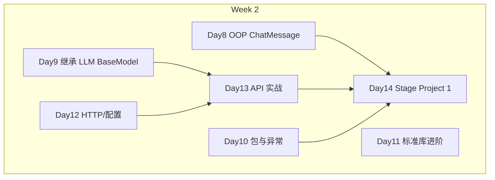

# Day 14 流程图与示意图

---

## 1. 总体 REPL 流程



---

## 2. 斜杠命令决策树



---

## 3. 多轮 memory 数据流

```ascii
Round 1:
  messages = [system, user₁]
       │
       ▼ chat()
  messages = [system, user₁, assistant₁]

Round 2:
  messages = [system, user₁, assistant₁, user₂]
       │
       ▼ chat()  ← 注意：整表发送，不是只发 user₂
  messages = [system, user₁, assistant₁, user₂, assistant₂]
```

---

## 4. mock vs live 分支



---

## 5. JSON 持久化流程



---

## 6. 异常传播（Day 10 模式）

```ascii
ValueError (ChatMessage)
    └── main: [输入错误] → 继续 REPL

LLMClientError
    └── main: [LLM 错误] → 不写入 assistant → 继续 REPL

SessionStorageError / DataLoadError
    └── commands / main: 打印原因 → 继续 REPL

Exception (未知)
    └── main: [未知错误] → 继续 REPL（不 exit）
```

---

## 7. 模块依赖图



---

## 8. 答辩演示时间轴（3 分钟）

```ascii
0:00  启动 run.sh，说明 mock 模式
0:30  第一轮提问
1:00  第二轮追问（指出 messages 增长）
1:30  /save + 展示 JSON 文件
2:00  /clear 演示
2:30  架构图指模块职责
3:00  /exit
```

---

## 9. Week 2 知识栈全景


