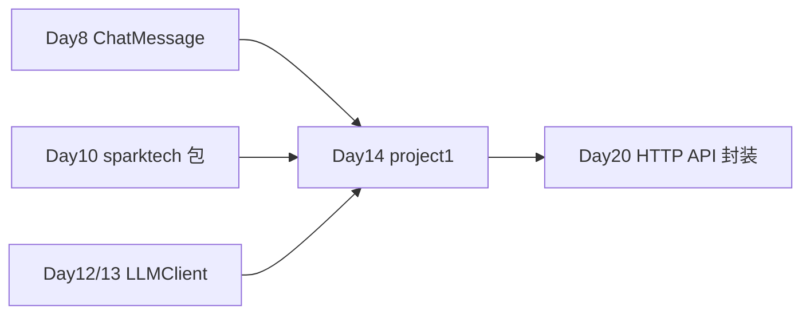

# Day 14 · Week 2 阶段项目 · 命令行多轮对话 AI 助手

> **旁白（讲师口吻）**  
> 周五下午，产品部小陈把 Week 2 答辩排期发到群里：*「Stage Project 1 不是练习题，是星火智服内部 PoC 的第一块里程碑——要能多轮对话、能存 JSON、能 `/clear` `/save` `/exit`，没 API Key 也要能 mock 跑通。」*  
> 张工补了一句：*「Day 8 的 `ChatMessage`、Day 10 的 `sparktech` 包、Day 12/13 的 LLM 客户端，今天全部串起来。代码要拆模块，异常不能裸 `print`。」*  
> **今日全天项目课**：从 PRD 到答辩，交付可运行的 `project1/` 命令行助手。

---

## 今日学习地图

| 时段 | 主题 | 产出物 |
|------|------|--------|
| 09:00–10:00 | 业务背景 & PRD 精读 | `01_业务背景.md` + `02_需求文档.md` |
| 10:00–11:30 | 架构设计 & 模块拆分 | `03_架构与设计.md` |
| 11:30–12:00 | 环境搭建 & mock 冒烟 | `bash run.sh` 能进 REPL |
| 14:00–16:00 | **主实战**：按模块实现 project1 | `models` → `session` → `llm` → `storage` → `commands` → `main` |
| 16:00–17:00 | 联调、异常场景、保存会话 | `data/sessions/*.json` |
| 17:00–17:30 | 答辩彩排 & Code Review 清单 | `06_课后作业.md` |
| 19:00–21:00 | 作业巩固 / 选做扩展 | `homework/day14/` |

## 与前后课程的衔接



| 前序能力 | 今日用法 |
|----------|----------|
| Day 8 `ChatMessage` | `project1/models.py` 消息单元与 JSON 互转 |
| Day 10 `sparktech` 异常 & `get_env` | `storage.py` / `llm_client.py` 统一错误处理 |
| Day 12/13 `LLMClient.chat(messages)` | 多轮上下文 API 调用 + mock 降级 |
| Day 6 REPL 循环 | `main.py` 主循环与斜杠命令分发 |

## 今日文件清单

| 文件 | 用途 |
|------|------|
| [01_业务背景.md](./01_业务背景.md) | 星火智服 PoC 里程碑、答辩背景 |
| [02_需求文档.md](./02_需求文档.md) | **详细 PRD** 与验收标准 |
| [03_架构与设计.md](./03_架构与设计.md) | 模块图、类设计、数据流 |
| [04_课堂讲义.md](./04_课堂讲义.md) | **项目实战指南**（分步编码） |
| [05_流程图与示意图.md](./05_流程图与示意图.md) | REPL、命令、持久化流程图 |
| [06_课后作业.md](./06_课后作业.md) | Code Review 清单 + 扩展作业 |
| [07_作业参考答案.md](./07_作业参考答案.md) | 参考答案与讲评要点 |
| [08_补充讲义.md](./08_补充讲义.md) | 真实 API、日志、测试预告 |
| [项目答辩评分标准.md](./项目答辩评分标准.md) | 里程碑答辩 Rubric |
| [project1/](./project1/) | **阶段项目源码** |
| [sparktech/](./sparktech/) | Day 10 包模式复用 |
| [data/sessions/](./data/sessions/) | 会话 JSON 存储目录 |
| [requirements.txt](./requirements.txt) | 项目依赖 |
| [.env.example](./.env.example) | 环境变量模板 |
| [run.sh](./run.sh) | 一键启动脚本 |

## 今日验收标准

- [ ] 无 API Key 时 `bash run.sh` 进入 mock REPL，能完成至少 2 轮对话  
- [ ] `/help` `/clear` `/save` `/exit` 四个命令行为符合 PRD  
- [ ] `/save` 后在 `data/sessions/` 生成合法 JSON，含 `messages` 数组  
- [ ] 非法输入与 LLM 异常有友好提示，进程不崩溃  
- [ ] 模块职责清晰：`models` / `session` / `llm_client` / `storage` / `commands` / `main`  
- [ ] 配置 `OPENAI_API_KEY` 后可切换真实 API（答辩加分项）  
- [ ] Git 已提交，commit message 含 `day14-project1`

## 快速开始

```bash
cd day14
cp .env.example .env          # 可选；默认 mock 无需 Key
bash run.sh                   # 创建 venv、安装依赖、启动 REPL
```

交互示例：

```text
你> 你好，我是培训生小王
助手> [mock] [mock/gpt-4o-mini] 已收到你的第 1 轮提问：...

你> /save demo.json
会话已保存：day14/data/sessions/demo.json

你> /exit
```

---

**讲师提醒**：答辩第一眼看 **能否无 Key 跑通**；第二眼看 **JSON 能否还原会话**；第三眼看 **异常是否工程化**。先 mock 闭环，再切真实 API。

**状态**：✅ Day 14 Stage Project 1 完整课件已发布
