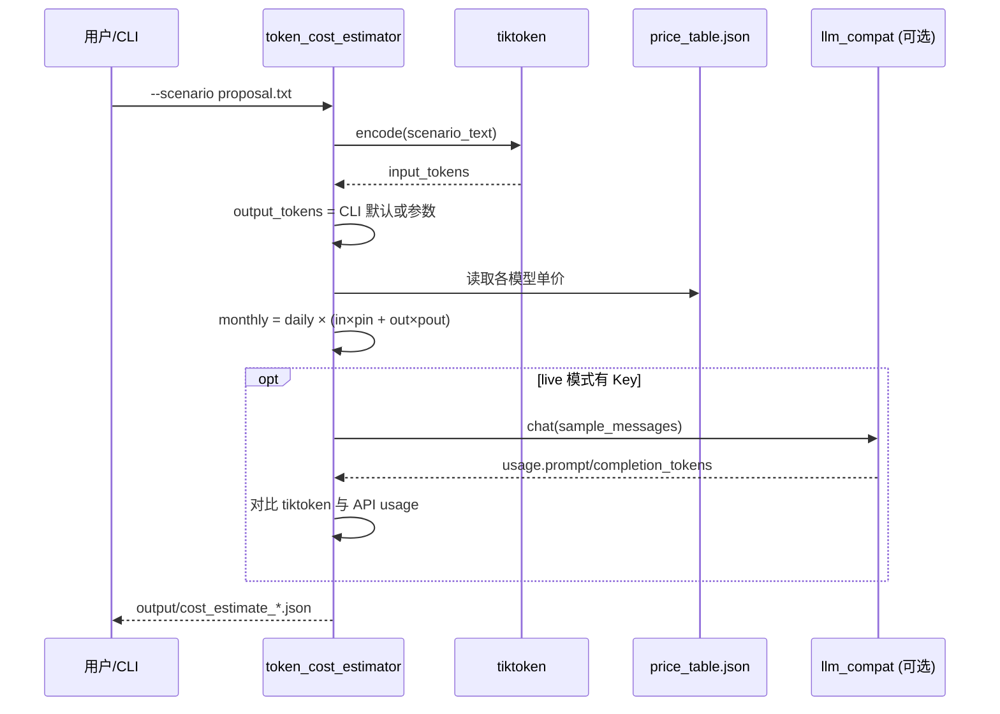

# Day 15 架构与设计 · Token 计量与成本估算模块

## 1. 总体架构

```text
┌─────────────────────────────────────────────────────────────────────┐
│                         入口层（可执行脚本）                            │
│  tiktoken_demo.py          token_cost_estimator.py                   │
│  verify_day15.py           model_landscape_quiz.md（阅读测验）         │
└────────────────────────────┬────────────────────────────────────────┘
                             │ import
                             ▼
┌─────────────────────────────────────────────────────────────────────┐
│                    计量层 token_utils（内置于各脚本）                    │
│   count_tokens() ──▶ tiktoken.encoding_for_model()                   │
│        │ 降级: estimate_tokens_fallback() = len(text)//4              │
│   count_messages_tokens() ──▶ 逐条 message + role 开销                 │
└────────────────────────────┬────────────────────────────────────────┘
                             │
              ┌──────────────┴──────────────┐
              ▼                             ▼
┌──────────────────────────┐   ┌──────────────────────────────────────┐
│   计价层 pricing.py       │   │   客户端桥接 llm_compat.py             │
│   load_price_table()     │   │   Day13 ResilientLLMClient            │
│   estimate_monthly()     │   │   Day12 LLMClient（回退）               │
└──────────────────────────┘   └──────────────────────────────────────┘
```

**设计原则**（张工规范）：

1. **计量与计价分离**：Token 数来自 tiktoken，单价来自可替换 JSON 表  
2. **降级可用**：无 tiktoken 时用 `chars÷4`，打印明确警告  
3. **商务可读**：JSON 输出含假设条件（日均请求、输出 Token）  
4. **衔接前序**：live 对比 usage 时复用 Day 12–14 客户端，不重复造轮子  

## 2. Token 计数数据流



## 3. messages Token 累计规则（教学近似）

OpenAI 官方对 chat 格式的 Token 计算含格式开销；课堂采用 **保守估算**：

```text
total = Σ count_tokens(msg["content"]) + 4 × len(messages)
```

| 组成部分 | 估算方式 | 说明 |
|----------|----------|------|
| 纯文本 | tiktoken | 与模型 encoding 对齐 |
| role 标签 | 每条 +4 tokens | 教学近似，live 以 API usage 为准 |
| 系统提示 | 同 user 计法 | 通常占比较大，不可省略 |

## 4. 成本公式

```text
单次成本 = (input_tokens / 1e6) × input_price
         + (output_tokens / 1e6) × output_price

月成本   = 单次成本 × daily_requests × 30
```

三档场景（产品向）：

| 档位 | daily_requests | output_tokens | 用途 |
|------|----------------|---------------|------|
| 低 | 200 | 150 | 试点部门 |
| 中 | 500 | 300 | 立项基准 |
| 高 | 2000 | 500 | 全量上线 |

## 5. 与 Day 12–14 客户端关系

```text
day15/code/llm_compat.py
    │
    ├─ sys.path → ../../day13/code
    │       └─ ResilientLLMClient.chat() → ChatResponse.prompt_tokens
    │
    └─ sys.path → ../../day12/code（回退）
            └─ LLMClient.chat() → usage 字段

day14/project1/llm_client.py
    └─ 可选：OpenAI SDK 路径，mock 由 SPARKTECH_MOCK 控制
```

**何时调用 live 客户端**：`token_cost_estimator.py --live-sample` 用一条样例 prompt 对比 API 返回的 `usage` 与 tiktoken 预估值。

## 6. 模块文件映射

| 脚本 | 核心函数 | 输出 |
|------|----------|------|
| `tiktoken_demo.py` | `count_tokens`, `demo_*` | 终端表格 |
| `token_cost_estimator.py` | `estimate_cost`, `main` | JSON 报告 |
| `llm_compat.py` | `get_llm_client` | 客户端实例 |
| `verify_day15.py` | `run_checks` | `[OK]` / `[FAIL]` |

## 7. 错误处理

| 场景 | 行为 |
|------|------|
| 方案文件不存在 | `FileNotFoundError` + 友好提示 |
| tiktoken 未安装 | 降级 `chars÷4`，`verify` 仍通过 |
| 无 API Key | 跳过 live 对比，mock 计价全绿 |
| 单价表缺失 | 使用内置 `DEFAULT_PRICE_TABLE` |

---

**下一页**：[04_课堂讲义.md](./04_课堂讲义.md)
